************************
Использование ботов
************************

Меню пользователя YaPB (yb menu)
===================================

Главное меню
-----------------

При нажатии на клавишу "=" в игре, на экране появится меню со следующими опциями.

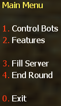

    Это главное меню YaPB
    
1. **Управление ботами** - Меню которое добавляет или убирает ботов из игры.
2. **Функции** - Меню, которое содержит настройки типов оружия используемого ботами, редактор вэйпоинтов, переключатель режима отладки и управления командами ботов.
3. **Заполнить сервер** - Меню которое задаёт параметры ботов для заполнения сервера.
4. **Закончить раунд** - Убивает всех ботов чтобы закончить раунд.

Меню управления ботами
--------------------------

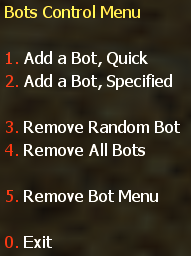

    Меню управления ботами
    
1. **Быстро добавить бота** - Это делает то что говорит. Оно быстро добавляет бота давая ему случайное имя, команду, сложность и модель. Сложность будет выбираться случайно между вашими значениями yb_difficulty_min/yb_difficulty_max указанные в yapb.cfg.
2. **Добавить особого бота** - Позволяет вам указать все вещи (исключая имя) для добавления одного бота.

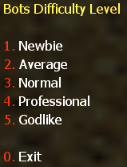

    Это позволяет вам выбрать сложность для бота.
    
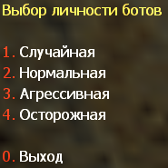

    Это позволяет вам выбрать личность для бота.

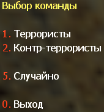

    Это позволяет вам выбрать команду для бота.

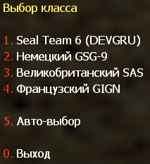

    Это позволяет вам выбрать класс для бота. (для команды Контр-Террористов)

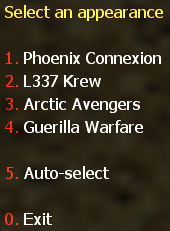

    Это позволяет вам выбрать класс для бота. (для команды Террористов)
    
3. **Убрать случайного бота** - убирает случайного бота.
4. **Убрать всех ботов** - убирает всех ботов с сервера.
5. **Меню убирания ботов** - Меню которое позволяет вам убрать бота с сервера указанного в списке.

Меню функций ботов
-----------------------

.. figure:: images/bots_features_menu.png
    :align: center

    Меню функций ботов
    
1. **Меню выбора режима оружия** - Меню которое настраивает тип используемого ботами оружия.

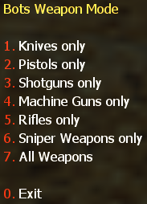

    Меню режима оружия ботов

2. **Меню вэйпоинтов** - Открывает меню редактора вэйпоинтов.
3. **Выбрать личность бота** - Добавляет бота с текущей заданной сложностью с настройкой личности.
4. **Переключить режим отладки** - Включает или выключает режим отладки.
5. **Меню команд бота** - Открывает меню команд бота.

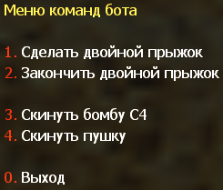

    Меню команд бота
    
1. **Сделать двойной прыжок** - Заставляет ближайшего бота тиммейта присесть рядом с вами чтобы сделать двойной прыжок.
2. **Закончить двойной прыжок** - Отпускает бота после первой команды, он должен встать и идти по своим делам.
3. **Скинуть бомбу C4** - Заставляет бота несущего бомбу, бросить её вам.
4. **Скинуть пушку** - Заставляет бота тиммейта бросить вам оружие.

Меню вэйпоинтов
------------------

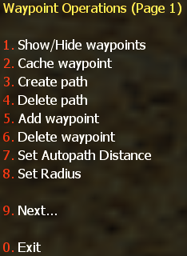

    Меню редактирования вэйпоинтов (Страница 1)
    
1. **Показать/Скрыть вэйпоинты** - Показать или скрыть отображение вэйпоинтов.
2. **Запомнить вэйпоинт** - Кэширует вэйпоинт для будущего использования.
3. **Создать путь** - Открывает меню создания путевых соединений.
4. **Удалить путь** - Удаляет путь с выбранного вэйпоинта.
5. **Добавить вэйпоинт** - Открывает меню выбора типа добавляемого вэйпоинта.
6. **Удалить вэйпоинт** - Удаляет вэйпоинт на котором вы стоите.
7. **Установить дистанцию автопути** - Открывает меню настройки дистанции автопути.
8. **Установить радиус** - Открывает меню настройки радиуса вэйпоинта.
9. **Далее...** - Переходит на вторую страницу меню редактора вэйпоинтов.

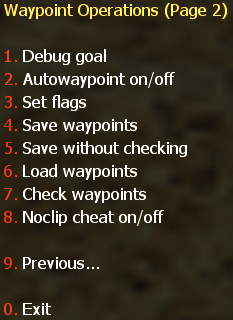

    Меню редактирования вэйпоинтов (Страница 2)

1. **Показать статистику** - Показывает статистику количества и типов вэйпоинтов на карте в консоли.
2. **Вкл/Выкл автовэйпоинт** - Включает или выключает автоматическую расстановку вэйпоинтов.
3. **Установить флаг** - Открывает меню выбора флагов для вэйпоинта.
4. **Сохранить вэйпоинты** - Сохраняет вэйпоинты с проверкой целостности путей.
5. **Сохранить без проверки** - Сохраняет вэйпоинты без проверки (из-за этого, могут быть проблемы с поведением ботов).
6. **Загрузить вэйпоинты** - Загружает вэйпоинты с файла.
7. **Проверить вэйпоинты** - Проверяет вэйпоинты на наличие ошибок.
8. **Вкл/Выкл режим полёта** - Включает или выключает чит noclip.
9. **Назад...** - Возвращает на первую страницу меню редактора вэйпоинтов.

Сводка консольных команд YaPB
==================================

Доступны следующие основные команды YaPB (заметьте, что они ЧУВСТВИТЕЛЬНЫ к регистру):
   +---------------------------+--------------------------------------------------------------------------------------------------------------------------------+
   | ``yb add``                | Добавляет заданного бота в игру. (смотрите ниже)                                                                               |
   +---------------------------+--------------------------------------------------------------------------------------------------------------------------------+
   | ``yb kick``               | Убирает случайного или указанного бота из игры. (смотрите ниже)                                                                |
   +---------------------------+--------------------------------------------------------------------------------------------------------------------------------+
   | ``yb removebots``         | Убирает всех ботов из игры. Также доступно через алиас ``yb kickall``                                                          |
   +---------------------------+--------------------------------------------------------------------------------------------------------------------------------+
   | ``yb kill``               | Убивает указанную команду или всех ботов. (смотрите ниже)                                                                      |
   +---------------------------+--------------------------------------------------------------------------------------------------------------------------------+
   | ``yb fill``               | Заполняет сервер (добавляет ботов) с заданными параметрами. (смотрите ниже)                                                    |
   +---------------------------+--------------------------------------------------------------------------------------------------------------------------------+
   | ``yb vote``               | Заставляет всех ботов голосовать за указанную карту.                                                                           |
   +---------------------------+--------------------------------------------------------------------------------------------------------------------------------+
   | ``yb weapons``            | Задаёт режим используемого ботами оружия. (смотрите ниже)                                                                      |
   +---------------------------+--------------------------------------------------------------------------------------------------------------------------------+
   | ``yb menu``               | Открывает главное меню бота.                                                                                                   |
   +---------------------------+--------------------------------------------------------------------------------------------------------------------------------+
   | ``yb version``            | Показывает информацию о версии сборки бота.                                                                                    |
   +---------------------------+--------------------------------------------------------------------------------------------------------------------------------+
   | ``yb list``               | Показывает список текущих ботов играющих на сервере.                                                                           |
   +---------------------------+--------------------------------------------------------------------------------------------------------------------------------+
   | ``yb cvars``              | Показывает все квары с их описаниями.                                                                                          |
   +---------------------------+--------------------------------------------------------------------------------------------------------------------------------+

yb add
---------------

Чтобы добавить заданного бота в игру, с никнеймом: John Smith, сложностью 2. Обычный, личностью 4. Осторожный, командой: Контр-Террористы, классом команды: SAS, вы должны написать в консоли ``yb add 2 4 2 3 "John Smith"``

Корректный формат для ``yb add`` команды это ``yb add [сложность][личность][команда][модель][имя]``. Все значения ботов выбираются цифрами (кроме имени).

yb kick
---------------

Напишите в консоли команду ``yb kick`` чтобы убрать случайного бота.

Если вы хотите убрать бота из конкретной команды, вы должны написать ``yb kick t`` чтобы убрать бота с команды Террористов, и ``yb kick ct`` чтобы убрать бота с команды Контр-Террористов.

yb kill
---------------

Команда ``yb kill`` убивает всех ботов. Чтобы убить конкретную команду, такую как террористы, вы должны написать в консоль ``yb kill t``. Для Контр-Террористов это команда ``yb kill ct``

yb fill
---------------

Чтобы заполнить сервер случайными ботами напишите в консоль ``yb fillserver``.

Если вы хотите заполнить сервер определёнными ботами, например: Команда: Террористы, Количество: 5, Сложность: 3. Средний, Личность: 2. Агрессивный, вы должны написать в консоли следующую команду ``yb fill 1 5 3 2``.

Корректный формат для команды ``yb fill`` это ``yb fill [команда][количество][сложность][личность]``.

yb weapons
---------------

Чтобы заставить бота использовать определённый вид оружия, например, дробовики, вы должны написать в консоль команду ``yb weapons shotgun``.

Допустимые значения: ``knife|pistol|shotgun|smg|rifle|sniper|standard``.

Standard означает что боты будут использовать все виды оружия.

Добавление ботов в игру
============================

Выберите ``1. Быстро добавить бота`` в меню управления ботами чтобы добавить бота со случайной статистикой (имя, сложность, личность и т.д.)
Выберите ``2. Добавить особого бота`` в меню управления ботами чтобы добавить бота с вручную заданной статистикой.

Или напишите в консоли ``yb_quota x`` где X это количество добавляемых ботов.

Выбор языка бота
=============================

Вы должны открыть файл ``yapb.cfg`` в папке ``addons/yapb/conf`` и изменить значение квара yb_language на следующее доступное.

#. ``en`` - Английский язык
#. ``ru`` - Русский язык
#. ``de`` - Немецкий язык
#. ``chs`` - Китайский язык

Например, напишите в конфиге ``yb_language ru`` для русского языка.