*********************
Waypointing
*********************

.. include:: .fontstyles.rst

Brief information
==========================

Waypoints, what are they?
--------------------------

Unlike humans, bots cannot see a map and analyze what they see. If you see a building with a door, you can walk straight to the door, open it and enter the building.
Bots cannot do this without help! They can see and fight enemies or react if they are being attacked. These ways of behaviour work without any external help. But in order to find their way around the map and to safely navigate through all ways and passages, they do need some help. They need something that tells them where they can go and where they can't. They need something that shows them where a ladder is located or where the mission goal (escape zone/hostages/bomb spot) is. This is done by means of waypoints. You can imagine waypoints a bit like those flags on a ski run. Each waypoint marks a point where bots can go. If two of them are connected with each other, a bot can go from one point to the other and back. So what you do when you waypoint a map is basically place a whole net of points in the map and connect them in a way that bots can proceed from one point to the other. All points must be placed in areas that are accessible for players, and if you want your bots to navigate smoothly and safely, you must also keep an eye on the connections. If connections go through walls or over a deep ravine, your bots will bump into walls or fall to their death.
There are several waypoint types that can be used to indicate map goals, rescue zones, nice camp spots, ladders etc. There are different types of connections too, one-way or two-way connections and jump connections that will make a bot jump from point A to B instead of walking or running there. We will come back to this later.

Besides, you don't have to worry about every little detail. The editor that comes with this bot version will do lots of the work for you, and besides, it's graphical and easy to use (no programming/coding skills or anything required). You may very well discover that making waypoints can be fun, especially when you see bots roam through the entire map without problems - and you made it possible!.

.. Note:: Since YaPB 2.10 version, a new waypoint format named **Graph** has been added, which raised the limit to 2048 nodes, allows you to set camp directions not only horizontally but also vertically, and also reduced the size of waypoint files. YaPB also continues to support the old **PWF** format. You can save waypoints to pwf format, but it will automatically converted to graph format when loaded. Waypoints (multicolored stripes) now named **Nodes** since YaPB 4.x version. Waypoint editor also renamed to Graph editor.

What do waypoints look like in the game?
----------------------------------------

When you are playing a normal game on a waypointed map, the waypoints will of course be invisible so that they don't distract or annoy you in any way.
When waypointing is activated (see: How can I access the waypoint editor?, Below for instructions on how to do that), you will see waypoints as vertical bars about as high as a standing player. The colour of normal waypoints is green, but you may also see waypoints in white, purple, red, blue and cyan. These colours indicate special waypoints, some of which have already been mentioned in the last paragraph. If you see waypoints that are much smaller than the other ones, they are crouch waypoints. They will force bots to crouch when approaching them. Such waypoints are needed to lead bots through vents or any other low and narrow passages.
Connections between waypoints are marked as horizontal lines leading from the centre of one waypoint to the other. They, too, exist in different colours. You may see yellow, white and red lines. Don't worry if all these different colours sound confusing right now - it's actually very easy, but of course it helps a lot if you see some waypoints on the screen.
Now you know what waypoints and connections are, what they are for and what they look like, you may want to enter the editing mode and see for yourself.

How can I access the waypoint editor?
-------------------------------------

The waypoint editor is not a separate program, it is included in the bot dll (or .so, if you are using linux). To open it, create a LAN/Listen Server game, select the map you want to waypoint and start the game as usual. As soon as you are in the map, you can activate the editing mode from the console by typing ``yb graphmenu`` or if you have bound a key for it, simply by pressing that key.

Graph console commands Summary
-------------------------------

The following Graph commands are available (note these ARE case sensitive):
   +---------------------------+--------------------------------------------------------------------------------------------------------------------------------+
   | ``yb g on``               | Turns on displaying of nodes.                                                                                                  |
   +---------------------------+--------------------------------------------------------------------------------------------------------------------------------+
   | ``yb g off``              | Turns off displaying of nodes.                                                                                                 |
   +---------------------------+--------------------------------------------------------------------------------------------------------------------------------+
   | ``yb g on auto``          | Turns on auto nodes placement setting (see below).                                                                             |
   +---------------------------+--------------------------------------------------------------------------------------------------------------------------------+
   | ``yb g off auto``         | Turns off auto nodes placement setting (see below).                                                                            |
   +---------------------------+--------------------------------------------------------------------------------------------------------------------------------+
   | ``yb g on models``        | Turns on the player models rendering on spawn points.                                                                          |
   +---------------------------+--------------------------------------------------------------------------------------------------------------------------------+
   | ``yb g off models``       | Turns off the player models rendering on spawn points.                                                                         | 
   +---------------------------+--------------------------------------------------------------------------------------------------------------------------------+
   | ``yb g on noclip``        | Turns on nodes editing with noclip cheat. This allows you to fly and you don't collide with walls.                             |
   +---------------------------+--------------------------------------------------------------------------------------------------------------------------------+
   | ``yb g off noclip``       | Turns off nodes editing with noclip cheat.                                                                                     |
   +---------------------------+--------------------------------------------------------------------------------------------------------------------------------+
   | ``yb g add``              | Adds a node at the current player location. A Menu will pop up where you have to select the different types of nodes.          |
   +---------------------------+--------------------------------------------------------------------------------------------------------------------------------+
   | ``yb g addbasic``         | Adds basic nodes on map, like spawn points, goals and ladders.                                                                 |
   +---------------------------+--------------------------------------------------------------------------------------------------------------------------------+
   | ``yb g cache``            | Remember the nearest to player node.                                                                                           |
   +---------------------------+--------------------------------------------------------------------------------------------------------------------------------+
   | ``yb g clean``            | Cleans useless path connections from all or single node.                                                                       |
   +---------------------------+--------------------------------------------------------------------------------------------------------------------------------+
   | ``yb g delete``           | Deletes the node nearest to the player (see below).                                                                            |
   +---------------------------+--------------------------------------------------------------------------------------------------------------------------------+
   | ``yb g erase``            | Removes the graph and bot experience files from hard drive.                                                                    |
   +---------------------------+--------------------------------------------------------------------------------------------------------------------------------+
   | ``yb g flags``            | Allows you to manually add/remove Flags to a node.                                                                             |
   +---------------------------+--------------------------------------------------------------------------------------------------------------------------------+
   | ``yb g setradius x``      | Manually sets the Wayzone Radius for this node to value x.                                                                     |
   +---------------------------+--------------------------------------------------------------------------------------------------------------------------------+
   | ``yb g teleport x``       | Teleport hostile to specified in value x node.                                                                                 |
   +---------------------------+--------------------------------------------------------------------------------------------------------------------------------+
   | ``yb g stats``            | Shows the number of different nodes you did already set.                                                                       |
   +---------------------------+--------------------------------------------------------------------------------------------------------------------------------+
   | ``yb g check``            | Checks if all node connections are valid.                                                                                      |
   +---------------------------+--------------------------------------------------------------------------------------------------------------------------------+
   | ``yb g load``             | Loads the nodes from a graph file (see below).                                                                                 |
   +---------------------------+--------------------------------------------------------------------------------------------------------------------------------+
   | ``yb g save``             | Saves the current nodes to a file (see below).                                                                                 |
   +---------------------------+--------------------------------------------------------------------------------------------------------------------------------+
   | ``yb g save nocheck``     | Saves the current nodes to a file without validating.                                                                          |
   +---------------------------+--------------------------------------------------------------------------------------------------------------------------------+
   | ``yb g upload``           | Uploads created graph file to graph database.                                                                                  |
   +---------------------------+--------------------------------------------------------------------------------------------------------------------------------+
   | ``yb g menu``             | Show the graph editor menu. Also available via alias ``yb graphmenu``                                                          |
   +---------------------------+--------------------------------------------------------------------------------------------------------------------------------+
   | ``yb g path_set_autopath``| Opens menu for setting autopath maximum distance.                                                                              |
   +---------------------------+--------------------------------------------------------------------------------------------------------------------------------+
   | ``yb g path_create``      | Opens menu for path creation.                                                                                                  |
   +---------------------------+--------------------------------------------------------------------------------------------------------------------------------+
   | ``yb g path_delete``      | Delete path from cached (or faced) to nearest node.                                                                            |
   +---------------------------+--------------------------------------------------------------------------------------------------------------------------------+
   | ``yb g path_create_in``   | Creating incoming path connection from cached (faced) to nearest node.                                                         |
   +---------------------------+--------------------------------------------------------------------------------------------------------------------------------+
   | ``yb g path_create_out``  | Creating outgoing path connection from nearest to cached (faced) node.                                                         |
   +---------------------------+--------------------------------------------------------------------------------------------------------------------------------+
   | ``yb g path_create_both`` | Creating both-ways path connection between cached (faced) and nearest node.                                                    |
   +---------------------------+--------------------------------------------------------------------------------------------------------------------------------+
   | ``yb g iterate_camp``     | Allows to go through all camp points on map.                                                                                   |
   +---------------------------+--------------------------------------------------------------------------------------------------------------------------------+
   | ``yb g acquire_editor``   | Acquires rights to edit graph on dedicated server. (see below)                                                                 |
   +---------------------------+--------------------------------------------------------------------------------------------------------------------------------+
   | ``yb g release_editor``   | Releases graph editing rights.                                                                                                 |
   +---------------------------+--------------------------------------------------------------------------------------------------------------------------------+

To use the graph commands, you will have to use the console. Use the ``~`` key to bring down the console. Enter the console commands that you wish, then use the ``~`` key again to return to the game.

Using graph commands
=========================

Using ``yb g delete`` will remove the waypoint closest to the player. The waypoint MUST be within 50 units from the player (about 1/2 the player height) in order to be removed. You will need to stand fairly close to the waypoint to be able to remove it. This prevents you from accidentally removing a waypoint on the other side of the room. When removing a waypoint you will hear a sound indicating that the waypoint was removed (the same sound the tripmine makes when placed on a wall).

Using ``yb g save`` will save the waypoint data to the graph file. The graph file will have the same name as the current map with an extension of ``.graph``. The file will be saved into the ``cstrike/addons/yapb/data/graph`` Folder. Your current player name will be saved as the waypoint file author.

You can also save the waypoint in ``.pwf`` format for older versions of YaPB or PODBot by typing in the console ``yb g save old``. Please note that you can save a waypoint in this format only when the number of nodes does not exceed 1024.

Using ``yb g load`` will clear out all waypoints in the current map and load them from the graph file in the graph folder. This is a good way to "undo" a bunch of waypoints that you have created but do not wish to save. There is no way to ``undo`` a single waypoint. You will have to use the ``yb g delete`` command to remove waypoints one-by-one.

The ``yb g on auto`` command allows you to automatically drop waypoints as you run around in a map. As you run around the level waypoints will be dropped every 200 units automatically. No waypoint will be dropped if another waypoint is already within 200 units of your current position. So if you want to place lots of waypoints fairly close together you may have to manually place some of the waypoints using the ``yb g add`` command. Autowaypointing keeps track of where the last waypoint was dropped (either manually or from autowaypointing) and will place another waypoint when you are 200 units from the last waypoint. If you don't like where autowaypointing placed a waypoint and want to move it a little bit, you can delete the waypoint using ``yb g delete`` (but turn off autowaypointing before, since it will place a new waypoint otherwise). 

When using autowaypointing, try to stay in the center of narrow hallways and always place a waypoint on BOTH sides of a door. You may have to place some of these waypoints manually using ``yb g add`` since places like intersections of hallways and doorway entrances and exits don't usually fall exactly at the location where autowaypoint would want to place a waypoint.

Whenever you get close to a waypoint, yellow, white or green lines will be drawn to all of the other waypoints that the bot would consider to be "reachable". If the connection is a two-way connection the line is yellow, one-way connections appear white. These "reachable" waypoints would be waypoints that are clearly visible from the current location. Certain waypoints will be disallowed as reachable for one reason or another. For example, waypoints suspended in mid-air above the bot would not be considered reachable since the bot couldn't jump high enough to get to them. Also waypoints that are too far away from the current location would not be considered reachable. You may have waypoints that are close enough to each other, but across a wide gap that would be too wide to jump. If the far waypoint is close enough and clearly visible, it would still show as "reachable" since currently we have no method to determine if the bot can get to that waypoint or not.

The bots will ONLY go from one waypoint to another if there is a path between them. Get in the habit of checking that paths exist BOTH WAYS between waypoints. Just because a path is drawn from point A to point B, doesn't mean that a path exists from point B to point A.

The ``yb g path_create`` command allows you to manually assign a path between 2 waypoints. This is needed in some cases where the waypoints are blocked (by doorways or other objects) and you wish to create a path between these waypoints. Move close to the waypoint you wish the path to start from and use the menu to add path.

The actual Waypoint Number you're standing on will be shown in the upper corner of your HUD. For example to manually assign a path between Waypoint #250 and 251, you first should stand in the near of #250, then use ``yb g cache`` to cache waypoint #250, then go to the waypoint #251 and type ``yb g path_create`` to show menu and create needed path connection (one-way or two-way). You can also do this by looking at needed waypoint instead of caching it.

The ``yb g path_delete`` command is just like the "create" command except that it removes a path (connection) from the starting point to the ending point. This is necessary in some cases where you may have a door that opens from one side and allows you to go through but once the door closes you can't go back through the other way.

The ``yb g acquire_editor`` command allows you to edit graph on dedicated server. Before you can use this, the ``yb_password`` and ``yb_password_key`` cvars must be configured on the server.

Installing waypoints
=========================

By default, if YaPB finds a graph (waypoint) in the official database for your map, it will automatically download it to the ``addons/yapb/data/graph`` folder.

If you want to install graph manually, put it in the ``*gamedir*/addons/yapb/data/graph`` folder.

Or if you want to install the old format (pwf) waypoint manually, put it in the ``*gamedir*/addons/yapb/data/pwf`` folder.

Where ``*gamedir*`` is the path to the game directory, for example:

- ``D:\Steam\steamapps\common\Half-Life\cstrike`` is the Counter-Strike 1.6 folder.
- ``D:\Steam\steamapps\common\Half-Life\czero`` is the Counter-Strike Condition Zero folder.

Graph Editor overview
=============================
The Graph Editor shows some useful information about Graph and Practice data, such as properties of current/faced/cached node, node practice data, map name and your current time.

Graph data are stored in ``.graph`` file at ``addons/yapb/data/graph`` or ``.pwf`` file at ``addons/yapb/data/pwf`` if you using/saving it to old PODBot waypoint format.
Practice data are stored in ``.prc`` file at ``addons/yapb/data/train`` folder.

Current/Faced/Cached node information shows index number of this node, total amount of nodes, radius, light value, flags and origin.
If you didn't cache any node or you are not currently facing any node at all, there will be only the data displayed of nearest node.

Node practice data shows index number of node and the damage value taken from it for both T (Terrorists) and CT (Counter-Terrorists).
You can also see arrows pointing to these nodes (red for Terrorists, blue for Counter-Terrorists).

White arrows are pointing to your faced node (on which you point your crosshair).
Yellow arrows are pointing to your cached node.

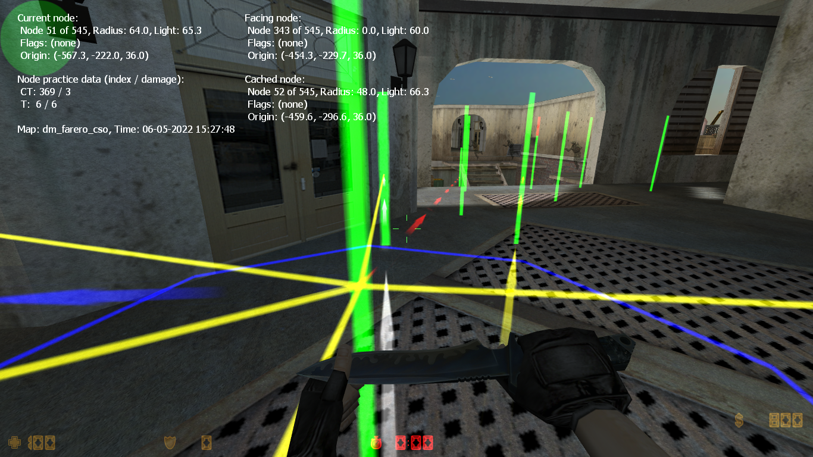

    Graph Editor viewport.

Adding waypoints
=========================

Adding a waypoint is really easy. Just walk to the position where you want a waypoint to be inserted, bring up your waypoint menu:

.. figure:: images/waypoint_menu_page1.png
    :align: center

    Waypoint Menu (Page 1).
	
To add a waypoint, simply select ``5. Add waypoint``. A new menu will appear, the "\ :green:`Waypoint Type`\ " menu. All waypoint types described below can be added by using this menu.

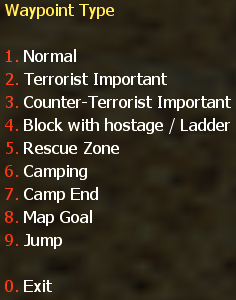

    Waypoint Type Menu.
	
Once you have selected a waypoint type from the "Waypoint Type" menu, you will hear a sound, and the selected waypoint will appear in the map, at the exact position where you stood when you pressed the key.

.. Note:: If you are standing while selecting a waypoint, a standing waypoint will be inserted. All bots will run or walk towards this waypoint normally. If you want bots to crouch when approaching a particular position, crouch down when inserting the waypoint. You will notice that the waypoint you just added is only about half as high as normally. As you inserted it when you were crouched down, it automatically carries a "\ :pink:`Crouch`\ " flag (see: Types Of Waypoints). Bots will now crouch automatically when trying to reach this waypoint.

Now that you know the basic method used to add a waypoint, let's have a closer look at the waypoint types that exist.

Types of Waypoints
=======================

Normal waypoints
---------------------

:green:`Normal` waypoints are the points you need in order to make bots walk through the map. They are used for navigation only and will not trigger any particular behaviour. You can add a :green:`Normal` waypoint by selecting ``1. Normal`` from the "\ :green:`Waypoint Type`\ " menu. :green:`The colour of Normal waypoints is green`, as you can see in the picture below.

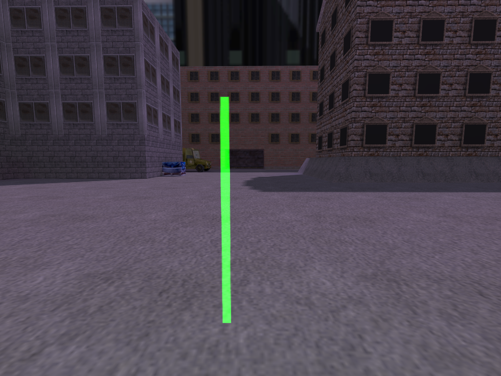

    Normal Waypoint.
	
Terrorist Important waypoints
---------------------------------

This type of waypoints can be navigated just as a :green:`Normal` waypoint by all bots, but it has one additional function. It marks strategically important points for a Terrorist team. Adding a :red:`Terrorist Important` point in a room will tell Terrorist bots to go to the room and check it frequently. You can add this type of waypoint by selecting ``2. Terrorist Important`` from the "\ :green:`Waypoint Type`\ " menu. :red:`The colour of Terrorist Important waypoints is green with red head`, as you can see in the picture below.

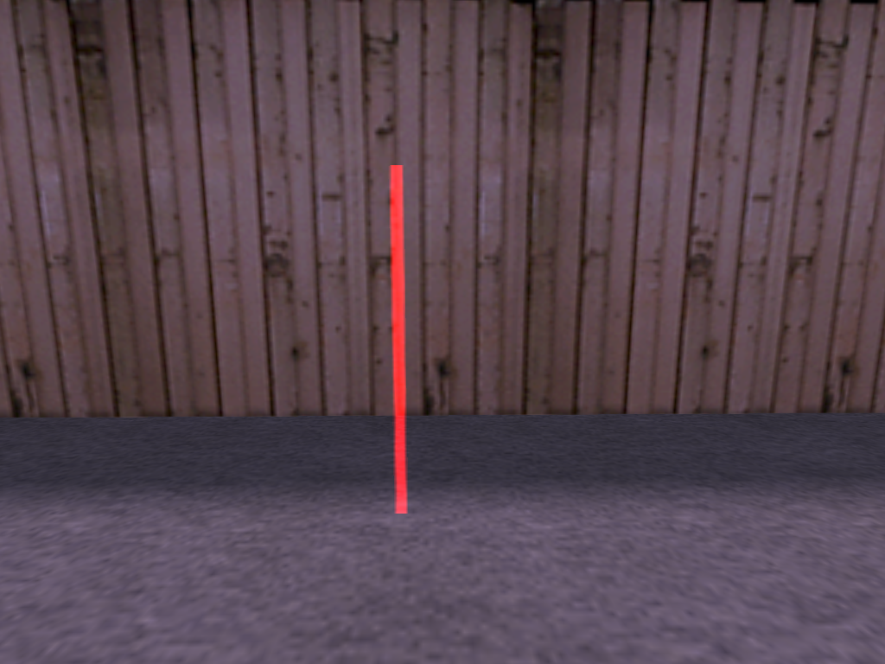

    Terrorist Important Waypoint.
	
.. important:: The use of :red:`Terrorist Important` points depends on the map type! Wherever the Terrorist team is the "defending" team (i.e. on As_ Cs_ type maps), :red:`Terrorist Important` points should be placed at key positions around the hostage area or VIP escape zone. For example, if the hostages are inside a building, :red:`Terrorist Important` points should be added behind each entrance to the building. Doing so will make the Terrorists check all entrances frequently and guard them. Do not place :red:`Terrorist Important` points far away on the other side of the map. After all, you don't want the Terrorists to abandon the hostages and rush planlessly through the map, now, do you? With the VIP escape zone, the same strategy applies, Make Terrorists guard the key routes to the escape zone by using :red:`Terrorist Important` waypoints. You :redbold:`DON'T` need to place :red:`Terrorist Important` points directly at the hostages. Terrorists will check on hostages anyway. On maps where the Terrorist team is "offensive" (i.e. De_ and Es_ type maps), :red:`Terrorist Important` waypoints should not be overused. The "offensive" team will try to reach the map goal waypoint anyway. The only useful function you can use important waypoints for is to make particular routes more attractive for the bots. For example, if there is a longer and more complicated, but safer and more surprising route to the map goal, bots may tend to underuse it a little. In such cases, placing one or two :red:`Terrorist Important` waypoints along this route can help.

Counter-Terrorist Important waypoints
----------------------------------------

The function of this waypoint type is exactly the same as the :red:`Terrorist Important` waypoint described above. The only difference is that a :blue:`Counter-Terrorists Important` waypoint obviously marks strategically important places for the :blue:`Counter-Terrorist (CT)` team. You can add this type of waypoint by selecting ``3. Counter-Terrorist Important`` from the "\ :green:`Waypoint Type`\ " menu. :blue:`The colour of Counter-Terrorist Important waypoints is green with blue head`, as you can see in the picture below.

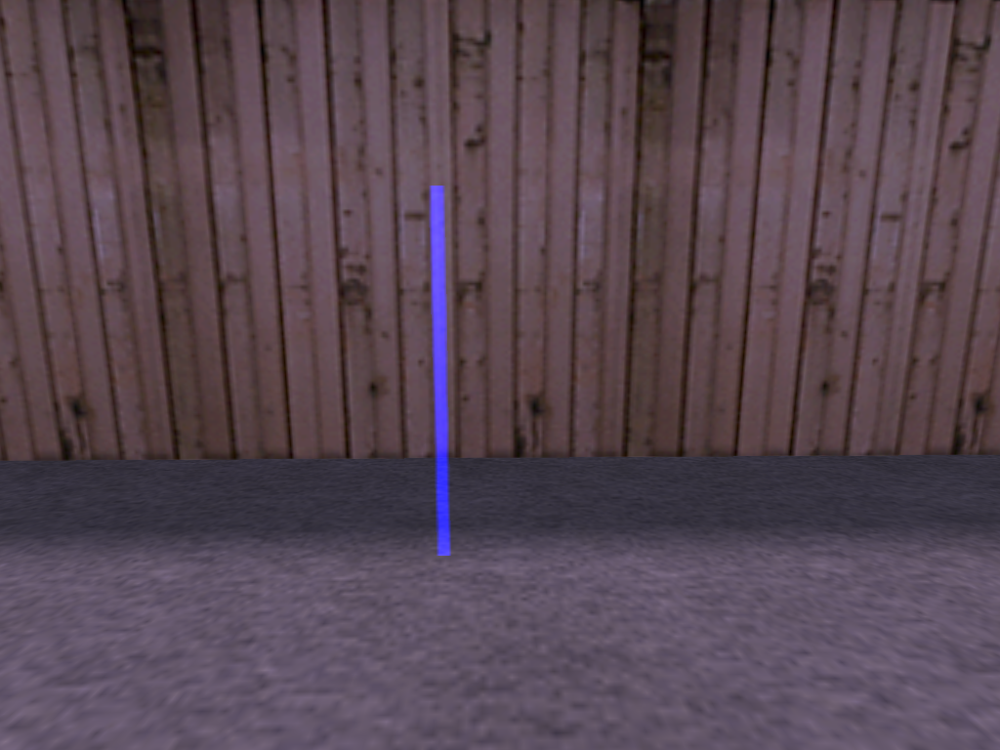

    Counter-Terrorist Important Waypoint.
	
.. important:: As with the other team specific waypoints, :blue:`Counter-Terrorist Important` waypoints should also be placed according to the map type. On maps where the Counter-Terrorist team is forced to move out and reach a certain goal - either hostages to rescue or a VIP escape zone to reach safely. :blue:`Counter-Terrorist Important` points can be useful to make a particular route more attractive. You :redbold:`DON'T` need to place :blue:`Counter-Terrorist Important` points near a map goal (hostages on CS_ maps, VIP escape zone(s) on As_ maps), Counter-Terrorist bots will go there anyway. It's the most important point for them, and adding several other important waypoints right next to it doesn't yield any benefit. On maps where the Counter-Terrosist team is in a defensive role (i.e. on De_ maps and Es_ maps), place :blue:`Counter-Terrorist Important` points at key positions around the bomb/escape zone(s) in order to make Counter-Terrorist bots defend all possible routes to the Terrorists map goal.

Ladder waypoints
--------------------

:chocolate:`Ladder` waypoints are only used for waypointing ladders, as you possibly guessed. To enable your bots to use a ladder, simply walk up to the ladder until you get "stuck" on it (you will see your crosshair grow wider once you are on the ladder). Now place one :chocolate:`Ladder` waypoint at the bottom of the ladder. Then climb up the ladder until you are almost completely over the edge. Place a second waypoint here and make sure that the two ladder waypoints are connected, (This should have happened automatically if the :chocolate:`Ladder` waypoints aren't too far away from each other, if not you can create a connection manually), That's all! You can add this type of waypoint by selecting ``1. Normal`` from the "\ :green:`Waypoint Type`\ " menu, it will automatically turn into a ladder waypoint if you are standing on ladder. Or choose ``4. Block with hostage / Ladder`` from the "\ :green:`Waypoint Type`\ " menu if it's a Hostage Rescue (CS_) scenario map so that bots don't miss the hostages when going up on ladders. :chocolate:`The colour of Ladder waypoints is brown`, as you can see in the picture below.

.. figure:: images/ladder_point.png
	:align: center
	
	Ladder waypoint
	
Some general hints and notes concerning ladder waypoints:
~~~~~~~~~~~~~~~~~~~~~~~~~~~~~~~~~~~~~~~~~~~~~~~~~~~~~~~~~~~~~~

#. Waypoint ladders AFTER you waypointed the areas above and below them! If you waypoint ladders first, all waypoints in reach of a ladder waypoint will be connected with it and have their radius reduced to zero automatically! It doesn't matter whether you place the top or the bottom :chocolate:`Ladder` waypoint first.
#. If the ladder is very long, you can place additional :chocolate:`Ladder` waypoints between the bottom and the top end.
#. The bottom waypoint will automatically get connected with the nearest waypoint, independent of current AutoPath Max Distance settings.
#. The top waypoint will usually get a connection towards it automatically, but you will have to add a connection leading away from it manually.
#. :chocolate:`Ladder` waypoints will always have a radius of zero, and this shouldn't be changed!

Rescue waypoints
--------------------

**Rescue** waypoints are only needed on Cs_ type maps (hostage rescue scenarios). They mark the zone where the Counter-Terrosist team must bring the hostages, the rescue zone. Place one of these waypoint inside each rescue zone there is. If there is only one, you only need one **Rescue** waypoint. Placing more points in one rescue zone is unnecessary bulk and will rather cause problems than improve anything.
A Counter-Terrorist bot that has succeeded in "activating" the hostages will determine the position of the nearest rescue point and lead the hostages there. When the bot has reached the rescue point, it will check if the hostages are really rescued and after max time about 5 seconds turn back to return to combat. Badly placed rescue points may lead to bots turning around before the hostages have really reached the rescue zone. As a consequence, the hostages will be left standing a few inches away from the rescue zone while the bot considers its mission as completed and turns back to fight, ignoring the deserted hostages. That's why you are advised to place a rescue waypoint well inside a rescue zone, not at its edges!
In the editor, rescue points will be displayed in bright white (see below). Their radius is set to zero by default and shouldn't be changed. All bots can use this waypoint type for :green:`Normal` navigation as well. You can add this type of waypoint by selecting ``5. Rescue Zone`` from the "\ :green:`Waypoint Type`\ " menu. **The colour of Rescue waypoints is white**, as you can see in the picture below.

.. figure:: images/hostage_rescue_point.png
	:align: center
	
	Hostage Rescue waypoint
	

Camp waypoints
------------------

As the name suggests, Camp waypoints are used to mark good sniper spots. They can be navigated by all bots. However, whether a bot may camp there or not is determined by the flag you can add to the camp waypoint. You can make Camp waypoints team specific or leave them "open" to any team. The colour of Normal Camp waypoints is cyan. Terrorist specific camp waypoints have cyan color with red head, Counter-Terrorist specific is cyan with blue head, as you can see in the picture below.

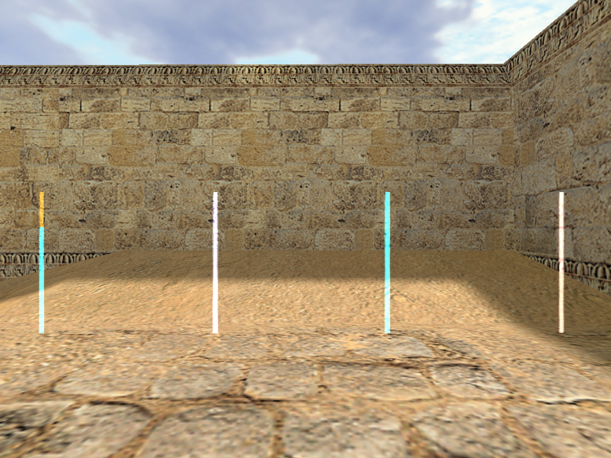
	
	From left to right. Sniper, Counter-Terrorist Specific, Normal and Terrorist Specific camp waypoints.
	
Although there are two entries in the "\ :green:`Waypoint Type`\ " menu ("\ :green:`Camping`\ " and "\ :green:`Camp end`\ "), the :cyan:`Camp` waypoint is in fact only one point. However, it carries two "markers" that tell a camping bot where to look while camping. When you are camping yourself, you will monitor a certain area. If you wanted to define this area, you could describe it as an angle. This angle would be specified by two lines going out from your position: One that marks the left edge and another one for the right edge. The monitored area would be between these two lines. The mentioned "markers" fulfill exactly this function. They are displayed as more or less horizontal beams going out from the top of a :cyan:`Camp` waypoint. :red:`The colour of Camp markers is red`, as you can see in the picture below.

.. figure:: images/camp_directions.png
	:align: center
	
	A crouched normal Camp waypoint with Camp start and Camp end markers (directions)

When a bot approaches the depicted :cyan:`Camp` waypoint, it will turn to face the direction of the Camp start marker first. Then it will scan the area between this marker and the Camp end marker by changing every few seconds the direction it is facing from one to the other. An enemy moving outside the two markers may escape the bot's attention, unless it hears the enemy coming. In the piture above, both markers are pointing to the same height. However, you can also specify different heights for each marker. This is very useful for making bots monitor a ramp, a slope, a stairway or other uneven surfaces.
So far, so good. But how to set a working camp waypoint? Follow these steps:

#. Go to the exact position where you want bots to camp (of course, a dark corner or similar locations are best suited for camping, but whom do I tell this?)
#. If you want bots to stand while they are camping, remain standing upright. If you want them to crouch while camping (more precise aiming!), crouch yourself while adding the point
#. Point your crosshair at the exact direction and height where you want your bots to start looking.
#. Bring up the "\ :green:`Waypoint Type`\ " menu and select ``6. Camping``. The :cyan:`Camp` waypoint itself will now be placed at your current position, and you will see the two marker beams going out from it. The Camp start marker will already be pointed at the direction you specified, the Camp end marker will still need some adjustment.
#. Now point your crosshair at the exact direction and height where you want your bots to end their monitoring.
#. Once again, open the "\ :green:`Waypoint Type`\ " menu, but now select "7. Camp end". You will see that the Camp end marker will now be pointed at the direction you specified.

That's it! Unless you want to make your :cyan:`Camp` waypoint team specific or add another flag (see: Waypoint Flags section), you are done! In fact, it sounds much more complicated than it actually is.

Some quick notes and hints about Camp waypoints:
~~~~~~~~~~~~~~~~~~~~~~~~~~~~~~~~~~~~~~~~~~~~~~~~~~~~

#. You can alter Camp start and Camp end markers as often as you want. As soon as you are near an existing :cyan:`Camp` waypoint (i.e. as soon as its waypoint stats are shown in the upper left corner of your HUD), Bring up the "\ :green:`Waypoint Type`\ " menu and selecting ``6. Camping`` or ``7. Camp end`` will :redbold:`NOT` add a new waypoint. Instead, it will readjust the Camp start and/or Camp end marker(s) of the nearby :cyan:`Camp` waypoint to the new direction you specified.
#. Thus, if you want to place two :cyan:`Camp` waypoints closely together, make sure that the waypoint stats of the first one have disappeared from your HUD before you set the second one. If the stats of the first waypoint are still visible, you will accidentally modify the Camp start and Camp end markers of that waypoint instead of inserting a new point.
#. Don't place :cyan:`Camp` waypoints in strategically irrelevant areas, or you will see bots having a situation totally unimportant areas while their team mates are under heavy attack.
#. Provide the "defending" team with some nice sniper spots near the map goal! In general, if you make team-specific :cyan:`Camp` waypoints, make more for the defending team than for the attacking team.

Map Goal waypoints
---------------------

This waypoint type obviously indicates the :purple:`Map Goal`.

On an As_ map, the :purple:`Map Goal` waypoint tells the bots where the VIP escape zone is. Make sure the escape zone symbol is visible on your HUD when you place a map goal waypoint there. Otherwise the VIP may end up reaching the point and running away again just like you would do with **Rescue** waypoints.
On a Cs_ map, the :purple:`Map Goal` waypoint marks the position of the hostages. It is :redbold:`NOT` necessary to place one :purple:`Map Goal` waypoint per hostage. Unless the hostages are standing really far away from each other, one point per hostage group will perfectly do.
On a De_ map, the :purple:`Map Goal` waypoint marks the bomb spots. It must be placed somewhere inside the bomb zone, i.e. the bomb icon must be blinking on your HUD when you place such a waypoint. In contrast to Cs_ maps, on De_ maps it makes sense to set various goal waypoints in one bomb zone. This will enable bots to choose from several spots to plant the bomb and make them less predictable.

.. note:: On Es_ maps, the :purple:`Map Goal` waypoint marks the escape zone for the Terrorists. You can follow the same rules as for As_ maps. Now you may wonder how to determine the exact function of a the :purple:`Map Goal` waypoint. Don't worry, this is entirely map specific, you don't have to do anything about it. All bots of both participating teams will automatically know what the the :purple:`Map Goal` is, they only need the point to guide them there. You can add this type of waypoint by selecting ``8. Goal`` from the "\ :green:`Waypoint Type`\ " menu. :purple:`The colour of Goal waypoints is purple`, as you can see in the pictures below.

Examples of Goal Waypoints
~~~~~~~~~~~~~~~~~~~~~~~~~~~~~~

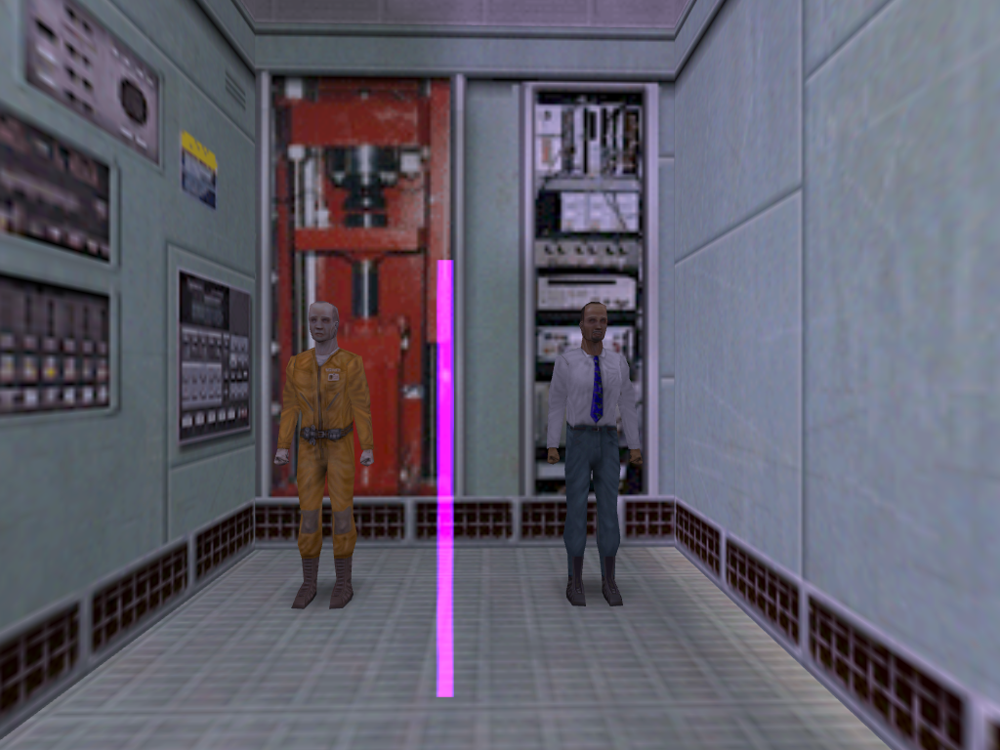

    Hostage Goal Waypoint (map cs_assault)

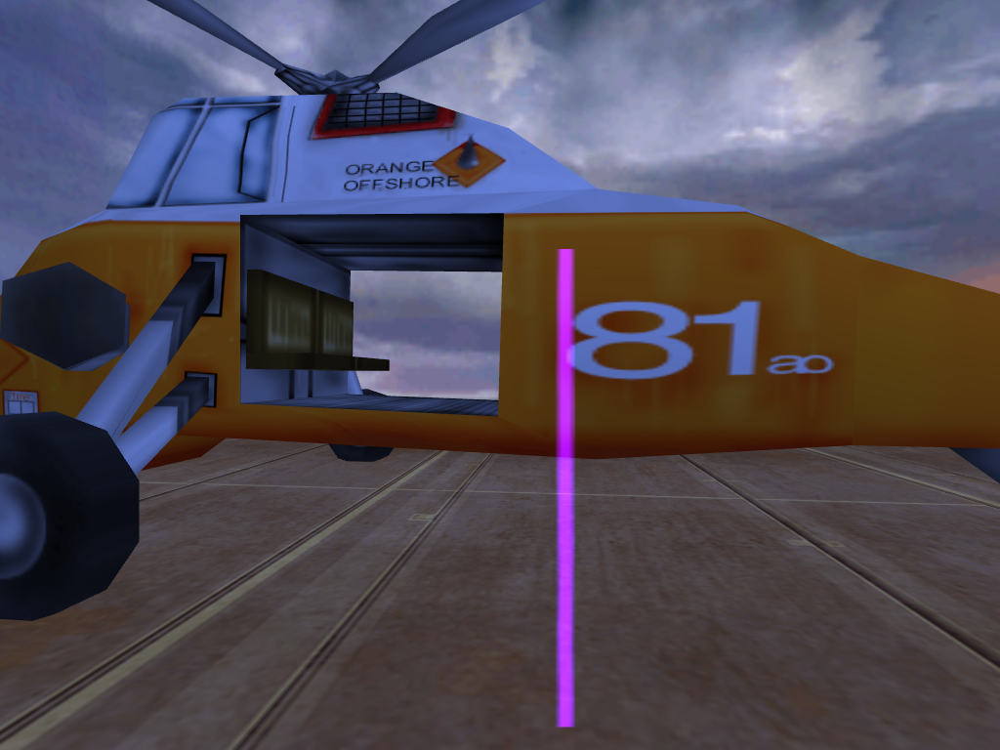

    VIP Escape Goal Waypoint (map as_oilrig)

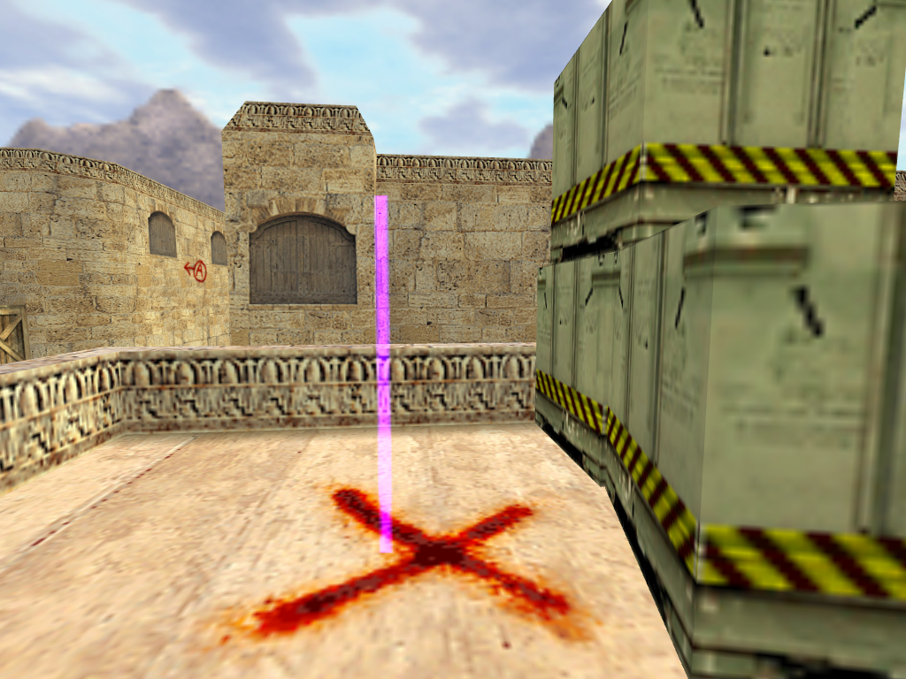

    Bomb place Goal Waypoint (map de_dust2)

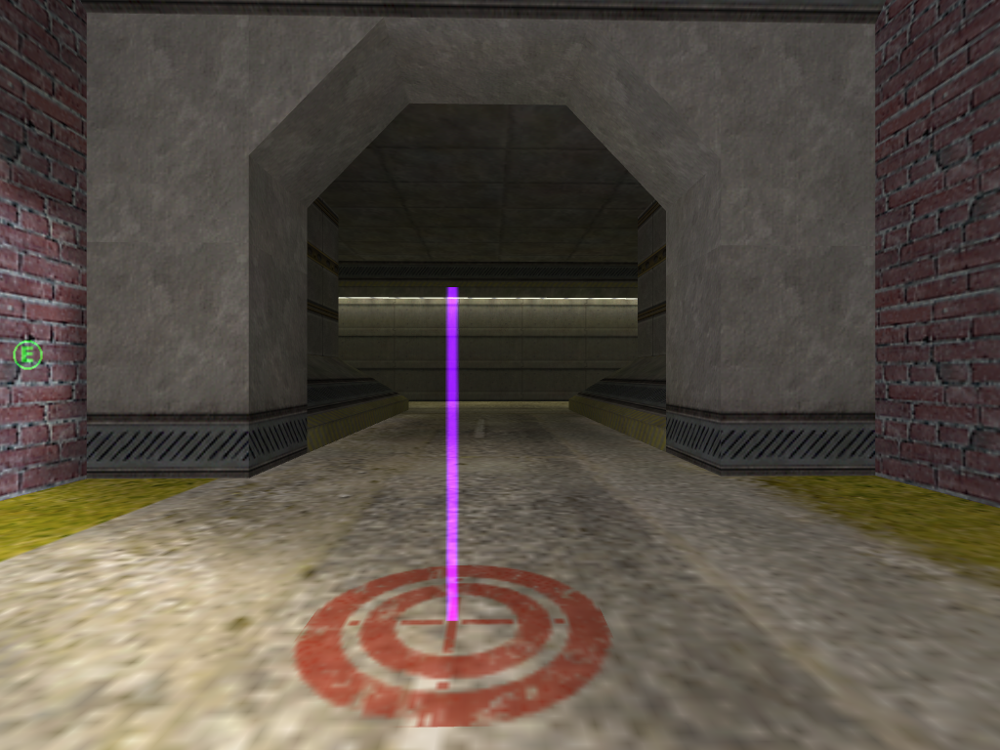

    Terrorists escape Goal Waypoint (map es_trinity)

Jump Connections
-----------------------

:red:`Jump` is not actually a waypoint but a connection between waypoints. (see: Waypoint Connections)

So now we've seen what type of waypoints the bots use, we can see how we can string these waypoints together to make a giant web to cover the map with.

The Radius
===============

The :blue:`Radius` of a waypoint is indicated by blue polygon that go out in all directions from the position of a waypoint. The photo below was taken from above, we are looking down onto a waypoint, and you can see :blue:`the colour of a Radius is Blue`, as you can see in the picture below.

.. figure:: images/wayzone_radius.png
    :align: center

    Waypoint Radius
    
The :blue:`Radius` indicator are a great mean to see how big the radius of a waypoint actually is, it ends exactly where the corners end.
What does the :blue:`Radius` actually do? It tells the bots how exactly they must navigate around the waypoint in question. If a bot walks past a row of waypoints with big radius, it will know that super-exact navigation is not required. If the radius are small, the bot will stick strictly to the waypoints.
Thus, in open areas big radius help to make bot navigation natural - you wouldn't want to see a bot run across a wide courtyard as if it was following an incredibly thin, straight line painted onto the ground, now, would you? It looks much more natural if the bot takes advantage of the space he has around him.
However, in narrow corridors and doorways or on bridges, the situation is different, too big radius would make bots too careless, they would bump into walls or even fall off a bridge because they think they can walk anywhere inside that big radius!
That's why choosing appropriate waypoint radius is so important. As a general rule, keep the radius big in open areas and make them small in narrow passages. Read the following section to learn how:

Setting or Changing the Radius:
----------------------------------

The good news first: You don't have to set every single :blue:`Radius` manually, the editor will do much of the work for you! It will automatically calculate the :blue:`Radius` of a waypoint depending on the area around it. If the editor detects higher (~more than knee-high) obstacles like walls nearby, it will automatically adjust the :blue:`Radius` to reach up to the wall, not further. However, the maximum :blue:`Radius` is limited to 128 units. This means that even on a totally open plain, where the nearest obstacle is hundreds of distance units away, the :blue:`Radius` will not exceed 128.

Now you might wonder "Well, if the editor does all this for me, why would I change radius by hand?" The answer is simple,the editor helps, but it isn't perfect, it cannot detect all kinds of obstacles (I can't go too much into detail here because all this is pretty much map-related). Anyway, you will see places where the radius cuts into an obstacle - it could be a very thin pillar, a fence, or even a solid-looking car that's parked in the streets... as I said, it depends on how the mapper built these elements.
Another problem is not with walls, but with holes and cliffs, If there is no high obstacle, the editor will regard an area as clear and set a big radius, it doesn't care if right next to the waypoint there's a yawning abyss where bots will fall to death!
So these are areas where you will have to keep a watchful eye on your radius and if necessary, change them by hand. In narrow corridors and especially around narrow doorways, you will see that even a small radius calculated by the editor doesn't make the bots navigate precisely enough. In such places, I strongly recommend lowering the radius to zero.
In order to change the radius of a waypoint, bring up the waypoint menu and select "\ :green:`8. Set Radius`\ ". The following menu will appear:

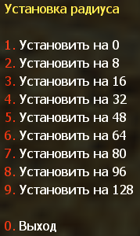

    Waypoint Radius Menu

Simply select an option by pressing the corresponding key, and the radius of the currently active waypoint will be changed to the selected value. You will quickly get a feeling for these numbers if you play around with them a bit.

Waypoints with fixed radius
~~~~~~~~~~~~~~~~~~~~~~~~~~~~~~

.. note:: Some waypoint types will always have, and require, a radius of zero. The radius of these waypoint types :redbold:`should NOT be changed!` The types with fixed radius are: :chocolate:`Ladder`, Rescue, :cyan:`Camp` (no matter if team specific or not) and :purple:`Map Goal`.

Connecting Waypoints
=======================

Waypoints alone aren't sufficient to make bots move the way you want. They must be connected with other waypoints in order to let bots reach their goal. By default, connections up to a certain distance will be made automatically.
You can select the automatic connection distance (AutoPath Max Distance, APMD) by bringing up the waypoint menu and selecting "7. Set Autopath Distance". The following sub-menu will appear:

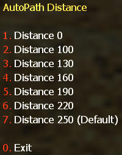

    Autopath Distance Menu

Select the desired distance from this menu. After selecting a distance, connections up to that distance will be drawn automatically, of course, you can also add and remove connections manually. However, this needs a little bit more explanation, and it's better to explain if you know the different connection types.
So let's first have a look at these - afterwards you can read how to add and remove such connections by hand.

Two-way (bidirectional) connections
-------------------------------------------

The vast majority of all connections in a waypoint set will be :gold:`bidirectional`. Obviously, these connections enable bots to walk both from point A to point B and back from point B to point A. :gold:`The colour of bidirectional paths is yellow`, as you can see in the picture below.

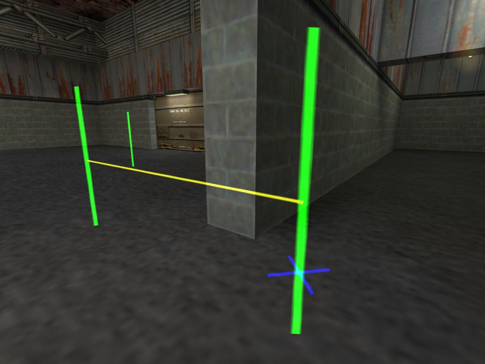

    A 2-Way connection between the two depicted waypoints.

One-way connections
---------------------------

One-way connections enable bots to walk from point A to point B, but not vice versa. They can be useful to make bots drop down a wall or a high crate, but prevent them from attempting to get up. Of course, there may be more places at which a 1-way connection can make sense, but that depends on the map.
In game, 1-way connections will be visible from 2 waypoints, their start and their end waypoint. In order to show you the direction of 1-way connection, it will be shown in different colours depending on from which perspective you view it. Let's say you have a 1-way connection from point 1 to point 2. In this case, when you are standing at point 1, you will see :green:`the outgoing 1-way connection displayed in green` as you can see in the picture below.

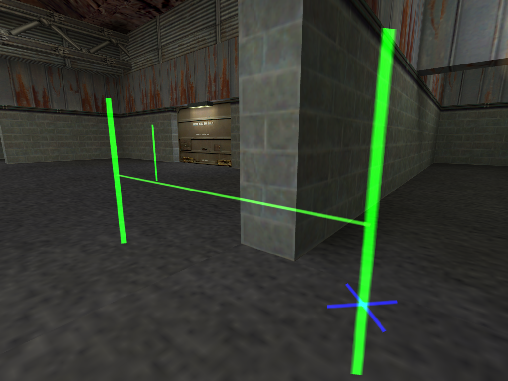

    An Outgoing 1-Way connection from right to left waypoint.

The picture below shows the same two waypoints with the incoming connection (from left to right waypoint), The incoming 1-way connection displayed in white as you can see in the picture below.

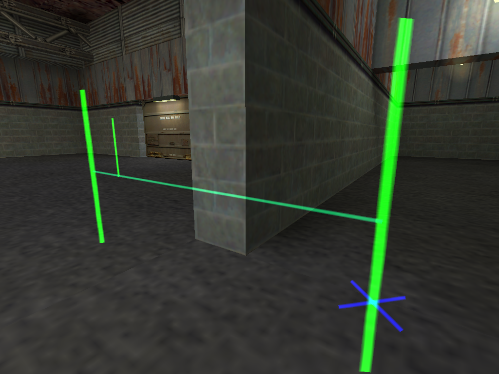

    An Incoming 1-Way connection from left to right waypoint.

.. note:: If you created an :green:`outgoing path connection` from waypoint A to waypoint B, it will be displayed in green. And when you get to waypoint B, the path connection will turn white like an incoming path connection.

The fact that 1-way connection are shown from both involved points is a great feature. It makes spotting errors very easy and saves you the trouble of running around to check if there is a connection TO the point where you are standing.

Jump connections
----------------------

:red:`Jump` connections are a bit special as they cannot be drawn like any other connection. But that's not all, apart from that, :red:`Jump` connections can also be :redbold:`one-way or two-way connections`. To make matters even more complex, their 2-way version can come in two flavours: A "pure" two-way jump connection, i.e. a :red:`Jump` connection from A to B and another :red:`Jump` connection back from B to A or a "mixed" two way connection, with a :red:`Jump` connection leading from A to B and a regular one-way connection back from B to A. The latter version will be very rare, though. Now once again, this sounds more complicted than it actually is.
:red:`The Jump connection horizontal line displayed in red(Outgoing Jump connection)`, viewed from the waypoints where the bots will start their jump can be seen in the picture below.

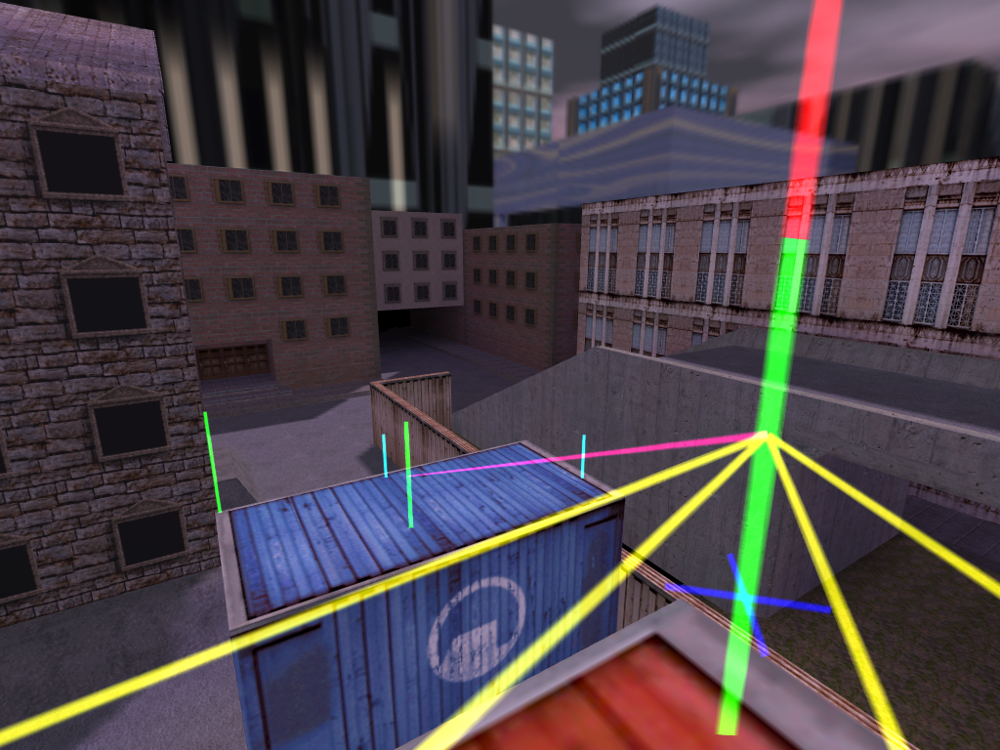

    An Outgoing Jump connection

Adding/Removing connections manually
============================================

Now you know the most important things about connections in general and the different types of connections. You also know how to adjust automatic connection lengths and how to add a jump connection by hand. But how do you add or remove a connection by hand?
You simply aim at the desired waypoint and select the action to perform from the on-screen menu!

Here's how it works (Look at the screenshot below), let's pretend we wanted to delete the connection from the waypoint where we're standing to the left waypoint near the wall, aim at the waypoint with your crosshair. As soon as the waypoint is selected, it will become bigger, and a little arrows will appear in front of it.

.. note:: This only works if you are standing near a waypoint and aiming at another one! If you are standing in a waypointless area, you won't be able to use this function because it needs two selected waypoints (The one where you are standing and the one you are aiming at).

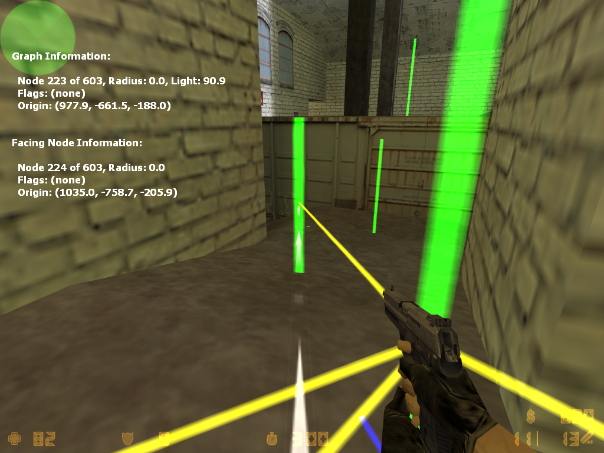

    The left selected waypoint

Removing path connections
------------------------------

To delete a path connection, you must open the waypoint menu and select ``4. Delete path``. 

After deleting the path connection, you may notice that the :green:`outgoing path connection` has been removed (from the waypoint where you are standing to the waypoint you selected) as you can see in picture below:

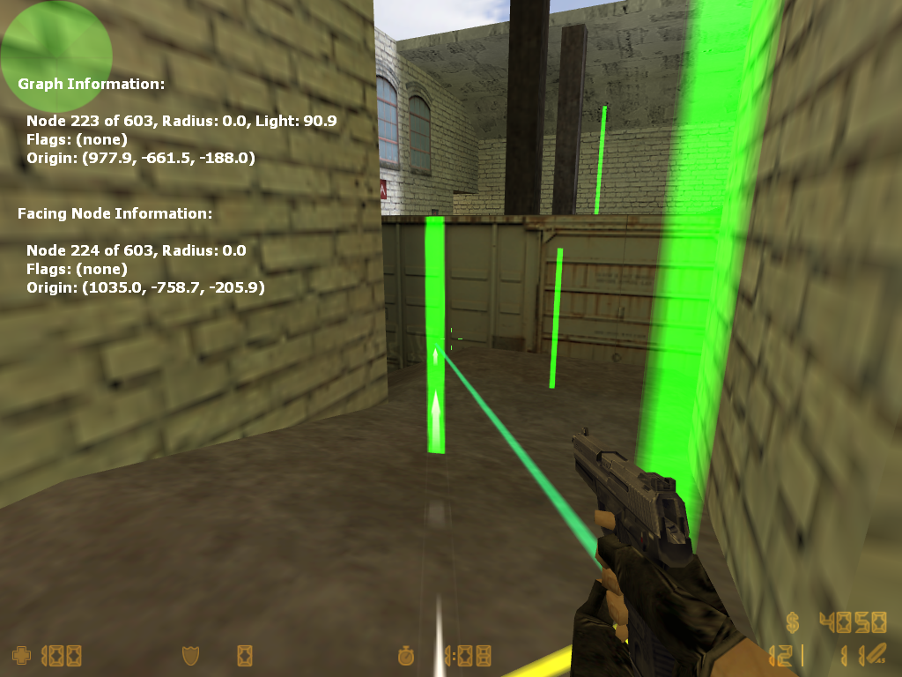

    Removed :green:`outgoing path connection`, only incoming path connection remains (from the selected waypoint to the waypoint you are standing on)

Select ``4. Delete path`` again to delete the incoming path connection.

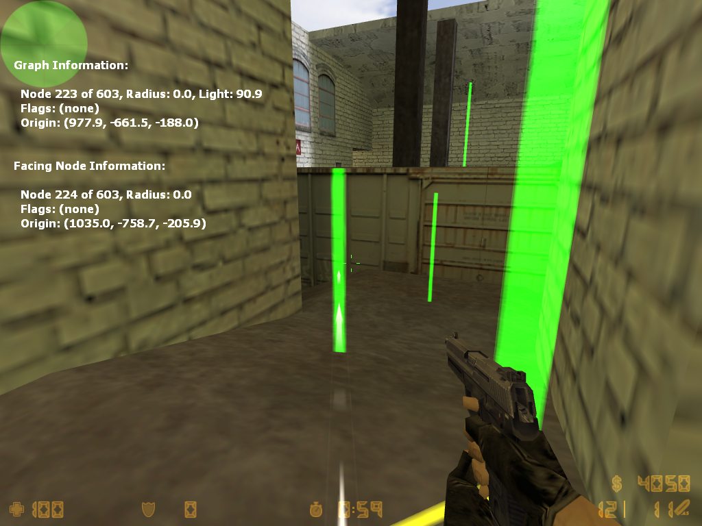

    Fully deleted path connection

    As you have already noticed, all path connections have been removed from the waypoint you are standing on to the selected waypoint.

Adding path connections
---------------------------

To add a path connection, you must open the waypoint menu and select ``3. Create path``. Then a menu should appear as shown in the picture below.

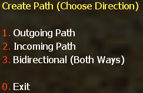

    Path directions menu

#. Select ``1. Outgoing Path`` to create an outgoing path connection from the waypoint you are standing on to the waypoint you selected.
#. Select ``2. Incoming Path`` to create an incoming path connection from the waypoint you selected to the waypoint you are standing.
#. Select ``3. Bidirectional (Both Ways)`` to create a bi-directional (2-way) path connection between the waypoint you are standing on and the waypoint you select.

Waypoint Flags
=========================

YaPB has 5 flags for waypoints, which are:

#. Block with Hostage - a flag that prohibits Counter-Terrorists leading hostages to go along certain waypoints marked with these flags. :redbold:`Important: you should definitely put these flags on the ways where counter-terrorists can lose hostages!`
#. Terrorist Specific - makes waypoint important for Terrorists
#. CTs Specific - makes waypoint important for Counter-Terrorists
#. Use Elevator - a flag for a waypoint that makes bots wait while they uplift on the elevator (you must put this flag on the waypoint at the beginning and at the end of the elevator path)
#. Sniper Point - a flag that makes the camp point as a sniper point (bots will only camp with sniper rifles).

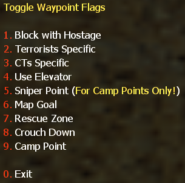

    Waypoint Flags Menu
