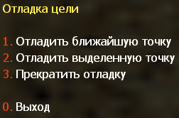

************************************
Инструкция по созданию вэйпоинтов
************************************

.. include:: .fontstyles.rst

Краткая информация
==========================

Вэйпоинты, что это такое?
--------------------------

В отличие от людей, боты не могут видеть карту и анализировать то, что они видят.  Если вы видите здание с дверью, вы можете подойти прямо к двери, открыть её и войти в здание.
Боты не могут сделать это без посторонней помощи! Они могут видеть врагов и сражаться с ними или реагировать, если на них нападают. Эти способы поведения работают без какой-либо внешней помощи. Но для того, чтобы ориентироваться на карте и безопасно перемещаться по всем путям и переходам, им действительно нужна помощь. Им нужно что-то, что говорило бы им, куда они могут пойти, а куда нет. Им нужно что-то, что показывает им, где находится лестница или где цель миссии (зона побега/заложники/место закладки бомбы). Это делается с помощью вэйпоинтов. Вы можете представить себе вэйпоинты, похожие на флаги на лыжной трассе. Каждый вэйпоинт отмечает точку, куда могут идти боты. Если два из них связаны друг с другом, бот может переходить из одной точки в другую и обратно. Итак, что вы делаете, когда вы расставляете вэйпоинты по карте, в основном размещаете целую сеть точек на карте и соединяете их таким образом, чтобы боты могли перемещаться из одной точки в другую. Все точки должны быть размещены в областях, доступных для игроков, и если вы хотите, чтобы ваши боты перемещались плавно и безопасно, вы также должны следить за соединениями. Если соединения проходят сквозь стены или над глубоким оврагом, ваши боты натыкаются на стены или падают насмерть.
Есть несколько типов вэйпоинтов, которые можно использовать для обозначения целей на карте, зон спасения, хороших мест для кемпинга, лестниц и т. д. Существуют также различные типы соединений, односторонние или двусторонние, а также прыговые соединения, которые заставляют бота прыгнуть с точки А до точки Б вместо того, чтобы идти или бежать туда. Мы вернемся к этому позже.

Кроме того, вам не нужно беспокоиться о каждой мелочи. Редактор, поставляемый с этой версией бота, сделает за вас большую часть работы, кроме того, он графический и простой в использовании (без навыков программирования/кодинга или чего-либо еще). Вы можете очень хорошо обнаружить, что создание вэйпоинтов может быть забавным, особенно когда вы видите, что боты без проблем перемещаются по всей карте и вы сделали это возможным!

.. Note:: Начиная с версии YaPB 2.10, был добавлен новый формат вэйпоинтов названный **Graph**. Благодаря этому, ограничение точек было повышено до 2048, направления кемперских точек теперь могут настраиватся по вертикали, а не только по горизонтали и понижен размер вэйпоинт файлов. YaPB также продолжает поддерживать старый **PWF** формат. Вы можете сохранять вэйпоинты в pwf формат, но они будут автоматически сконвертированы в graph формат когда загружены. Вэйпоинты (разноцветные полосы) теперь называются **Точки** начиная с версии YaPB 4.x. Редактор вэйпоинтов также был переименован в редактор графов.

Как выглядят вэйпоинты в игре?
----------------------------------------

Когда вы играете в обычную игру на карте с вэйпоинтами, вэйпоинты, конечно, будут невидимы, чтобы они никоим образом не отвлекали и не раздражали вас.
Когда редактирование вэйпоинтов активировано (см .: Как я могу получить доступ к редактору вэйпоинтов? Инструкции о том, как это сделать ниже), вы увидите вэйпоинты в виде вертикальных полос примерно на высоте стоящего игрока. Цвет обычных вэйпоинтов зелёный, но вы также можете видеть белые, фиолетовые, красные, синие и голубые вэйпоинты. Эти цвета указывают на особые вэйпоинты, некоторые из которых уже упоминались в последнем абзаце. Если вы видите вэйпоинты, которые намного меньше других, это вэйпоинты для приседания. Они заставят ботов приседать при приближении к ним. Такие вэйпоинты необходимы, чтобы вести ботов через вентиляцию или любые другие низкие и узкие проходы.
Соединения между вэйпоинтами отмечены горизонтальными линиями, ведущими от центра одного вэйпоинта к другому. Они тоже существуют в разных цветах. Вы можете увидеть желтые, белые, красные и бирюзовые линии. Не волнуйтесь, если все эти разные цвета сейчас вас сбивают с толку - на самом деле это очень просто, это очень помогает, если вы видите несколько вэйпоинтов на экране.
Теперь вы знаете, что такое вэйпоинты и соединения, для чего они нужны и как они выглядят, вы можете войти в режим редактирования и убедиться в этом сами.

Как я могу получить доступ к редактору вэйпоинтов?
----------------------------------------------------

Редактор вэйпоинтов это не отдельная программа, он включён в dll бота (или .so, если вы используете linux). Чтобы открыть его, создайте игру в LAN/Listen Server, выберите карту для которой вы хотите создать вэйпоинты и запустите игру как обычно. Как только вы окажетесь на карте, вы можете активировать режим редактирования с консоли, набрав ``yb graphmenu``, или, если вы связали для него клавишу, просто нажмите на эту клавишу.

Сводка консольных graph команд
------------------------------------

Доступны следующие Graph команды (заметьте, что они ЧУВСТВИТЕЛЬНЫ к регистру):
   +---------------------------+--------------------------------------------------------------------------------------------------------------------------------+
   | ``yb g on``               | Включает отображение точек.                                                                                                    |
   +---------------------------+--------------------------------------------------------------------------------------------------------------------------------+
   | ``yb g off``              | Выключает отображение точек.                                                                                                   |
   +---------------------------+--------------------------------------------------------------------------------------------------------------------------------+
   | ``yb g on auto``          | Включает автоматическую расстановку точек (см. ниже).                                                                          |
   +---------------------------+--------------------------------------------------------------------------------------------------------------------------------+
   | ``yb g off auto``         | Выключает автоматическую расстановку точек (см. ниже).                                                                         |
   +---------------------------+--------------------------------------------------------------------------------------------------------------------------------+
   | ``yb g on models``        | Включает отображение моделей игроков на точках спавна.                                                                         |
   +---------------------------+--------------------------------------------------------------------------------------------------------------------------------+
   | ``yb g off models``       | Выключает отображение моделей игроков на точках спавна.                                                                        | 
   +---------------------------+--------------------------------------------------------------------------------------------------------------------------------+
   | ``yb g on noclip``        | Включает редактирование точек с noclip читом. Это позволяет вам лететь и не соприкосаться со стенами.                          |
   +---------------------------+--------------------------------------------------------------------------------------------------------------------------------+
   | ``yb g off noclip``       | Выключает редактирование точек с noclip читом.                                                                                 |
   +---------------------------+--------------------------------------------------------------------------------------------------------------------------------+
   | ``yb g add``              | Добавляет точку в текущем местоположении игрока. Появится меню, в котором вы должны выбрать разные типы точек.                 |
   +---------------------------+--------------------------------------------------------------------------------------------------------------------------------+
   | ``yb g addbasic``         | Добавляет основные точки на карте, такие как точки спавна, цели и лестницы.                                                    |
   +---------------------------+--------------------------------------------------------------------------------------------------------------------------------+
   | ``yb g cache``            | Запоминает ближайшую к игроку точку.                                                                                           |
   +---------------------------+--------------------------------------------------------------------------------------------------------------------------------+
   | ``yb g clean``            | Очищает бесполезные путевые соединения со всех или с одной точки.                                                              |
   +---------------------------+--------------------------------------------------------------------------------------------------------------------------------+
   | ``yb g delete``           | Удаляет ближайшую к игроку точку (см. ниже).                                                                                   |
   +---------------------------+--------------------------------------------------------------------------------------------------------------------------------+
   | ``yb g erase``            | Удаляет файлы опыта ботов и графов с жёсткого диска.                                                                           |
   +---------------------------+--------------------------------------------------------------------------------------------------------------------------------+
   | ``yb g flags``            | Позволяет вам вручную добавлять/удалять флаги на точке.                                                                        |
   +---------------------------+--------------------------------------------------------------------------------------------------------------------------------+
   | ``yb g setradius x``      | Вручную настраивает радиус путевой зоны для этой точки на значение x.                                                          |
   +---------------------------+--------------------------------------------------------------------------------------------------------------------------------+
   | ``yb g teleport x``       | Телепортирует игрока к указанной в значении x точке.                                                                           |
   +---------------------------+--------------------------------------------------------------------------------------------------------------------------------+
   | ``yb g stats``            | Показывает количество различных точек которые вы уже поставили.                                                                |
   +---------------------------+--------------------------------------------------------------------------------------------------------------------------------+
   | ``yb g fileinfo``         | Показывает базовую информацию о graph файле.                                                                                   |
   +---------------------------+--------------------------------------------------------------------------------------------------------------------------------+
   | ``yb g adjust_height``    | Изменяет высоту (z-компонент) всех точек с указанным смещением.                                                                |
   +---------------------------+--------------------------------------------------------------------------------------------------------------------------------+
   | ``yb g check``            | Проверяет правильность всех путевых соединений.                                                                                |
   +---------------------------+--------------------------------------------------------------------------------------------------------------------------------+
   | ``yb g load``             | Загружает точки из graph файла (см. ниже).                                                                                     |
   +---------------------------+--------------------------------------------------------------------------------------------------------------------------------+
   | ``yb g save``             | Сохраняет текущие точки в файл (см. ниже).                                                                                     |
   +---------------------------+--------------------------------------------------------------------------------------------------------------------------------+
   | ``yb g save nocheck``     | Сохраняет текущие точки в файл без проверки.                                                                                   |
   +---------------------------+--------------------------------------------------------------------------------------------------------------------------------+
   | ``yb g upload``           | Загружает созданный graph файл в базу данных графов.                                                                           |
   +---------------------------+--------------------------------------------------------------------------------------------------------------------------------+
   | ``yb g menu``             | Показывает меню редактора графов. Также доступно через алиас ``yb graphmenu``                                                  |
   +---------------------------+--------------------------------------------------------------------------------------------------------------------------------+
   | ``yb g path_set_autopath``| Открывает меню для настройки максимальной дистанции автопути.                                                                  |
   +---------------------------+--------------------------------------------------------------------------------------------------------------------------------+
   | ``yb g path_create``      | Открывает меню создания путей.                                                                                                 |
   +---------------------------+--------------------------------------------------------------------------------------------------------------------------------+
   | ``yb g path_delete``      | Удаляет путь от кэшированной (или выбранной) до ближайшей точки.                                                               |
   +---------------------------+--------------------------------------------------------------------------------------------------------------------------------+
   | ``yb g path_create_in``   | Создание входящего путевого соединения от кэшированной (выбранной) до ближайшей точки.                                         |
   +---------------------------+--------------------------------------------------------------------------------------------------------------------------------+
   | ``yb g path_create_out``  | Создание исходящего путевого соединения от ближайшей до кэшированной (выбранной) точки.                                        |
   +---------------------------+--------------------------------------------------------------------------------------------------------------------------------+
   | ``yb g path_create_both`` | Создание двухстороннего путевого соединения между кэшированной (выбранной) и ближайшей точкой.                                 |
   +---------------------------+--------------------------------------------------------------------------------------------------------------------------------+
   | ``yb g iterate_camp``     | Позволяет переходить по всем кемперским точкам на карте.                                                                       |
   +---------------------------+--------------------------------------------------------------------------------------------------------------------------------+
   | ``yb g acquire_editor``   | Получает права на редактирование графов на выделенном сервере. (см. ниже)                                                      |
   +---------------------------+--------------------------------------------------------------------------------------------------------------------------------+
   | ``yb g release_editor``   | Снимает права на редактирование графов.                                                                                        |
   +---------------------------+--------------------------------------------------------------------------------------------------------------------------------+

Чтобы использовать graph команды, вы должны использовать консоль. Нажмите клавишу ``~`` чтобы открыть консоль. Вводите консольные команды которые пожелаете, затем снова нажмите клавишу ``~`` чтобы вернуться в игру.

Использование graph команд
================================

Использование ``yb g delete`` удалит вэйпоинт ближайший к игроку. Вэйпоинт ДОЛЖЕН быть в пределах 50 юнитов от игрока (примерно 1/2 роста игрока), чтобы его можно было удалить. Вам нужно будет встать достаточно близко к вэйпоинту, чтобы его можно было удалить. Это предотвратит случайное удаление вэйпоинта на другой стороне комнаты. При удалении вэйпоинта вы услышите звук, указывающий на то, что вэйпоинт был удалён (тот же звук, который издает мина, когда ставится на стену).

Использование ``yb g save`` сохранит данные вэйпоинтов в graph файл. Graph файл будет иметь то же имя, что и текущая карта, с расширением ``.graph``. Файл будет сохранен в папке ``cstrike/addons/yapb/data/graph``. Ваше текущее имя игрока будет сохранено как имя автора graph файла.

Вы также можете сохранить вэйпоинт в ``.pwf`` формате для старых версий YaPB или PODBot написав в консоли ``yb g save old``. Обратите внимание, что вы можете сохранить вэйпоинт в этом формате только тогда, когда количество точек не превышает 1024.

Использование ``yb g load`` удалит все вэйпоинты на текущей карте и загрузит их из graph файла в папке graph. Это хороший способ "отменить" несколько вэйпоинтов, которые вы создали, но не хотите сохранять. Невозможно ``отменить`` один вэйпоинт. Вам нужно будет использовать команду ``yb g delete`` для удаления вэйпоинтов один за другим.

Команда ``yb g on auto`` позволяет вам автоматически добавлять вэйпоинты когда вы бегаете по карте. Когда вы бегаете вокруг карты, вэйпоинты будут автоматически расставляться на каждые 200 юнитов. Вэйпоинт не будет ставиться если уже есть другой вэйпоинт в пределах 200 юнитов от вашей текущей позиции. Поэтому, если вы хотите разместить множество вэйпоинтов достаточно близко друг к другу, возможно, вам придется вручную разместить некоторые вэйпоинты используя команду ``yb g add``. Автоматическая расстановка вэйпоинтов отслеживает куда был поставлен последний вэйпоинт (вручную или из автовэйпоинта) и разместит другой вэйпоинт, когда вы находитесь на расстоянии 200 юнитов от последнего вэйпоинта. Если вам не нравится куда автовэйпоинт поставил вэйпоинт и хотите его немного переместить, вы можете удалить его используя ``yb g delete`` (но вам нужно будет выключить автовэйпоинт заранее, так как в ином случае он поставит вэйпоинт на том же месте).

При использовании автовэйпоинта старайтесь оставаться в центре узких проёмов и всегда размещайте вэйпоинты с ОБЕИХ сторон двери. Возможно, вам придётся разместить некоторые из этих вэйпоинтов вручную, используя ``yb g add``, поскольку такие места, как узкие переулки, дверные входы и выходы обычно не попадают точно в то место, где автовэйпоинт хотел бы разместить вэйпоинт.

Каждый раз, когда вы приближаетесь к вэйпоинту, желтые или зелёные линии будут нарисованы ко всем другим вэйпоинтам, которые бот будет считать "достижимыми". Если соединение является двухсторонним, линия отображается желтым цветом, а односторонние соединения отображаются зелёным цветом. Эти "достижимые" вэйпоинты будут вэйпоинтами, которые чётко видны из текущего местоположения. Определённые вэйпоинты не будут считаться как достижимые по той или иной причине. Например, вэйпоинты, висящие в воздухе над ботом, не будут считаться достижимыми, поскольку бот не может прыгнуть достаточно высоко, чтобы добраться до них. Также не будут считаться достижимыми вэйпоинты, расположенные слишком далеко от текущего местоположения. У вас могут быть вэйпоинты, расположенные достаточно близко друг к другу, но с широким промежутком, который будет слишком широк для прыжка. Если дальний вэйпоинт находится достаточно близко и чётко виден, он всё равно будет отображаться как "достижимый", поскольку в настоящее время у нас нет метода, чтобы определить, может ли бот добраться до этого вэйпоинта или нет.

Боты будут переходить от одного вэйпоинта к другому ТОЛЬКО, если между ними есть путь. Заведите привычку проверять, существуют ли ДВУХСТОРОННИЕ ПУТИ между вэйпоинтами. Тот факт, что путь отрисован из точки A в точку B, не означает, что путь существует из точки B в точку A.

Команда ``yb g path_create`` позволяет вам вручную назначить путь между двумя вэйпоинтами. Это необходимо в некоторых случаях, когда вэйпоинты заблокированы (дверными проёмами или другими объектами), и вы хотите создать путь между этими вэйпоинтами. Подойдите ближе к вэйпоинту, к какому хотите, и используйте меню, чтобы добавить путь.

Действительный номер вэйпоинта, на котором вы стоите, будет показан в верхнем углу вашего HUD. Например, чтобы вручную назначить путь между вэйпоинтами #250 и 251, вы сначала должны встать рядом с вэйпоинтом #250 и использовать ``yb g cache`` для кэширования этого вэйпоинта, затем подойти к вэйпоинту #251 и ввести ``yb g path_create``, чтобы открыть меню и создать необходимое путевое соединение (одностороннее или двухстороннее). Вы также можете сделать это, посмотрев на нужный вэйпоинт вместо его кеширования.

Команда ``yb g path_delete`` аналогична команде "create", за исключением того, что она удаляет путь (соединение) от начальной точки до конечной точки. Это необходимо в некоторых случаях, когда у вас может быть дверь, которая открывается с одной стороны и позволяет вам пройти, но как только дверь закрывается, вы не можете вернуться через другую сторону.

Команда ``yb g acquire_editor`` позволяет вам редактировать graph файл на выделенном сервере. Перед тем, как вы сможете использовать это, на сервере должны быть настроены квары ``yb_password`` и ``yb_password_key``.

Установка вэйпоинтов
=========================

По умолчанию, если YaPB находит graph (вэйпоинт) в официальной базе для вашей карты, он автоматически скачает его в папку ``addons/yapb/data/graph``.

Если вы хотите установить graph вручную, положите его в папку ``*gamedir*/addons/yapb/data/graph``.

Или если вы хотите установить вэйпоинт старого формата (pwf) вручную, положите его в папку ``*gamedir*/addons/yapb/data/pwf``.

Где ``*gamedir*`` это путь до папки с игрой, например:

- ``D:\Steam\steamapps\common\Half-Life\cstrike`` это папка Counter-Strike 1.6.
- ``D:\Steam\steamapps\common\Half-Life\czero`` это папка Counter-Strike Condition Zero.

Обзор редактора графов
=============================
Редактор графов показывает полезную информацию о данных графов и практики, такие как свойства текущей/выделенной/кэшированной точки, данные практики точки, название карты и ваше текущее время.

Graph данные хранятся в ``.graph`` файле в ``addons/yapb/data/graph`` или ``.pwf`` файле в ``addons/yapb/data/pwf`` если вы используете/сохраняете их в старый формат вэйпоинтов PODBot.
Данные практики хранятся в ``.prc`` файле в папке ``addons/yapb/data/train``.

Информация об текущей/выделенной/кэшированной точке показывает номер этой точки, общее количество точек, радиус, уровень освещённости, флаги и координаты.
Если вы не кэшировали никакую точку или не смотрите ни на какую точку вообще, тогда будут отображаться только данные о ближайшей точке.

Данные практики точки показывают номер точки с количеством полученного урона от неё как для T (Террористов) так и CT (Контр-Террористов).
Вы можете также видеть стрелочки указывающие на эти точки (красные для Террористов, синие для Контр-Террористов).

Белые стрелочки указывают на выделенную вами точку (на которую указывает ваш прицел).
Жёлтые стрелочки указывают на кэшированную вами точку.

.. figure:: images/graph_editor_overview.png
    :align: center

    Окно просмотра редактора графов.

Добавление вэйпоинтов
=========================

Добавить вэйпоинт очень просто. Просто подойдите к месту, куда вы хотите поставить вэйпоинт, затем откройте меню редактирования вэйпоинтов:

.. figure:: images/waypoint_menu_page1.png
    :align: center

    Меню редактирования вэйпоинтов (Страница 1).
	
Чтобы добавить вэйпоинт, просто выберите ``5. Добавить вэйпоинт``. Должно появиться новое меню, под названием "\ :green:`Тип вэйпоинта`\ ". Все типы вэйпоинтов описаны ниже которые могут быть добавлены через это меню.

.. figure:: images/waypoint_type_menu.png
    :align: center

    Меню типа вэйпоинта.
	
После того, как вы выбрали тип вэйпоинта в меню "Типы вэйпоинта", вы услышите звук, и выбранный вэйпоинт появится на карте в том месте, где вы стояли, когда нажали кнопку.

.. Note:: Если вы стоите при выборе вэйпоинта, будет поставлен стоячий вэйпоинт. Все боты будут бежать или идти к этому вэйпоинту как обычно. Если вы хотите, чтобы боты приседали при приближении к определенной позиции, присядьте во время установки вэйпоинта. Вы заметите, что только что добавленный вэйпоинт примерно вдвое ниже, чем обычно. Когда вы поставите его, сидевши на корточках, на нём автоматически отобразится флаг "\ :pink:`Crouch`\ " (см. Типы вэйпоинтов). Боты теперь будут автоматически приседать при попытке достичь этого вэйпоинта.

Теперь, когда вы знаете основной способ, используемый для добавления вэйпоинта, давайте более подробно рассмотрим существующие типы вэйпоинтов.

Типы вэйпоинтов
=======================

Обычные вэйпоинты
---------------------

:green:`Обычные` вэйпоинты - это точки, которые вам нужны, чтобы заставить ботов перемещаться по карте. Они используются только для навигации и не вызывают какой-либо особый тип поведения. Вы можете добавить :green:`Обычный` вэйпоинт, выбрав ``1. Обычный`` в меню "\ :green:`Тип вэйпоинта`\ ". :green:`Обычные вэйпоинты имеют зелёный цвет`, как вы можете видеть на картинке ниже.

.. figure:: images/normal_point.png
    :align: center

    Обычный вэйпоинт.
	
Важные для террористов вэйпоинты
---------------------------------

Этот тип вэйпоинтов может использоваться всеми ботами так же, как и :green:`обычный` вэйпоинт, но имеет одну дополнительную функцию. Он отмечает стратегически важные точки для террористов. Добавление :red:`важной для террористов` точки в комнате будет указывать ботам-террористам, чтобы они заходили в комнату и часто её проверяли. Вы можете добавить этот тип вэйпоинта, выбрав ``2. Важный для террористов`` в меню "\ :green:`Тип вэйпоинта`\ ". :red:`Цвет вэйпоинтов важных для террористов зелёный с красной головкой`, как вы можете видеть на картинке ниже.

.. figure:: images/terrorist_important_point.png
    :align: center

    Вэйпоинт важный для террористов.
	
.. important:: Использование точек :red:`важных для террористов` зависит от типа карты! Везде, где команда террористов является "обороняющейся" (например, на картах типа As_ Cs_), :red:`важные для террористов` точки должны быть размещены на ключевых позициях вокруг зоны заложников или зоны побега VIP. Например, если заложники находятся внутри здания, за каждым входом в здание следует добавлять :red:`важные для террористов` точки. Это заставит террористов часто проверять все входы и охранять их. Не размещайте :red:`важные для террористов` точки далеко на другой стороне карты. В конце концов, вы же не хотите, чтобы террористы бросили заложников и бесцельно мчались по карте, не так ли? С зоной побега VIP применяется та же стратегия: заставить террористов охранять ключевые маршруты к зоне побега, используя :red:`важные для террористов` точки. Вам :redbold:`НЕ` нужно ставить :red:`важные для террористов` точки прямо на заложников. В любом случае террористы будут проверять заложников. На картах, где команда террористов является "наступательной" (например, карты типа De_ и Es_), не следует злоупотреблять :red:`важными для террористов` вэйпоинтами. "Наступательная" команда в любом случае попытается достичь целевого вэйпоинта на карте. Единственная полезная функция, для которой вы можете использовать важные вэйпоинты, это сделать определённые маршруты более привлекательными для ботов. Например, если существует более длинный и более сложный, но более безопасный и более неожиданный маршрут к цели на карте, боты могут его немного недооценивать. В таких случаях может помочь размещение одного или двух :red:`важных для террористов` вэйпоинтов на этом маршруте.

Важные для контр-террористов вэйпоинты
----------------------------------------

Функция этого типа вэйпоинта точно такая же, как и у :red:`важного для террористов` вэйпоинта, описанного выше. Единственное отличие состоит в том, что :blue:`важный для контр-террористов` вэйпоинт отмечает стратегически важные места для команды :blue:`Контр-Террористов (CT)`. Вы можете добавить этот тип вэйпоинта, выбрав ``3. Важный для Контр-Террористов`` в меню "\ :green:`Тип вэйпоинта`\ ". :blue:`Важные для контр-террористов вэйпоинты имеют зелёный цвет с синей головкой`, как вы можете видеть на картинке ниже.

.. figure:: images/counter_terrorist_important_point.png
    :align: center

    Вэйпоинт важный для контр-террористов.
	
.. important:: Как и в случае с другими вэйпоинтами для конкретной команды, :blue:`важные для контр-террористов` вэйпоинты также должны быть размещены в соответствии с типом карты. На картах, где команда контр-террористов вынуждена пойти и достичь определённой цели - либо заложников которых нужно спасти, либо зоны побега VIP чтобы добраться до неё безопасно. :blue:`Важные для контр-террористов` точки могут быть полезны для того, чтобы сделать конкретный маршрут более привлекательным. Вам :redbold:`НЕ` нужно размещать :blue:`важные для контр-террористов` точки возле цели на карте (заложники на картах CS_, VIP-зона (зоны) побега на картах As_), туда всё равно пойдут боты контр-террористы. Для них это самые важные точки, и добавление нескольких других важных вэйпоинтов рядом с ними не принесёт никакой пользы. На картах где команда контр-террористов играет оборонительную роль (например на картах De_ и Es_), поместите :blue:`важные для контр-террористов` точки на ключевых позициях вокруг места закладки бомбы/зоны побега чтобы заставить ботов контр-террористов защищать все возможные пути к цели для террористов.

Лестничные  вэйпоинты
------------------------

:chocolate:`Лестничные` вэйпоинты используются только для лестниц, как вы возможно догадались. Чтобы позволить вашим ботам использовать лестницу, просто подойдите к лестнице, пока вы не зацепитесь за неё (вы увидите как ваш прицел становится шире когда вы поднимаетесь по лестнице). Теперь поместите один :chocolate:`лестничный` вэйпоинт внизу лестницы. Затем поднимайтесь по лестнице, пока почти полностью не дойдёте до края. Разместите здесь второй вэйпоинт и убедитесь, что два лестничных вэйпоинта соединены (это должно было произойти автоматически, если :chocolate:`лестничные` вэйпоинты не слишком далеко друг от друга, в противном случае вы можете создать соединение вручную), Вот и всё! Вы можете добавить этот тип вэйпоинта, выбрав ``1. Обычный`` в меню "\ :green:`Тип вэйпоинта`\ ", он автоматически превратится в лестничный вэйпоинт, если вы стоите на лестнице. Или выберите ``4. Лестница / Блокировать с заложником`` в меню "\ :green:`Тип вэйпоинта`\ ", если это карта сценария спасения заложников (CS_), чтобы боты не потеряли заложников, поднимаясь по лестнице. :chocolate:`Цвет лестничных вэйпоинтов коричневый`, как вы можете видеть на картинке ниже.

.. figure:: images/ladder_point.png
	:align: center
	
	Лестничный вэйпоинт
	
Несколько общих советов и примечаний относительно лестничных вэйпоинтов:
~~~~~~~~~~~~~~~~~~~~~~~~~~~~~~~~~~~~~~~~~~~~~~~~~~~~~~~~~~~~~~~~~~~~~~~~~~~~

#. Ставьте вэйпоинты на лестницы только ПОСЛЕ того, как вы поставили вэйпоинты над и под ними! Если вы сначала ставите вэйпоинты на лестницы, все вэйпоинты в пределах досягаемости лестничного вэйпоинта будут соединены с ним, а их радиус автоматически уменьшится до нуля! Неважно, разместите ли вы сначала верхний или нижний :chocolate:`лестничный` вэйпоинт.
#. Если лестница очень длинная, вы можете разместить дополнительные :chocolate:`лестничные` вэйпоинты между нижним и верхним концом.
#. Нижний вэйпоинт будет автоматически соединён с ближайшим вэйпоинтом, независимо от текущих настроек максимального расстояния автопути.
#. Верхний вэйпоинт обычно соединяется с нижним автоматически, но вам придётся добавить соединение, ведущее от него вручную.
#. У :chocolate:`лестничных` вэйпоинтов всегда будет нулевой радиус, и его не следует менять!

Вэйпоинты точек спасения
----------------------------

**Спасательные** вэйпоинты необходимы только на картах типа Cs_ (сценарий спасения заложников). Они помечают зону куда команда контр-террористов должна вести заложников, называемую зоной спасения. Поставьте один из этих вэйпоинтов внутри каждой зоны спасения. Если есть только одна, вам понадобится только один **спасательный** вэйпоинт. Расстановка большего количества точек в одной зоне спасения - ненужная масса и скорее вызовет проблемы, чем улучшит что-либо.
Бот контр-террорист которому удалось взять заложников, определит положение ближайшей точки спасения и приведет заложников туда. Когда бот достиг точки спасения, он проверяет действительно ли заложники спасены, и по прошествии максимального времени около 5 секунд поворачивается назад, чтобы вернуться в бой. Неправильно расположенные точки спасения могут привести к тому, что боты развернутся раньше чем заложники действительно достигнут зоны спасения. Как следствие, заложники останутся в нескольких сантиметрах от зоны спасения, в то время как бот считает свою миссию выполненной и возвращается в бой, игнорируя брошенных заложников. Вот почему рекомендуется размещать точки спасения внутри зоны спасения, а не по её краям!
В редакторе, точки спасения будут отображаться ярко-белым цветом (см. ниже). Их радиус по умолчанию равен нулю и не должен изменяться. Все боты также могут использовать этот тип вэйпоинта для :green:`обычной` навигации. Вы можете добавить этот тип вэйпоинта, выбрав ``5. Зона спасения`` в меню "\ :green:`Тип вэйпоинта`\ ". **Цвет спасательных вэйпоинтов белый**, как вы можете видеть на картинке ниже.

.. figure:: images/hostage_rescue_point.png
	:align: center
	
	Вэйпоинт зоны спасения заложников
	

Кемперские вэйпоинты
------------------------

Как следует из названия, кемперские вэйпоинты используются для обозначения хороших снайперских точек. По ним могут перемещаться все боты. Однако может ли бот кемперить там или нет, определяется флагом который вы можете добавить к кемперскому вэйпоинту. Вы можете сделать кемперские вэйпоинты важными для конкретной команды или оставить их "открытыми" для любой команды. Цвет обычных кемперских вэйпоинтов голубой. Кемперские вэйпоинты для террористов имеют голубой цвет с красной головкой, а для контр-террористов они голубые с синей головкой, как вы можете видеть на картинке ниже.

.. figure:: images/camp_points.png
	:align: center
	
	Слева направо. Снайперский, Важный для Контр-Террористов, Обычный и Важный для Террористов кемперские вэйпоинты.
	
Хоть в меню "\ :green:`Тип вэйпоинта`\ " есть две записи ("\ :green:`Кемперский`\ " и "\ :green:`Конец кемперского`\ "), :cyan:`кемперский` вэйпоинт на самом деле всего один. Тем не менее, на нём есть два "маркера", которые сообщают кемперскому боту куда смотреть во время кемпинга. Когда вы кемперите сами, вы будете следить за определённой областью. Если вы хотите определить эту область, вы можете описать её как угол. Этот угол будет определяться двумя линиями, выходящими из вашего положения: одна отмечает левый край, а другая - правый край. Контролируемая зона будет между этими двумя линиями. Упомянутые "маркеры" выполняют именно эту функцию. Они отображаются в виде горизонтальных линий, выходящих из верхней части :cyan:`кемперского` вэйпоинта. :red:`Цвет кемперских маркеров красный`, как вы можете видеть на картинке ниже.

.. figure:: images/camp_directions.png
	:align: center
	
	Обычный кемперский вэйпоинт с приседанием и с маркерами начала и конца просматриваемой зоны (направления)

Когда бот приближается к изображённому :cyan:`кемперскому` вэйпоинту, он сначала поворачивается лицом к начальному маркеру. Затем он просмотрит область между этим маркером и конечным маркером, меняя каждые несколько секунд направление с одного на другое. Враг, выходящий за пределы двух маркеров, может ускользнуть от внимания бота, если только он не услышит приближение врага. На рисунке выше оба маркера указывают на одинаковую высоту. Однако вы также можете указать разную высоту для каждого маркера. Это очень полезно, если боты следят за подъёмом, уклоном, лестницей или другими неровными поверхностями.
Все идёт нормально. Но как установить рабочий кемперский вэйпоинт? Следуйте этим шагам:

#. Подойдите к тому месту, где вы хотите чтобы боты кемперили (конечно, тёмный угол или подобные места лучше всего подходят для кемпинга, хотя кому я говорю?)
#. Если вы хотите, чтобы боты стояли во время кемпинга, продолжайте стоять прямо. Если вы хотите, чтобы они приседали во время кемпинга (более точное прицеливание!), Присядьте, добавляя точку.
#. Наведите прицел в том направлении и на той высоте, куда вы хотите чтобы ваши боты начали смотреть.
#. Вызовите меню "\ :green:`Тип вэйпоинта`\ " и выберите ``6. Кемперский``. :cyan:`Кемперский` вэйпоинт теперь будет размещён в вашем текущем положении, и вы увидите две выходящие линии из него. Начальный кемперский маркер уже будет направлен в указанном вами направлении, а конечный кемперский маркер будет нуждаться в некоторой корректировке.
#. Теперь наведите прицел в том направлении и на той высоте, где вы хотите чтобы ваши боты заканчивали наблюдение.
#. Ещё раз откройте меню "\ :green:`Тип вэйпоинта`\ ", но теперь выберите ``7. Конец кемперского``. Вы увидите, что конечный кемперский маркер теперь будет направлен в указанном вами направлении.

Это всё! Если вы не хотите сделать ваш :cyan:`кемперский` вэйпоинт важным для определённой команды или добавить ещё один флаг (см. раздел: Флаги вэйпоинтов), всё готово! На самом деле это звучит намного сложнее, чем есть на самом деле.

Небольшие заметки и подсказки о кемперских вэйпоинтах:
~~~~~~~~~~~~~~~~~~~~~~~~~~~~~~~~~~~~~~~~~~~~~~~~~~~~~~~~~~~

#. Вы можете изменять начальные и конечные кемперские маркеры ровно столько, сколько вы захотите. Как только вы приблизитесь к существующему :cyan:`кемперскому` вэйпоинту (т.е. как только отобразится статистика этого вэйпоинта в верхнем левом углу вашего HUD), откройте меню "\ :green:`Тип вэйпоинта`\ " и выбрав ``6. Кемперский`` или ``7. Конец кемперского`` :redbold:`НЕ` добавит новый вэйпоинт. Вместо этого он изменит положение начального и/или конечного кемперского маркера на ближайшем :cyan:`кемперском` вэйпоинте в указанном вами новом направлении.
#. Таким образом, если вы хотите разместить два :cyan:`кемперских` вэйпоинта близко друг к другу, убедитесь, что статистика первого вэйпоинта исчезла из вашего HUD, прежде чем устанавливать второй. Если статистика первого вэйпоинта все ещё видна, вы можете случайно изменить начальный или конечный кемперский маркер этого вэйпоинта вместо того, чтобы поставить новую точку.
#. Не размещайте :cyan:`кемперские` вэйпоинты в неважных стратегически областях, иначе вы увидите, как боты находятся в совершенно бесполезных областях, в то время как их товарищи по команде подвергаются сильной атаке.
#. Обеспечьте "оборонительную" команду несколькими хорошими снайперскими точками рядом с целью на карте! В общем, если вы создаете командные :cyan:`кемперские` вэйпоинты, вы добиваетесь больше для оборонительной команды, чем для атакующей команды.

Целевые вэйпоинты
---------------------

Очевидно, что этот тип вэйпоинта указывает на :purple:`цель карты`.

На As_ картах, :purple:`целевой` вэйпоинт сообщает ботам, где находится зона побега VIP. Убедитесь что в вашем HUD отображается символ зоны побега когда вы ставите туда целевой вэйпоинт. Иначе, VIP может закончить тем, что достигнет точки и снова убежит, как вы бы сделали со **спасательными** вэйпоинтами.
На Cs_ картах, :purple:`целевой` вэйпоинт отмечает местоположение заложников. Вам :redbold:`НЕ` следует размещать по одному :purple:`целевому` вэйпоинту на каждого заложника. Если заложники не стоят очень далеко друг от друга, одна точка на группу заложников вполне подойдет.
На De_ картах, :purple:`целевой` вэйпоинт отмечает места закладки бомб. Он должен быть размещён где-то внутри зоны закладки бомбы, то есть значок бомбы должен мигать на вашем HUD, когда вы размещаете такой вэйпоинт. В отличие от карт Cs_, на картах De_ имеет смысл устанавливать несколько целевых вэйпоинтов в одной зоне закладки бомбы. Это позволит ботам выбирать из нескольких мест для установки бомбы и сделает их менее предсказуемыми.

.. note:: На Es_ картах, :purple:`целевые` вэйпоинты отмечают зону побега для Террористов. Вы можете следовать тем же правилам что и для As_ карт. Теперь вы можете задаться вопросом, как определить точную функцию :purple:`целевого` вэйпоинта? Не волнуйтесь, это полностью зависит от карты, вам не нужно ничего с этим делать. Все боты обеих участвующих команд автоматически знают, какая :purple:`цель карты` на данный момент, им нужна только точка которая направляет их туда. Вы можете добавить этот тип вэйпоинта, выбрав ``8. Целевой`` в меню "\ :green:`Тип вэйпоинта`\ ". :purple:`Цвет целевых вэйпоинтов фиолетовый`, как вы можете видеть на картинках ниже.

Примеры целевых вэйпоинтов
~~~~~~~~~~~~~~~~~~~~~~~~~~~~~~

.. figure:: images/hostage_goal_point.png
    :align: center

    Целевой вэйпоинт заложников (карта cs_assault)

.. figure:: images/vip_goal_point.png
    :align: center

    Целевой вэйпоинт побега VIP (карта as_oilrig)

.. figure:: images/bombplace_goal_point.png
    :align: center

    Целевой вэйпоинт места закладки бомбы (карта de_dust2)

.. figure:: images/terrorists_escape_goal_point.png
    :align: center

    Целевой вэйпоинт побега террористов (карта es_trinity)

Прыговые соединения
-----------------------

:red:`Прыговые` вэйпоинты на самом деле не вэйпоинты, а соединения между ними. (см .: Соединения вэйпоинтов)

Итак, теперь мы увидели какие типы вэйпоинтов используют боты, мы можем видеть как мы можем связать эти вэйпоинты вместе чтобы создать гигантскую сеть, покрывающую карту.

Радиус
===============

:blue:`Радиус` вэйпоинта обозначается синим многоугольником, который расходится во всех направлениях от положения вэйпоинта. Фото ниже было сделано сверху, где мы смотрим на вэйпоинт, и вы можете увидеть что :blue:`цвет радиуса синий`, как вы можете видеть на картинке ниже.

.. figure:: images/wayzone_radius.png
    :align: center

    Радиус вэйпоинта
    
Индикатор :blue:`радиуса` отличное средство для того чтобы увидеть, насколько велик радиус вэйпоинта на самом деле, он заканчивается там, где заканчиваются углы.
Что на самом деле делает :blue:`радиус`? Он сообщает ботам, как именно они должны перемещаться вокруг по рассматриваемому вэйпоинту. Если бот проходит мимо ряда вэйпоинтов с большими радиусами, он будет знать, что сверхточная навигация не требуется. Если радиусы маленькие, бот будет строго придерживаться вэйпоинтов.
Таким образом, на открытых участках большой радиус помогает сделать навигацию бота естественной - вы же не хотели бы видеть, как бот бежит по широкому двору, как если бы он следовал невероятно тонкой прямой линии, нарисованной на земле, не так ли? Это выглядит намного естественнее, если бот использует пространство вокруг себя.
Однако в узких коридорах и дверных проемах или на мостах ситуация иная: слишком большой радиус сделает ботов слишком неаккуратными, они будут врезаться в стены или даже падать с моста, потому что они думают, что могут ходить где угодно в пределах этого большого радиуса!
Вот почему так важен выбор подходящего радиуса вэйпоинта. Как правило, на открытых участках радиус должен быть большим, а в узких проходах - маленьким. Прочтите следующий раздел, чтобы узнать подробнее:

Настройка или изменение радиуса:
----------------------------------

Сначала хорошие новости: Вам не нужно настраивать каждый :blue:`радиус` вручную, редактор сделает большую часть работы за вас! Он автоматически вычислит :blue:`радиус` вэйпоинта в зависимости от области вокруг него. Если редактор обнаруживает более высокие (~больше чем высота колена) препятствия, такие как стены поблизости, он автоматически отрегулирует :blue:`радиус` чтобы он не выходил за стену. Однако, максимальный :blue:`радиус` ограничен 128 юнитами. Это означает что даже на полностью открытой местности, где ближайшее препятствие находится на расстоянии сотен юнитов, :blue:`радиус` не превышает 128.

Теперь вы можете спросить "Ну, если редактор делает всё это за меня, зачем мне менять радиусы вручную?" Ответ прост, редактор помогает, но он не идеален, он не может обнаруживать всевозможные препятствия (я не могу здесь вдаваться в подробности, потому что всё это в значительной степени связано с картой). В любом случае вы увидите места, где радиус врезается в препятствие - это может быть очень тонкий столб, забор или даже солидный автомобиль припаркованный на улице... как я уже сказал, это зависит от того, как маппер построил эти элементы.
Другая проблема связана не со стенами, а с отверстиями и скалами. Если нет высоких препятствий, редактор будет считать область чистой и установит большой радиус, ему всё равно есть ли рядом с вэйпоинтом огромная пропасть где боты могут упасть насмерть!
Поэтому, в этих областях вам нужно будет внимательно следить за своими радиусами и при необходимости, изменять их вручную. В узких коридорах и особенно вокруг узких дверных проёмов, вы увидите что даже небольшой радиус рассчитанный редактором не позволяет ботам перемещаться достаточно точно. В таких местах настоятельно рекомендую снизить радиус до нуля.
Чтобы изменить радиус вэйпоинта, откройте меню вэйпоинтов и выберите "\ :green:`8. Установить радиус`\ ". Появится следующее меню:

.. figure:: images/setradius_menu.png
    :align: center

    Меню радиуса вэйпоинта

Просто выберите параметр, нажав соответствующую кнопку и радиус текущего вэйпоинта будет изменён на выбранное значение. Вы быстро почувствуете эти числа, если немного поиграете с ними.

Вэйпоинты с фиксированным радиусом
~~~~~~~~~~~~~~~~~~~~~~~~~~~~~~~~~~~~

.. note:: Некоторые типы вэйпоинтов всегда имеют и требуют нулевой радиус. Радиусы этих типов вэйпоинтов :redbold:`НЕ следует изменять!` Типы вэйпоинтов с фиксированными радиусами: :chocolate:`Лестничные`, Спасательные, :cyan:`Кемперские` (независимо от того, являются ли они важными для конкретной команды или нет) и :purple:`Целевые`.

Соединения вэйпоинтов
=======================

Одних вэйпоинтов недостаточно чтобы заставить ботов двигаться так, как вы хотите. Они должны быть соединены с другими вэйпоинтами чтобы позволить ботам достичь своей цели. По умолчанию соединения на определенном расстоянии будут создаваться автоматически.
Вы можете выбрать расстояние автоматических соединений (максимальное расстояние автопути, APMD), открыв меню вэйпоинтов и выбрав ``7. Установить дистанцию автопути``. Появится следующее подменю:

.. figure:: images/autopath_distance_menu.png
    :align: center

    Меню дистанции автопути

Выберите желаемое расстояние из этого меню. После выбора расстояния, соединения на этом расстоянии будут отображаться автоматически, конечно, вы также можете добавлять и удалять соединения вручную. Однако, для этого нужно немного больше объяснений, и лучше объяснить знаете ли вы различные типы соединений.
Итак, давайте сначала посмотрим на них - потом вы можете прочитать, как добавлять и удалять такие соединения вручную.

Двухсторонние (двунаправленные) соединения
----------------------------------------------

Подавляющее большинство всех соединений в наборе вэйпоинтов будет :gold:`двунаправленным`. Очевидно, что эти соединения позволяют ботам перемещаться как из точки A в точку B, так и обратно из точки B в точку A. :gold:`Цвет двунаправленных путей желтый`, как вы можете видеть на картинке ниже.

.. figure:: images/bidirectional_path.png
    :align: center

    Двухстороннее соединение между двумя изображёнными вэйпоинтами.

Односторонние соединения
---------------------------

Односторонние соединения позволяют ботам перемещаться из точки A в точку B, но не наоборот. Они могут быть полезны чтобы заставить ботов упасть со стены или высокого ящика, но не дать им попытаться подняться. Конечно, может быть больше мест в которых может иметь смысл одностороннее соединение, но это зависит от карты.
В игре односторонние соединения будут видны с 2-ух вэйпоинтов, начальным и конечным. Чтобы показать вам направление одностороннего соединения, оно будет отображаться разными цветами в зависимости от того, с какой точки вы его просматриваете. Допустим, у вас есть одностороннее соединение из точки 1 в точку 2. В этом случае, когда вы стоите в точке 1, вы увидите :green:`исходящее одностороннее соединение отображённое зеленым цветом`, как вы можете видеть на картинке ниже.

.. figure:: images/outgoing_path.png
    :align: center

    Исходящее одностороннее соединение от правого к левому вэйпоинту.

На рисунке ниже показаны те же два вэйпоинта с входящим соединением (от левого к правому вэйпоинту), Входящее одностороннее соединение отображается белым, как вы можете видеть на картинке ниже.

.. figure:: images/incoming_path.png
    :align: center

    Входящее одностороннее соединение от левого к правому вэйпоинту.

.. note:: Если вы создали :green:`исходящее путевое соединение` от вэйпоинта A к вэйпоинту B, оно будет отображаться зелёным. А когда вы подойдёте к вэйпоинту B, путевое соединение станет белым как входящее путевое соединение.

Тот факт, что одностороннее соединение показано с обеих задействованных точек является отличным средством. Это упрощает обнаружение ошибок и избавляет вас от необходимости бегать, чтобы проверить есть ли связь с точкой где вы стоите.

Прыговые соединения
----------------------

:red:`Прыговые` соединения немного особенные, поскольку их нельзя создать как любое другое соединение. Но это ещё не всё, кроме этого, :red:`прыговые` соединения также могут быть :redbold:`односторонними или двухсторонними`. Чтобы ещё больше усложнить ситуацию, их двусторонняя версия может быть двух видов: "чистое" двухстороннее прыговое соединение, т. е. :red:`прыговое` соединение от A до B и ещё одно :red:`прыговое` соединение назад от B к A или "смешанное" двустороннее соединение, с :red:`прыговым` соединением ведущим от A к B, и обычным односторонним соединением от B к A. Последняя версия будет очень редкой, хотя... Опять же, это звучит более сложно, чем есть на самом деле.
:red:`Прыговое соединение отображено красной горизонтальной линией(Исходящее прыговое соединение)`, просматривается на вэйпоинтах где боты начнут прыжок, это может быть видно на картинке ниже.

.. figure:: images/jump_connection.png
    :align: center

    Исходящее прыговое соединение

Добавление/Удаление соединений вручную
============================================

Теперь вы знаете самое важное о соединениях в целом и о различных типах соединений. Вы также знаете, как настроить длину автоматических соединений и как вручную добавить прыговое соединение. Но как вручную добавить или удалить соединение?
Вы просто нацеливаетесь на желаемый вэйпоинт и выбираете действие в наэкранном меню!

Вот как это работает (посмотрите на скриншот ниже), давайте представим, что мы хотим удалить соединение с вэйпоинта на котором мы стоим до левого вэйпоинта у стены, нацелимся на вэйпоинт своим прицелом. Как только вэйпоинт будет выбран, он станет больше и перед ним появятся маленькие стрелки.

.. note:: Это работает только если вы стоите возле одного вэйпоинта и целитесь на другой! Если вы стоите в зоне без вэйпоинтов, вы не сможете использовать эту функцию, потому что для этого нужны два выбранных вэйпоинта (тот, на котором вы стоите и тот, в который вы целитесь).

.. figure:: images/selected_point.png
    :align: center

    Левый выбранный вэйпоинт

Удаление путевых соединений
------------------------------

Чтобы удалить путевое соединение, вы должны открыть меню вэйпоинтов и выбрать ``4. Удалить путь``. 

После удаления путевого соединения, вы можете заметить что :green:`исходящее путевое соединение` было удалено (от вэйпоинта на котором вы стоите до выбранного вами вэйпоинта) как вы можете видеть на картинке ниже:

.. figure:: images/deleted_outgoing_path.png
    :align: center

    Удалено :green:`исходящее путевое соединение`, осталось только входящее путевое соединение (от выбранного вэйпоинта до вэйпоинта на котором вы стоите)

Снова выберите ``4. Удалить путь`` чтобы удалить входящее путевое соединение.

.. figure:: images/fully_deleted_path.png
    :align: center

    Полностью удалённое путевое соединение

    Как вы уже заметили, все путевые соединения были удалены с вэйпоинта на котором вы стоите до выбранного вэйпоинта.

Добавление путевых соединений
--------------------------------

Чтобы добавить путевое соединение, вы должны открыть меню вэйпоинтов и выбрать ``3. Создать путь``. Затем появится меню как показано на картинке ниже.

.. figure:: images/path_directions_menu.png
    :align: center

    Меню путевых соединений

#. Выберите ``1. Исходящий путь`` чтобы создать исходящее путевое соединение от вэйпоинта на котором вы стоите до выбранного вэйпоинта.
#. Выберите ``2. Входящий путь`` чтобы создать входящее путевое соединение от выбранного вэйпоинта к вэйпоинту на котором вы стоите.
#. Выберите ``3. Двунаправленный (Оба пути)`` чтобы создать двунаправленное (двухстороннее) путевое соединение между вэйпоинтом на котором вы стоите и выбранном вэйпоинтом.

Флаги вэйпоинтов
=========================

YaPB имеет 9 флагов для вэйпоинтов, которые из них:

#. Блокировка с заложником - флаг, который запрещает Контр-Террористам ведущих заложников идти через определённые вэйпоинты помеченные этими флагами. :redbold:`Важно: вы обязательно должны ставить эти флаги на путях где контр-террористы могут потерять заложников!`
#. Только для Террористов - делает вэйпоинт важным для Террористов
#. Только для Контр-Террористов - делает вэйпоинт важным для Контр-Террористов
#. Использовать лифт - флаг для вэйпоинта который заставляет ботов ждать пока они поднимутся на лифте (вы должны поставить этот флаг в начале и конце пути лифта)
#. Снайперский - флаг, который делает кемперскую точку как снайперскую.
#. Цель карты - флаг, который превращает обычный вэйпоинт в целевой.
#. Зона спасения - флаг, который указывает вэйпоинт как точку спасения заложников.
#. Присесть - флаг, который заставляет ботов приседать при достижении этого вэйпоинта.
#. Кемперская точка - флаг, который делает вэйпоинт как кемперскую точку. При добавлении этого флага, открывается меню выбора начального и конечного направления обзора бота, когда он кемперит.

.. figure:: images/waypoint_flags_menu.png
    :align: center

    Меню флагов вэйпоинтов

Меню "Отладка цели"
=========================

Чтобы проверить проходимость ботов до указанной точки, вам нужно открыть вторую страницу меню "Операции с вэйпоинтами", и выбрать ``1. Отладка цели``. Затем, должно появиться меню, как показано на картинке ниже.

    Меню "Отладка цели"

#. Выберите ``1. Отладить ближайшую точку`` чтобы указать ближайшую точку как цель, которую боту нужно достичь.
#. Выберите ``2. Отладить указанную точку`` чтобы указать точку, на которую наведён ваш прицел, как цель, которую боту нужно достичь.
#. Выберите ``3. Прекратить отладку`` чтобы отключить функционирование "Отладки цели".
