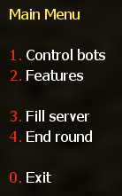
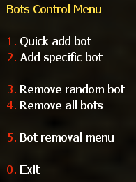
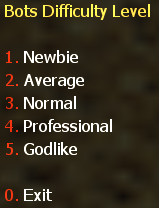
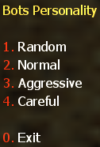
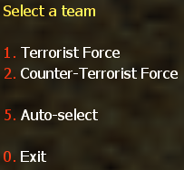
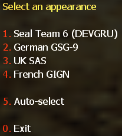
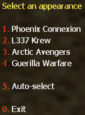
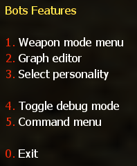
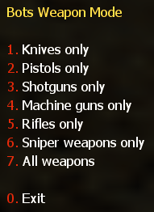
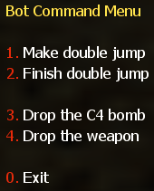

## The YaPB User Menu

### Main Menu

Pressing the `=` key in game, a menu with the following options should appear on your screen:



1. **Control Bots** -- A menu that adds or removes bots from the game
2. **Features** -- A menu that configures the type of weapons used by bots, opens the graph editor menu, toggles debug mode and controls bots commands
3. **Fill Server** -- A menu that fills the server with bots with the specified parameters
4. **End Round** -- Kills all bots for the end of round

### Bots Control Menu



1. **Quick add bot** -- This does what it says. It quickly adds a Bot giving him a random name, team, difficulty and model. Difficulty will be chosen randomly between your `yb_difficulty_min`/`yb_difficulty_max` values specified in yapb.cfg
2. **Add specific bot** -- Allows you to specify all things (except name) for adding a single Bot











3. **Remove random bot** -- Removes a random bot
4. **Remove all bots** -- Removes all bots from the server
5. **Bot removal menu** -- A menu that allows you to remove a bot from the server specified in the list

### Bots Features Menu



1. **Weapon mode menu** -- A menu that configures the type of weapons used by bots



2. **Graph editor** -- Opens the graph editor
3. **Select personality** -- Adds a bot with the currently set difficulty with personality setting
4. **Toggle debug mode** -- Enables or disables debug mode
5. **Command menu** -- Opens the bot command menu



1. **Make double jump** -- Forces the nearest teammate bot to crouch next to you to make a double jump
2. **Finish double jump** -- Releases the bot after the first command, it must get up and go about its business
3. **Drop the C4 bomb** -- Forces the bot carrying the bomb to drop it at you
4. **Drop the weapon** -- Makes the teammate bot throw a weapon at you

:::note
Bot will only throw a weapon at you when it has a primary weapon and 2000 or more dollars in the account.
:::

---

## Console Commands

The following main YaPB commands are available:

| Command | Description |
|---------|-------------|
| `yb add` | Adds specific bot into the game |
| `yb kick` | Kicks off the random or specified bot from the game |
| `yb removebots` | Kicks all the bots from the game. Also available via alias `yb kickall` |
| `yb kill` | Kills the specified team or all the bots |
| `yb fill` | Fills the server (add bots) with specified parameters |
| `yb vote` | Forces all the bots to vote to specified map |
| `yb weapons` | Sets the bots weapon mode to use |
| `yb fun` | Sets the classic fun mode for everyone to enjoy |
| `yb menu` | Opens the main bot menu |
| `yb version` | Displays version information about bot build |
| `yb graphmenu` | Opens the graph editor menu |
| `yb list` | Lists the bots currently playing on server |
| `yb cvars` | Displays all the CVARs with their descriptions |
| `yb show_custom` | Shows the current values from `custom.cfg` |
| `yb graph` | Handles graph operations (see subcommands below) |
| `yb debug` | Debug commands for players (see subcommands below) |

To get help for all commands such as arguments, aliases, etc, type in the console `yb help`.

If you want to get help for a specified command, for example `yb add`, type in the console `yb help add`.

### yb add

To add a specific bot to the game, with nickname: John Smith, Difficulty: Average, Personality: Careful, Team: Counter-Terrorists, Team Class: SAS, you should type in console:

```
yb add 1 2 2 3 "John Smith"
```

#### Arguments

**Difficulties:**

| Value | Difficulty |
|-------|-----------|
| `0` | Newbie |
| `1` | Average |
| `2` | Normal |
| `3` | Professional |
| `4` | Godlike |

**Personalities:**

| Value | Personality |
|-------|------------|
| `0` | Normal |
| `1` | Aggressive (rusher) |
| `2` | Careful |

**Teams:**

| Value | Team |
|-------|------|
| `0` | Random |
| `1` | Terrorists |
| `2` | Counter-Terrorists |

**Team classes:**

Terrorists:

| Value | Class |
|-------|-------|
| `0` | Random |
| `1` | Phoenix Connexion |
| `2` | Elite Crew |
| `3` | Arctic Avengers |
| `4` | Guerilla Warfare |
| `5` | Midwest Militia **(Condition Zero only!)** |

Counter-Terrorists:

| Value | Class |
|-------|-------|
| `0` | Random |
| `1` | Seal Team 6 |
| `2` | GSG-9 |
| `3` | SAS |
| `4` | GIGN |
| `5` | Spetsnaz **(Condition Zero only!)** |

Correct format for the `yb add` command is:

```
yb add [difficulty] [personality] [team] [model] [name]
```

All bot values are selected by numbers (except the bot name).

### yb kick

Type in console `yb kick` command to remove the random bot.

If you want to remove the bot from the specified team, type in the console `yb kick t` to kick a bot from Terrorists team, and `yb kick ct` to kick a bot from Counter-Terrorists team.

### yb removebots

You can also use the alias `yb kickall` to remove all bots.

If you want to remove bots instantly, add the `instant` argument to this command.

Example: `yb kickall instant`

### yb kill

The `yb kill` command kills all the bots. To kill a specific team, such as terrorists, you should type in console `yb kill t` command. For Counter-Terrorists the command is `yb kill ct`.

The `silent` argument disables the "All bots died..." message in the console. You should enter `yb kill silent` in console, to kill bots without that message.

### yb fill

To fill the server with random bots type in console `yb fill 0`.

If you want to fill the server with specific bots, for example: Team: Terrorists, Count: 5, Difficulty: Normal, Personality: Aggressive, you should type in console the following command:

```
yb fill 1 5 2 1
```

#### Arguments

**Teams:**

| Value | Team |
|-------|------|
| `0` | Both teams |
| `1` | Terrorists only |
| `2` | Counter-Terrorists only |

**Difficulties:**

| Value | Difficulty |
|-------|-----------|
| `0` | Newbie |
| `1` | Average |
| `2` | Normal |
| `3` | Professional |
| `4` | Godlike |

**Personalities:**

| Value | Personality |
|-------|------------|
| `0` | Normal |
| `1` | Aggressive (rusher) |
| `2` | Careful |

Don't enter the bot personality value if you want bots with random personalities.

Correct format for the `yb fill` command is:

```
yb fill [team] [count] [difficulty] [personality]
```

### yb weapons

To force the bot to use only a certain type of weapon, for example, shotguns, you should type in console the `yb weapons shotgun` command.

Allowed values: `knife|pistol|shotgun|smg|rifle|sniper|standard`.

Standard means that bots will use all weapons.

### yb cvars

This command lists all CVARs with their descriptions.

- To save all CVARs you configured to config, add the `save` argument to this command
- You can also save a map-specific config by using the `save_map` argument to save the current values of all CVARs to `addons/yapb/conf/maps/map_name.cfg`

Example: `yb cvars save`

You can also narrow your search by entering a word as an argument, instead of looking through a list of all CVARs.

To restore the default values of all bot CVARs, type `yb cvars defaults` in console.

### yb fun

Sets the classic fun mode for everyone to enjoy. Same values as the `yb_fun_mode` CVAR: `imsober|tronisback|itsnewyear|imhaunted|itstoodark|stonedagain|imonmars`.

Example: `yb fun tronisback`

### yb graph

Handles graph operations. Full reference of subcommands (also available via the `yb g`, `yb w`, `yb wp`, `yb wpt` and `yb waypoint` aliases):

| Subcommand | Description |
|------------|-------------|
| `on [display\|auto\|noclip\|models]` | Enables displaying of graph, nodes, noclip cheat |
| `off [display\|auto\|noclip\|models]` | Disables displaying of graph, auto adding nodes, noclip cheat |
| `menu` | Opens the graph editor menu |
| `add` | Opens the graph node add menu |
| `addbasic` | Adds basic nodes such as player spawn points, goals and ladders |
| `save` / `load` | Save / load the graph file |
| `erase iamsure` | Erases the graph file from disk |
| `erase_training` | Erases the training data, leaving graph files |
| `delete [nearest\|index]` | Deletes a single graph node from the map |
| `check` | Checks if the graph works correctly |
| `cache [nearest\|index]` | Caches a node for future use |
| `clean [all\|nearest\|index]` | Cleans useless path connections from all or a single node |
| `setradius [radius] [nearest\|index]` | Sets the radius for a node |
| `flags` | Opens the menu for modifying flags of the nearest point |
| `teleport [index]` | Teleports the player to the specified node index |
| `upload` | Uploads the created graph to the graph database |
| `stats` | Shows stats about node types on the map |
| `fileinfo` | Shows basic information about the graph file |
| `export` / `import` | Exports the graph into a text file (conf format) for version control / imports it back, replacing the current one |
| `apply` | Saves the current graph and reloads it, so bots can be added after an import |
| `adjust_height [height offset]` | Modifies the height (z-component) of all graph nodes by the specified offset |
| `refresh` | Deletes the current graph and downloads one from the graph database |
| `path_create` | Opens the path creation menu |
| `path_create_in` / `path_create_out` / `path_create_both` / `path_create_jump` | Creates incoming / outgoing / both-ways / jumping path connection between the faced and the nearest node |
| `path_delete` | Deletes the path from the nearest to the faced node |
| `path_set_autopath [max_distance]` | Opens the menu for setting the autopath maximum distance |
| `path_clean [index]` | Clears connections of all types from the node |
| `iterate_camp [begin\|end\|next]` | Allows to go through all camp points on the map |
| `acquire_editor` / `release_editor` | Acquires / releases graph editing rights (dedicated server only) |

### yb debug

Debug commands for players:

| Subcommand | Description |
|------------|-------------|
| `slay [id\|name\|host]` | Kills a player by id or name (or host for listenserver) |
| `slap [id\|name\|host] [damage]` | Slaps a player by id or name (or host for listenserver) |
| `god [id\|name\|host]` | Toggles god mode on the host entity (listenserver) or a player |
| `notarget [id\|name\|host]` | Toggles notarget on a player |
| `exec [id\|name\|host] [command]` | Executes a client command on a player |
| `memory` | Displays memory allocation statistics |
| `translate [reset\|write]` | Lists untranslated strings collected during play; `write` appends them to the language config, `reset` clears the list |

Example — execute a command from a bot entity (find the bot id with `yb list` first):

```
yb debug exec 3 "say hello"
```

---

## Adding Bots to the Game

- Select `1. Quick add bot` from the bot control menu to add a bot with random stats (name, difficulty, personality, etc.)
- Select `2. Add specific bot` from the bot control menu to add a bot with manually specified stats

Or type in console `yb_quota x` where X is the amount of bots to add.

---

## Selecting the Bot Language

You must open the file `yapb.cfg` in the folder `addons/yapb/conf` and change the value of `yb_language` CVAR to the next available one.

1. `en` -- English Language
2. `ru` -- Russian Language
3. `de` -- Deutsch Language
4. `chs` -- Chinese (Simplified) Language
5. `cht` -- Chinese (Traditional) Language

For example, write in the config `yb_language ru` for Russian Language.

---

## Bot Management on a Dedicated Server

To have access to the bot's menus and commands, you need to specify a password and a key from which the password will be read in a server console.

To specify a password, enter in the console the following CVAR:

```
yb_password botpassword
```

Where `botpassword` is the password you specified.

To specify a key, enter in the console the following CVAR:

```
yb_password_key _ybpw
```

Where `_ybpw` is the key you specified.

Then, in a client console, enter the following command to have access to the commands and menus of the bot:

```
setinfo _ybpw botpassword
```

To have access to graph commands, you need to enter in the console the following command:

```
yb g acquire_editor
```

Make sure that no one has entered this command before you, who has the password from the bot. Otherwise, you won't be able to access graph commands until that player removes graph editing rights.

To revoke the rights to edit graphs, you must enter in the console the following command:

```
yb g release_editor
```
