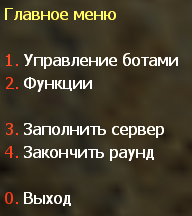
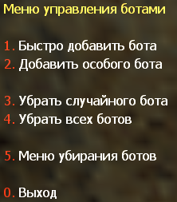
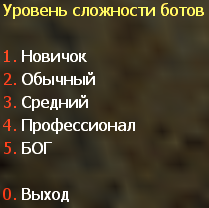
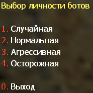
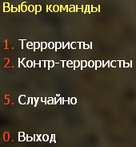
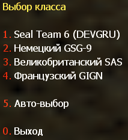
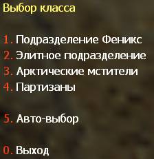
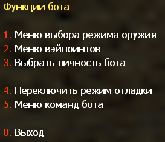
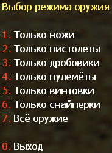
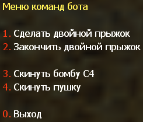

## Меню пользователя YaPB

### Главное меню

При нажатии на клавишу `=` в игре, на экране появится меню со следующими опциями:



1. **Управление ботами** -- Меню, которое добавляет или убирает ботов из игры
2. **Функции** -- Меню, которое содержит настройки типов оружия, используемого ботами, редактор вэйпоинтов, переключатель режима отладки и управления командами ботов
3. **Заполнить сервер** -- Меню, которое задаёт параметры ботов для заполнения сервера
4. **Закончить раунд** -- Убивает всех ботов для окончания раунда

### Меню управления ботами



1. **Быстро добавить бота** -- Это делает то, что говорит. Оно быстро добавляет бота, давая ему случайное имя, команду, сложность и модель. Сложность будет выбираться случайно между вашими значениями `yb_difficulty_min`/`yb_difficulty_max`, указанными в yapb.cfg
2. **Добавить особого бота** -- Позволяет вам указать все параметры (кроме имени) для добавления одного бота











3. **Убрать случайного бота** -- Убирает случайного бота
4. **Убрать всех ботов** -- Убирает всех ботов с сервера
5. **Меню убирания ботов** -- Меню, которое позволяет вам убрать бота с сервера, указанного в списке

### Меню функций ботов



1. **Меню выбора режима оружия** -- Меню, которое настраивает тип используемого ботами оружия



2. **Меню вэйпоинтов** -- Открывает меню редактора вэйпоинтов
3. **Выбрать личность бота** -- Добавляет бота с текущей заданной сложностью с настройкой личности
4. **Переключить режим отладки** -- Включает или выключает режим отладки
5. **Меню команд бота** -- Открывает меню команд бота



1. **Сделать двойной прыжок** -- Заставляет ближайшего бота тиммейта присесть рядом с вами, чтобы сделать двойной прыжок
2. **Закончить двойной прыжок** -- Отпускает бота после первой команды, он должен встать и идти по своим делам
3. **Скинуть бомбу C4** -- Заставляет бота, несущего бомбу, бросить её вам
4. **Скинуть оружие** -- Заставляет бота тиммейта бросить вам оружие

:::note
Бот будет бросать вам оружие только тогда, когда у него есть основное оружие и 2000 или более долларов на счету.
:::

---

## Консольные команды

Доступны следующие основные команды YaPB:

| Команда | Описание |
|---------|----------|
| `yb add` | Добавляет заданного бота в игру |
| `yb kick` | Убирает случайного или указанного бота из игры |
| `yb removebots` | Убирает всех ботов из игры. Также доступно через алиас `yb kickall` |
| `yb kill` | Убивает указанную команду или всех ботов |
| `yb fill` | Заполняет сервер (добавляет ботов) с заданными параметрами |
| `yb vote` | Заставляет всех ботов голосовать за указанную карту |
| `yb weapons` | Задаёт режим используемого ботами оружия |
| `yb fun` | Включает классический фан-режим для всех |
| `yb menu` | Открывает главное меню бота |
| `yb version` | Показывает информацию о версии сборки бота |
| `yb graphmenu` | Открывает меню редактора графов |
| `yb list` | Показывает список текущих ботов, играющих на сервере |
| `yb cvars` | Показывает все квары с их описаниями |
| `yb show_custom` | Показывает текущие значения из `custom.cfg` |
| `yb graph` | Управляет операциями графов (подкоманды ниже) |
| `yb debug` | Отладочные команды для игроков (подкоманды ниже) |

Чтобы получить помощь по всем командам, такую как аргументы, алиасы и т.д., напишите в консоли `yb help`.

Если вы хотите получить помощь по указанной команде, например `yb add`, напишите в консоли `yb help add`.

### yb add

Чтобы добавить заданного бота в игру, с ником: John Smith, Сложность: Обычная, Личность: Осторожная, Команда: Контр-Террористы, Класс команды: SAS, вы должны написать в консоли:

```
yb add 1 2 2 3 "John Smith"
```

#### Аргументы

**Сложности:**

| Значение | Сложность |
|----------|-----------|
| `0` | Новичок |
| `1` | Обычный |
| `2` | Средний |
| `3` | Профессионал |
| `4` | Бог |

**Личности:**

| Значение | Личность |
|----------|----------|
| `0` | Нормальная |
| `1` | Агрессивная |
| `2` | Осторожная |

**Команды:**

| Значение | Команда |
|----------|----------|
| `0` | Случайная |
| `1` | Террористы |
| `2` | Контр-Террористы |

**Классы команд:**

Террористы:

| Значение | Класс |
|----------|-------|
| `0` | Случайный |
| `1` | Подразделение Феникс |
| `2` | Элитное подразделение |
| `3` | Арктические мстители |
| `4` | Партизаны |
| `5` | Ополченцы среднего запада **(Только для Condition Zero!)** |

Контр-Террористы:

| Значение | Класс |
|----------|-------|
| `0` | Случайный |
| `1` | Seal Team 6 |
| `2` | GSG-9 |
| `3` | SAS |
| `4` | GIGN |
| `5` | Спецназ **(Только для Condition Zero!)** |

Корректный формат для команды `yb add`:

```
yb add [сложность] [личность] [команда] [модель] [имя]
```

Все значения ботов выбираются цифрами (кроме имени).

### yb kick

Напишите в консоли команду `yb kick`, чтобы убрать случайного бота.

Если вы хотите убрать бота из конкретной команды, вы должны написать `yb kick t`, чтобы убрать бота с команды Террористов, и `yb kick ct`, чтобы убрать бота с команды Контр-Террористов.

### yb removebots

Вы также можете использовать алиас `yb kickall`, чтобы убрать всех ботов.

Если вы хотите убрать ботов мгновенно, добавьте аргумент `instant` к этой команде.

Пример: `yb kickall instant`

### yb kill

Команда `yb kill` убивает всех ботов. Чтобы убить конкретную команду, такую как террористы, вы должны написать в консоль `yb kill t`. Для Контр-Террористов команда `yb kill ct`.

Аргумент `silent` отключает сообщение "Все боты убиты..." в консоли. Вы должны ввести в консоль `yb kill silent`, чтобы убить ботов без этого сообщения.

### yb fill

Чтобы заполнить сервер случайными ботами, напишите в консоль `yb fill 0`.

Если вы хотите заполнить сервер определёнными ботами, например: Команда: Террористы, Количество: 5, Сложность: Средняя, Личность: Агрессивная, вы должны написать в консоли следующую команду:

```
yb fill 1 5 2 1
```

#### Аргументы

**Команды:**

| Значение | Команда |
|----------|----------|
| `0` | Обе команды |
| `1` | Только террористы |
| `2` | Только контр-террористы |

**Сложности:**

| Значение | Сложность |
|----------|-----------|
| `0` | Новичок |
| `1` | Обычный |
| `2` | Средний |
| `3` | Профессионал |
| `4` | Бог |

**Личности:**

| Значение | Личность |
|----------|----------|
| `0` | Нормальная |
| `1` | Агрессивная |
| `2` | Осторожная |

Не вводите значение личности бота, если вы хотите ботов со случайными личностями.

Корректный формат для команды `yb fill`:

```
yb fill [команда] [количество] [сложность] [личность]
```

### yb weapons

Чтобы заставить бота использовать определённый вид оружия, например, дробовики, вы должны написать в консоль команду `yb weapons shotgun`.

Допустимые значения: `knife|pistol|shotgun|smg|rifle|sniper|standard`.

Standard означает, что боты будут использовать все виды оружия.

### yb cvars

Эта команда выводит список всех кваров с их описаниями.

- Чтобы сохранить все настроенные квары в конфиг, добавьте аргумент `save` к этой команде
- Вы также можете сохранить конфиг для конкретной карты, используя аргумент `save_map` для сохранения текущих значений всех кваров в файл `addons/yapb/conf/maps/map_name.cfg`

Пример: `yb cvars save`

Также вы можете сузить свой поиск, введя слово как аргумент, вместо просмотра списка со всеми кварами.

Чтобы восстановить стандартные значения всех кваров бота, введите в консоль `yb cvars defaults`.

### yb fun

Включает классический фан-режим для всех. Те же значения, что у квара `yb_fun_mode`: `imsober|tronisback|itsnewyear|imhaunted|itstoodark|stonedagain|imonmars`.

Пример: `yb fun tronisback`

### yb graph

Управляет операциями графов. Полный список подкоманд (также доступны через алиасы `yb g`, `yb w`, `yb wp`, `yb wpt` и `yb waypoint`):

| Подкоманда | Описание |
|------------|----------|
| `on [display\|auto\|noclip\|models]` | Включает отображение графа, точек, noclip-чит |
| `off [display\|auto\|noclip\|models]` | Выключает отображение графа, авто-добавление точек, noclip-чит |
| `menu` | Открывает меню редактора графов |
| `add` | Открывает меню добавления точки графа |
| `addbasic` | Добавляет базовые точки: спавны игроков, цели и лестницы |
| `save` / `load` | Сохранить / загрузить файл графа |
| `erase iamsure` | Удаляет файл графа с диска |
| `erase_training` | Удаляет данные обучения, оставляя файлы графов |
| `delete [nearest\|index]` | Удаляет одну точку графа с карты |
| `check` | Проверяет корректность работы графа |
| `cache [nearest\|index]` | Кэширует точку для будущего использования |
| `clean [all\|nearest\|index]` | Очищает бесполезные соединения путей у всех или одной точки |
| `setradius [radius] [nearest\|index]` | Задаёт радиус точки |
| `flags` | Открывает меню изменения флагов ближайшей точки |
| `teleport [index]` | Телепортирует игрока к точке с указанным индексом |
| `upload` | Загружает созданный граф в базу данных графов |
| `stats` | Показывает статистику по типам точек на карте |
| `fileinfo` | Показывает базовую информацию о файле графа |
| `export` / `import` | Экспортирует граф в текстовый файл (формат conf) для контроля версий / импортирует обратно с заменой текущего |
| `apply` | Сохраняет текущий граф и перезагружает его, чтобы можно было добавить ботов после импорта |
| `adjust_height [height offset]` | Изменяет высоту (z-компоненту) всех точек графа на указанное смещение |
| `refresh` | Удаляет текущий граф и скачивает граф из базы данных |
| `path_create` | Открывает меню создания пути |
| `path_create_in` / `path_create_out` / `path_create_both` / `path_create_jump` | Создаёт входящее / исходящее / двустороннее / прыжковое соединение пути между точкой под прицелом и ближайшей точкой |
| `path_delete` | Удаляет путь от ближайшей точки к точке под прицелом |
| `path_set_autopath [max_distance]` | Открывает меню настройки максимальной дистанции автопути |
| `path_clean [index]` | Очищает соединения всех типов у точки |
| `iterate_camp [begin\|end\|next]` | Позволяет пройти по всем кемперским точкам на карте |
| `acquire_editor` / `release_editor` | Получить / освободить права на редактирование графа (только выделенный сервер) |

### yb debug

Отладочные команды для игроков:

| Подкоманда | Описание |
|------------|----------|
| `slay [id\|name\|host]` | Убивает игрока по id или имени (или host для локального сервера) |
| `slap [id\|name\|host] [damage]` | Бьёт игрока по id или имени (или host для локального сервера) |
| `god [id\|name\|host]` | Переключает god mode на host-сущности (локальный сервер) или игроке |
| `notarget [id\|name\|host]` | Переключает notarget на игроке |
| `exec [id\|name\|host] [command]` | Выполняет клиентскую команду на игроке |
| `memory` | Показывает статистику распределения памяти |
| `translate [reset\|write]` | Показывает собранные во время игры непереведённые строки; `write` дописывает их в языковой конфиг, `reset` очищает список |

Пример — выполнить команду от лица бота (сначала узнайте id бота через `yb list`):

```
yb debug exec 3 "say hello"
```

---

## Добавление ботов в игру

- Выберите `1. Быстро добавить бота` в меню управления ботами, чтобы добавить бота со случайной статистикой (имя, сложность, личность и т.д.)
- Выберите `2. Добавить особого бота` в меню управления ботами, чтобы добавить бота с вручную заданной статистикой

Или напишите в консоли `yb_quota x`, где X — это количество добавляемых ботов.

---

## Выбор языка бота

Вы должны открыть файл `yapb.cfg` в папке `addons/yapb/conf` и изменить значение квара `yb_language` на следующее доступное:

1. `en` -- Английский язык
2. `ru` -- Русский язык
3. `de` -- Немецкий язык
4. `chs` -- Китайский (Упрощённый) язык
5. `cht` -- Китайский (Традиционный) язык

Например, напишите в конфиге `yb_language ru` для русского языка.

---

## Управление ботами на выделенном сервере

Чтобы иметь доступ к командам и меню бота, вам нужно в консоли сервера указать пароль и ключ, откуда будет считываться пароль.

Чтобы указать пароль, введите в консоли следующий квар:

```
yb_password botpassword
```

Где `botpassword` — это указанный вами пароль.

Чтобы указать ключ, введите в консоли следующий квар:

```
yb_password_key _ybpw
```

Где `_ybpw` — это указанный вами ключ.

Затем в консоли клиента вы должны ввести следующую команду, чтобы иметь доступ к командам и меню бота:

```
setinfo _ybpw botpassword
```

Чтобы иметь доступ к graph командам, вам нужно ввести в консоль следующую команду:

```
yb g acquire_editor
```

Убедитесь, что никто не вводил эту команду ранее, у кого есть пароль от бота. Иначе вы не сможете иметь доступ к graph командам, пока игрок не снимет с себя права на редактирование графов.

Чтобы снять права на редактирование графов, вы должны ввести в консоль следующую команду:

```
yb g release_editor
```
