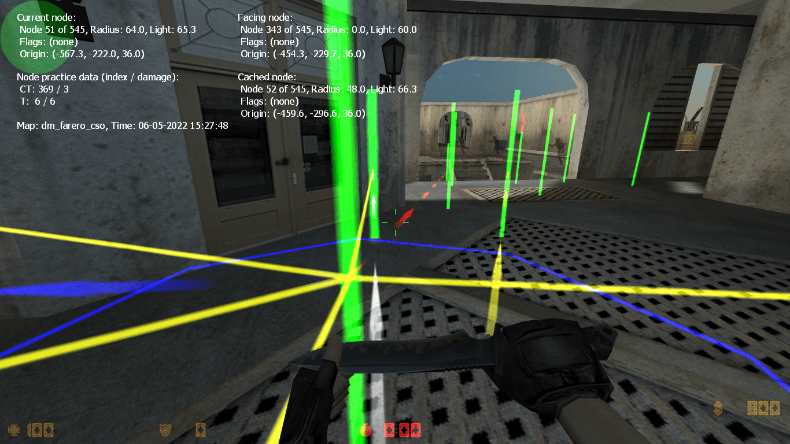

# Graph Editing

## Brief Information

### Nodes, What Are They?

Unlike humans, bots cannot see a map and analyze what they see. If you see a building with a door, you can walk straight to the door, open it and enter the building. Bots cannot do this without help! They can see and fight enemies or react if they are being attacked. These ways of behavior work without any external help. But in order to find their way around the map and to safely navigate through all ways and passages, they do need some help. They need something that tells them where they can go and where they can't. They need something that shows them where a ladder is located or where the mission goal (escape zone/hostages/bomb spot) is. This is done by means of nodes. You can imagine nodes a bit like those flags on a ski run. Each node marks a point where bots can go. If two of them are connected with each other, a bot can go from one point to the other and back. So what you do when you node a map is basically place a whole net of points in the map and connect them in a way that bots can proceed from one point to the other. All points must be placed in areas that are accessible for players, and if you want your bots to navigate smoothly and safely, you must also keep an eye on the connections. If connections go through walls or over a deep ravine, your bots will bump into walls or fall to their death.

There are several node types that can be used to indicate map goals, rescue zones, nice camp spots, ladders, etc. There are different types of connections too: one-way or two-way connections and jump connections that will make a bot jump from point A to B instead of walking or running there. We will come back to this later.

Besides, you don't have to worry about every little detail. The editor that comes with this bot version will do lots of the work for you, and besides, it's graphical and easy to use (no programming/coding skills or anything required). You may very well discover that making nodes can be fun, especially when you see bots roam through the entire map without problems -- and you made it possible!

> **Note:** Since YaPB 2.10 version, a new waypoint format named **Graph** has been added, which raised the limit to 2048 nodes (in later builds, when graph auto-analysis feature was introduced, the node limit has been raised again), allows you to set camp directions not only horizontally but also vertically, and also reduced the size of waypoint files. YaPB also continues to support the old **PWF** format. You can save waypoints to PWF format, but it will be automatically converted to graph format when loaded. Waypoints (multicolored stripes) are now named **Nodes** since YaPB 4.x version. Waypoint editor was also renamed to Graph editor.

### What Do Nodes Look Like in the Game?

When you are playing a normal game on a noded map, the nodes will of course be invisible so that they don't distract or annoy you in any way.

When the graph editor is activated, you will see nodes as vertical bars about as high as a standing player. The color of normal nodes is green, but you may also see nodes in white, purple, red, blue, and cyan. These colors indicate special nodes, some of which have already been mentioned in the last paragraph. If you see nodes that are much smaller than the other ones, they are crouch nodes. They will force bots to crouch when approaching them. Such nodes are needed to lead bots through vents or any other low and narrow passages.

Connections between nodes are marked as horizontal lines leading from the center of one node to the other. They, too, exist in different colors. You may see yellow, white, and red lines. Don't worry if all these different colors sound confusing right now -- it's actually very easy, but of course it helps a lot if you see some nodes on the screen.

### How Can I Access the Graph Editor?

The graph editor is not a separate program, it is included in the bot DLL (or .so, if you are using Linux). To open it, create a LAN/Listen Server game, select the map you want to create the graph for, and start the game as usual. As soon as you are in the map, you can activate the editing mode from the console by typing `yb graphmenu` or if you have bound a key for it, simply by pressing that key.

### Graph Console Commands

The following Graph commands are available:

| Command | Description |
|---------|-------------|
| `yb g on` | Turns on displaying of nodes |
| `yb g off` | Turns off displaying of nodes |
| `yb g on auto` | Turns on auto nodes placement setting |
| `yb g off auto` | Turns off auto nodes placement setting |
| `yb g on models` | Turns on the player models rendering on spawn points |
| `yb g off models` | Turns off the player models rendering on spawn points |
| `yb g on noclip` | Turns on nodes editing with noclip cheat |
| `yb g off noclip` | Turns off nodes editing with noclip cheat |
| `yb g add` | Adds a node at the current player location. A Menu will pop up where you have to select the different types of nodes |
| `yb g addbasic` | Adds basic nodes on map, like spawn points, goals and ladders |
| `yb g cache` | Remember the nearest node to the player |
| `yb g clean` | Cleans useless path connections from all or single node |
| `yb g delete` | Deletes the node nearest to the player |
| `yb g erase` | Removes the graph and bot experience files from hard drive |
| `yb g flags` | Allows you to manually add/remove Flags to a node |
| `yb g setradius x` | Manually sets the Wayzone Radius for this node to value x |
| `yb g teleport x` | Teleports player to node index specified in value x |
| `yb g stats` | Shows the number of different nodes you did already set |
| `yb g fileinfo` | Shows basic information about graph file |
| `yb g adjust_height` | Modifies all the graph nodes height (z-component) with specified offset |
| `yb g check` | Checks if all node connections are valid |
| `yb g load` | Loads the nodes from a graph file |
| `yb g save` | Saves the current nodes to a file |
| `yb g save nocheck` | Saves the current nodes to a file without validating |
| `yb g upload` | Uploads created graph file to graph database |
| `yb g menu` | Show the graph editor menu. Also available via alias `yb graphmenu` |
| `yb g path_set_autopath` | Opens menu for setting autopath maximum distance |
| `yb g path_create` | Opens menu for path creation |
| `yb g path_delete` | Delete path from cached (or faced) to nearest node |
| `yb g path_create_in` | Creating incoming path connection from faced (or cached) to nearest node |
| `yb g path_create_out` | Creating outgoing path connection from nearest to faced (or cached) node |
| `yb g path_create_both` | Creating both-ways path connection between faced (or cached) and nearest node |
| `yb g path_create_jump` | Creating outgoing jumping path connection from nearest to faced (or cached) node |
| `yb g path_clean` | Clears connections of all types from the node |
| `yb g iterate_camp` | Allows to go through all camp points on map |
| `yb g acquire_editor` | Acquires rights to edit graph on dedicated server |
| `yb g release_editor` | Releases graph editing rights |

To use the graph commands, you will have to use the console. Use the `~` key to bring down the console. Enter the console commands that you wish, then use the `~` key again to return to the game.

### Using Graph Commands

**`yb g delete`** will remove the node closest to the player. The node MUST be within 50 units from the player (about 1/2 the player height) in order to be removed. You will need to stand fairly close to the node to be able to remove it. This prevents you from accidentally removing a node on the other side of the room. When removing a node you will hear a sound indicating that the node was removed (the same sound the tripmine makes when placed on a wall).

**`yb g save`** will save the node data to the graph file. The graph file will have the same name as the current map with an extension of `.graph`. The file will be saved into the `cstrike/addons/yapb/data/graph` Folder. Your current player name will be saved as the graph file author.

You can also save the nodes in `.pwf` format for older versions of YaPB or PODBot by typing in the console `yb g save old`. Please note that you can save nodes in this format only when the number of nodes does not exceed 1024.

**`yb g load`** will clear out all nodes in the current map and load them from the graph file in the graph folder. This is a good way to "undo" a bunch of nodes that you have created but do not wish to save. There is no way to `undo` a single node. You will have to use the `yb g delete` command to remove nodes one-by-one.

**`yb g on auto`** command allows you to automatically drop nodes as you run around in a map. As you run around the level nodes will be dropped every 200 units automatically. No node will be dropped if another node is already within 200 units of your current position. So if you want to place lots of nodes fairly close together you may have to manually place some of the nodes using the `yb g add` command. Auto node placement keeps track of where the last node was dropped (either manually or from auto node placement) and will place another node when you are 200 units from the last node. If you don't like where auto node placement placed a node and want to move it a little bit, you can delete the node using `yb g delete` (but turn off auto node placement before, since it will place a new node otherwise).

When using auto node placement, try to stay in the center of narrow hallways and always place a node on BOTH sides of a door. You may have to place some of these nodes manually using `yb g add` since places like intersections of hallways and doorway entrances and exits don't usually fall exactly at the location where auto node placement would want to place a node.

Whenever you get close to a node, yellow, white or green lines will be drawn to all of the other nodes that the bot would consider to be "reachable". If the connection is a two-way connection the line is yellow, one-way connections appear white. These "reachable" nodes would be nodes that are clearly visible from the current location. Certain nodes will be disallowed as reachable for one reason or another. For example, nodes suspended in mid-air above the bot would not be considered reachable since the bot couldn't jump high enough to get to them. Also nodes that are too far away from the current location would not be considered reachable. You may have nodes that are close enough to each other, but across a wide gap that would be too wide to jump. If the far node is close enough and clearly visible, it would still show as "reachable" since currently we have no method to determine if the bot can get to that node or not.

The bots will ONLY go from one node to another if there is a path between them. Get in the habit of checking that paths exist BOTH WAYS between nodes. Just because a path is drawn from point A to point B, doesn't mean that a path exists from point B to point A.

**`yb g path_create`** command allows you to manually assign a path between 2 nodes. This is needed in some cases where the nodes are blocked (by doorways or other objects) and you wish to create a path between these nodes. Move close to the node you wish the path to start from and use the menu to add path.

The actual Node Number you're standing on will be shown in the upper corner of your HUD. For example to manually assign a path between Node #250 and 251, you first should stand in the near of #250, then use `yb g cache` to cache node #250, then go to the node #251 and type `yb g path_create` to show menu and create needed path connection (one-way or two-way). You can also do this by looking at needed node instead of caching it.

**`yb g path_delete`** command is just like the "create" command except that it removes a path (connection) from the starting point to the ending point. This is necessary in some cases where you may have a door that opens from one side and allows you to go through but once the door closes you can't go back through the other way.

Using **`yb g path_clean`** command will remove all connections of any type from the nearest node, unless a node index number is specified as an argument.

**`yb g acquire_editor`** command allows you to edit graph on dedicated server. Before you can use this, the `yb_password` and `yb_password_key` CVARs must be configured on the server.

### Graph Installation

By default, if YaPB finds a graph in the official database for your map, it will automatically download it to the `addons/yapb/data/graph` folder.

If you want to install a graph manually, put it in the `*gamedir*/addons/yapb/data/graph` folder.

Or if you want to install the old format (PWF) waypoint manually, put it in the `*gamedir*/addons/yapb/data/pwf` folder.

Also you can install the E-BOT (EWP) waypoints in the `*gamedir*/addons/yapb/data/ewp` folder.

Where `*gamedir*` is the path to the game directory, for example:

- `D:\Steam\steamapps\common\Half-Life\cstrike` is the Counter-Strike 1.6 folder
- `D:\Steam\steamapps\common\Half-Life\czero` is the Counter-Strike Condition Zero folder

### Graph Editor Overview

The Graph Editor shows some useful information about Graph and Practice data, such as properties of current/faced/cached node, node practice data, map name and your current time.

Graph data are stored in `.graph` file at `addons/yapb/data/graph` or `.pwf` file at `addons/yapb/data/pwf` if you are using/saving it to old PODBot waypoint format. Practice data are stored in `.prc` file at `addons/yapb/data/train` folder.

Current/Faced/Cached node information shows index number of this node, total amount of nodes, radius, light value, flags and origin. If you didn't cache any node or you are not currently facing any node at all, there will be only the data displayed of the nearest node.

Node practice data shows index number of node and the damage value taken from it for both T (Terrorists) and CT (Counter-Terrorists). You can also see arrows pointing to these nodes (red for Terrorists, blue for Counter-Terrorists).

White arrows are pointing to your faced node (on which you point your crosshair). Yellow arrows are pointing to your cached node.

