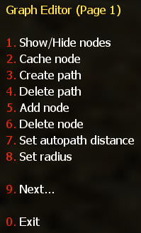
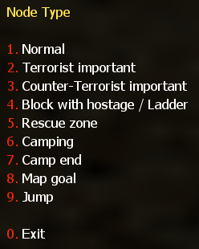

# Adding Nodes

Adding a node is really easy. Just walk to the position where you want a node to be inserted, bring up your graph editor:

To add a node, simply select **5. Add node**. A new menu will appear, the **Node Type** menu. All node types described below can be added by using this menu.

Once you have selected a node type from the "Node Type" menu, you will hear a sound, and the selected node will appear in the map, at the exact position where you stood when you pressed the key.

> **Note:** If you are standing while selecting a node, a standing node will be inserted. All bots will run or walk towards this node normally. If you want bots to crouch when approaching a particular position, crouch down when inserting the node. You will notice that the node you just added is only about half as high as normally. As you inserted it when you were crouched down, it automatically carries a **Crouch** flag (see: [Node Types](node-types.md)). Bots will now crouch automatically when trying to reach this node.

Now that you know the basic method used to add a node, let's have a closer look at the node types that exist.
