# Соединения и флаги

## Радиус

**Радиус** узла обозначается синим многоугольником, который выходит во всех направлениях от позиции узла. Фото ниже было сделано сверху — мы смотрим вниз на узел, и вы можете видеть **цвет радиуса — синий**.

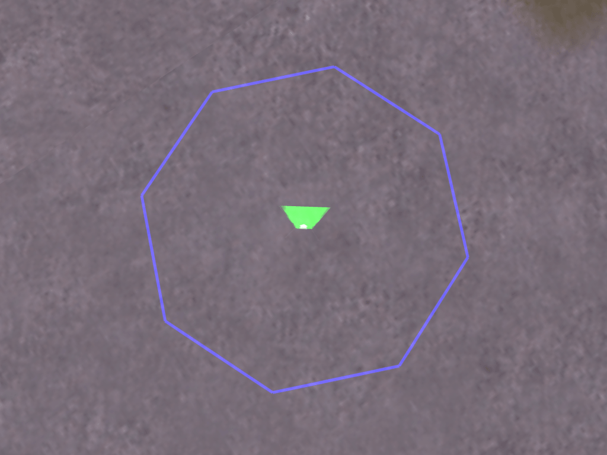

Индикатор радиуса — отличный способ увидеть, насколько большой радиус у узла на самом деле; он заканчивается точно там, где заканчиваются углы.

Что на самом деле делает радиус? Он сообщает ботам, как именно они должны перемещаться вокруг рассматриваемого узла. Если бот проходит мимо ряда узлов с большим радиусом, он будет знать, что сверхточная навигация не требуется. Если радиус маленький, бот будет строго придерживаться узлов.

Таким образом, на открытых участках большой радиус помогает сделать навигацию ботов естественной — вы же не хотите видеть, как бот бежит через широкий двор, как будто он следует невероятно тонкой прямой линии, нарисованной на земле, не так ли? Выглядит гораздо естественнее, если бот использует пространство вокруг себя.

Однако в узких коридорах и дверных проёмах или на мостах ситуация иная: слишком большой радиус сделает ботов слишком беспечными, они будут натыкаться на стены или даже падать с моста, потому что думают, что могут ходить где угодно внутри этого большого радиуса!

Вот почему выбор подходящего радиуса узла так важен. Как общее правило, делайте радиус большим на открытых участках и маленьким в узких проходах.

### Установка или изменение радиуса

Сначала хорошие новости: вам не нужно устанавливать каждый радиус вручную, редактор сделает много работы за вас! Он автоматически рассчитает радиус узла в зависимости от области вокруг него. Если редактор обнаружит высокие препятствия (выше колена) поблизости, он автоматически настроит радиус так, чтобы он доходил до стены, но не дальше. Однако максимальный радиус ограничен 128 юнитами. Это означает, что даже на совершенно открытой равнине, где ближайшее препятствие находится на расстоянии сотен единиц, радиус не превысит 128.

Теперь вы можете задаться вопросом: "Ну, если редактор делает всё это за меня, зачем мне менять радиус вручную?" Ответ прост: редактор помогает, но он не идеален, он не может обнаружить все виды препятствий (я не могу вдаваться в подробности, потому что это довольно много связано с картой). Как бы то ни было, вы увидите места, где радиус входит в препятствие — это может быть очень тонкая стойка, забор или даже машина, припаркованная на улице. Другая проблема — не со стенами, а с ямами и обрывами: если нет высокого препятствия, редактор сочтёт область свободной и установит большой радиус, ему всё равно, что рядом с узлом есть зияющая пропасть, куда боты упадут насмерть!

Итак, это области, за которыми вам нужно следить за радиусом и при необходимости изменять его вручную. В узких коридорах и особенно вокруг узких дверных проёмов вы увидите, что даже маленький радиус, рассчитанный редактором, не позволяет ботам навигировать достаточно точно. В таких местах настоятельно рекомендуется уменьшить радиус до нуля.

Чтобы изменить радиус узла, откройте редактор графов и выберите **8. Установить радиус**. Появится следующее меню:

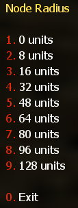

Просто выберите опцию, нажав соответствующую клавишу, и радиус активного узла изменится на выбранное значение. Вы быстро почувствуете эти числа, если немного поэкспериментируете с ними.

### Узлы с фиксированным радиусом

> **Примечание:** Некоторые типы узлов всегда имеют и требуют радиус, равный нулю. Радиус этих типов узлов **НЕ должен изменяться!** Типы с фиксированным радиусом: Лестница, Спасение, Кемпинг (независимо от того, для конкретной команды или нет) и Цель карты.

---

## Соединение узлов

Одних узлов недостаточно, чтобы заставить ботов двигаться так, как вы хотите. Они должны быть соединены с другими узлами, чтобы боты могли достичь своей цели. По умолчанию соединения на определённое расстояние будут создаваться автоматически.

Вы можете выбрать автоматическое расстояние соединения (максимальное расстояние автопути, APMD), открыв редактор графов и выбрав "7. Установить расстояние автопути". Появится следующее подменю:

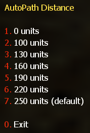

Выберите нужное расстояние из этого меню. После выбора расстояния соединения до этого расстояния будут рисоваться автоматически. Конечно, вы также можете добавлять и удалять соединения вручную.

### Двусторонние (двунаправленные) соединения

Подавляющее большинство всех соединений в наборе узлов будут **двунаправленными**. Эти соединения, очевидно, позволяют ботам ходить как от точки A к точке B, так и обратно от точки B к точке A. **Цвет двусторонних путей — жёлтый**, как вы можете видеть на картинке ниже.

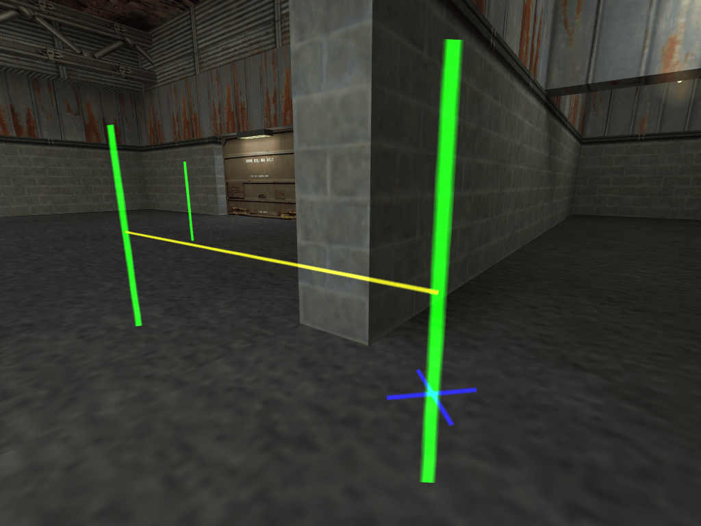

### Односторонние соединения

Односторонние соединения позволяют ботам ходить от точки A к точке B, но не наоборот. Они могут быть полезны, чтобы заставить ботов спуститься со стены или высокого ящика, но помешать им попытаться подняться. Конечно, может быть больше мест, где одностороннее соединение имеет смысл, но это зависит от карты.

В игре односторонние соединения будут видны от 2 узлов — их начального и конечного узла. Чтобы показать вам направление одностороннего соединения, оно будет показано разными цветами в зависимости от того, с какой стороны вы на него смотрите. Допустим, у вас есть одностороннее соединение от узла 1 к узлу 2. В этом случае, когда вы стоите на узле 1, вы увидите исходящее одностороннее соединение, отображаемое белым цветом.

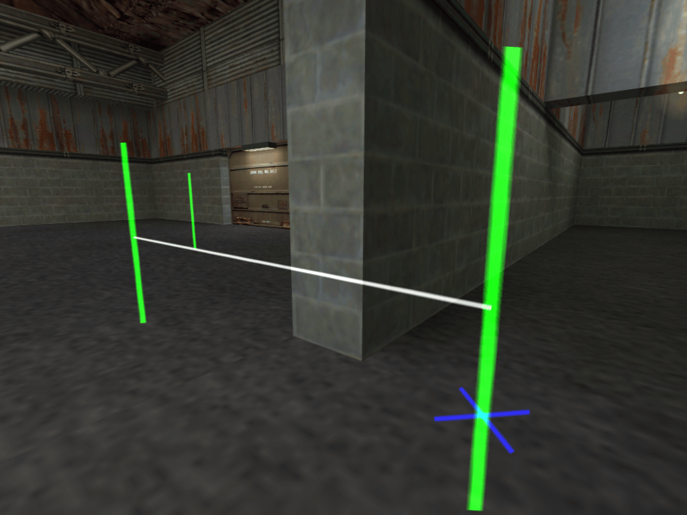

На картинке ниже показаны те же два узла с входящим соединением (слева направо). **Входящее одностороннее соединение отображается бирюзовым цветом**.

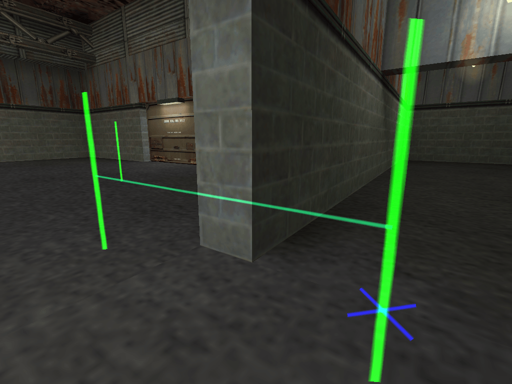

> **Примечание:** Если вы создали исходящее путевое соединение от узла A к узлу B, оно будет отображаться белым цветом. И когда вы дойдёте до узла B, путевое соединение станет бирюзовым, как входящее путевое соединение.

Тот факт, что односторонние соединения отображаются с обоих вовлечённых узлов, — отличная функция. Это позволяет очень легко обнаруживать ошибки и избавляет вас от необходимости бегать, чтобы проверить, есть ли соединение К узлу, на котором вы стоите.

### Прыжковые соединения

**Прыжковые** соединения немного особенные, поскольку их нельзя нарисовать, как любое другое соединение. Но это не всё, помимо этого прыжковые соединения также могут быть **односторонними или двусторонними**. Чтобы сделать всё ещё сложнее, их двусторонняя версия может быть двух видов: "чистое" двустороннее прыжковое соединение, т.е. прыжковое соединение от A к B и ещё одно прыжковое соединение обратно от B к A, или "смешанное" двустороннее соединение с прыжковым соединением от A к B и обычным односторонним соединением обратно от B к A. Хотя последняя версия будет очень редкой.

Теперь ещё раз, это звучит сложнее, чем есть на самом деле. **Горизонтальная линия прыжкового соединения отображается красным цветом (исходящее прыжковое соединение)**, если смотреть с узлов, с которых боты начнут свой прыжок.

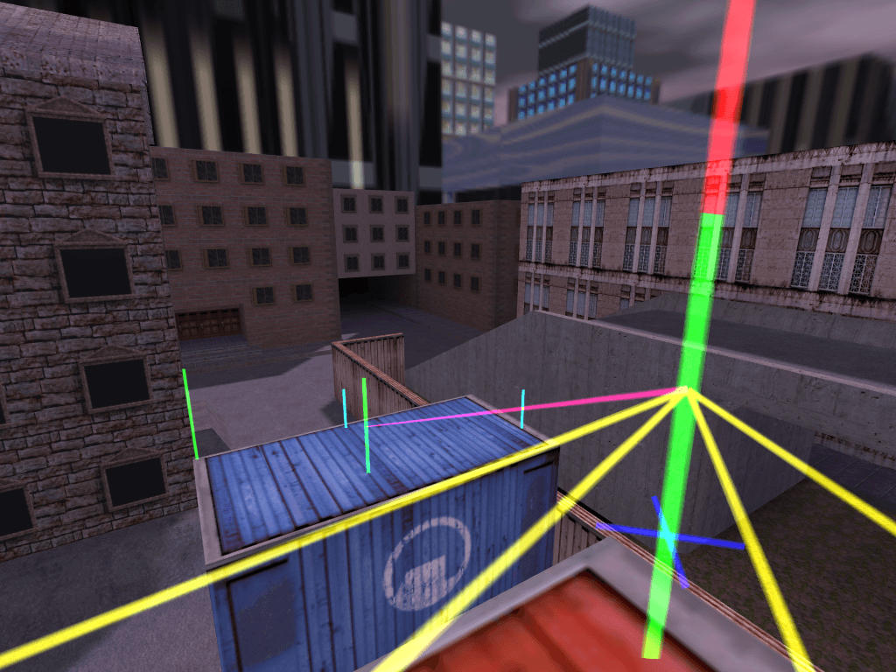

---

## Добавление/удаление соединений вручную

Теперь вы знаете наиболее важные вещи о соединениях в целом и о различных типах соединений. Вы также знаете, как настроить автоматическую длину соединений и как добавить прыжковое соединение вручную. Но как добавить или удалить соединение вручную?

Вы просто наведите прицел на нужный узел и выберите действие для выполнения из экранного меню!

Вот как это работает. Допустим, мы хотим удалить соединение от узла, на котором мы стоим, к левому узлу у стены — наведите прицел на узел. Как только узел будет выбран, он станет больше, и появится маленькая стрелочка перед ним.

> **Примечание:** Это работает только если вы стоите рядом с узлом и направляете прицел на другой! Если вы стоите в области без узлов, вы не сможете использовать эту функцию, потому что она требует двух выбранных узлов (того, на котором вы стоите, и того, на который вы направляете прицел)!

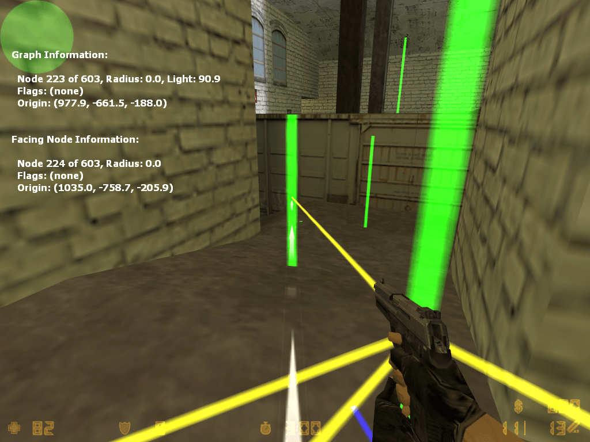

### Удаление путевых соединений

Чтобы удалить путевое соединение, вы должны открыть редактор графов и выберите **4. Удалить путь**.

После удаления путевого соединения вы можете заметить, что исходящее путевое соединение было удалено (от узла, на котором вы стоите, к выбранному узлу), как вы можете видеть на картинке ниже:

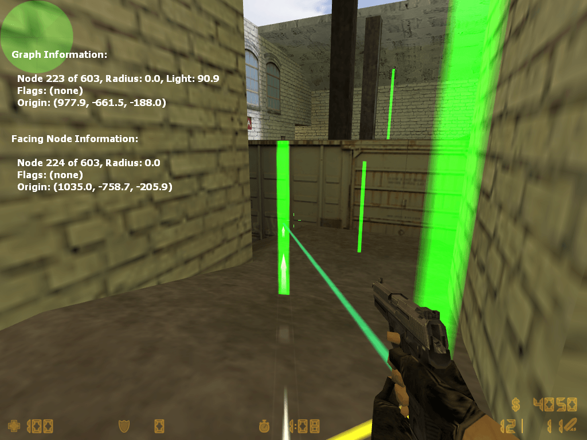

Снова выберите **4. Удалить путь**, чтобы удалить входящее путевое соединение.

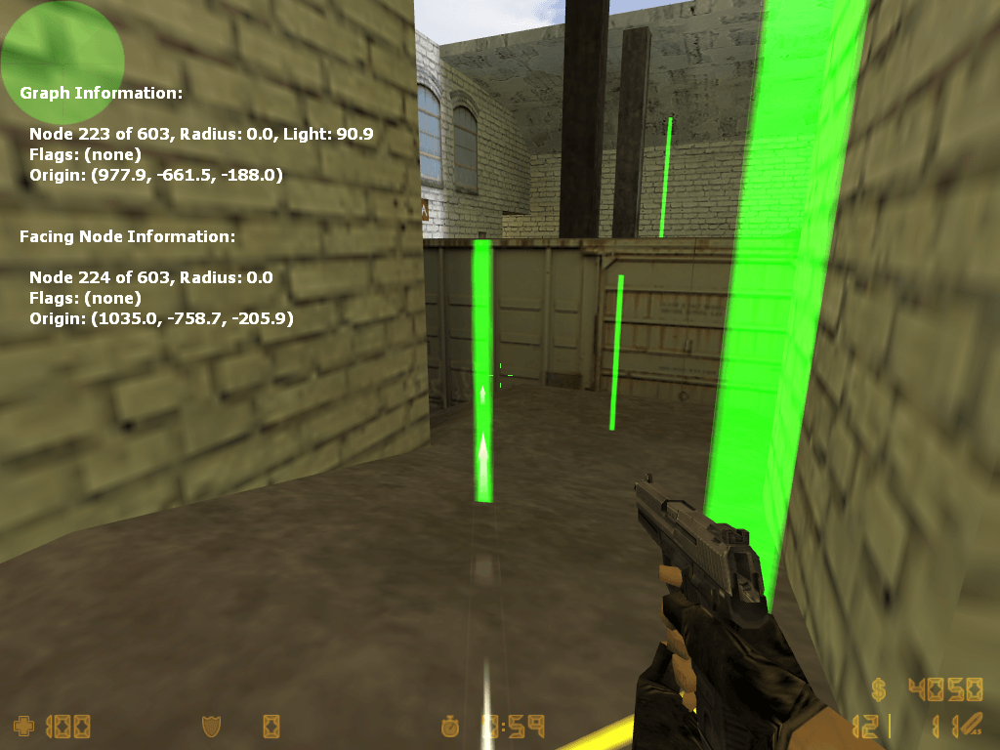

Как вы уже заметили, все путевые соединения были удалены от узла, на котором вы стоите, к выбранному узлу.

### Добавление путевых соединений

Чтобы добавить путевое соединение, вы должны открыть редактор графов и выбрать **3. Создать путь**. Затем должно появиться меню, как показано на картинке ниже.

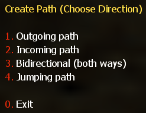

1. Выберите **1. Исходящий путь**, чтобы создать исходящее путевое соединение от ближайшего к направленному (или кэшированному) узлу
2. Выберите **2. Входящий путь**, чтобы создать входящее путевое соединение от направленного (или кэшированного) к ближайшему узлу
3. Выберите **3. Двусторонний (Оба направления)**, чтобы создать двустороннее (двунаправленное) путевое соединение между ближайшим и направленным (или кэшированным) узлом
4. Выберите **4. Прыжковый путь**, чтобы создать исходящий прыжковый путь от ближайшего к направленному (или кэшированному) узлу

---

## Флаги узлов

YaPB имеет 9 флагов для узлов:

| # | Флаг | Описание |
|---|------|----------|
| 1 | Блокировать с заложником | Флаг, который запрещает контр-террористам, ведущим заложников, проходить определённые узлы, отмеченные этим флагом. **Важно: вы обязательно должны разместить эти флаги на путях, где контр-террористы могут потерять заложников!** |
| 2 | Только для террористов | Делает узел важным для террористов |
| 3 | Только для КТ | Делает узел важным для контр-террористов |
| 4 | Использовать лифт | Флаг для узла, который заставляет ботов ждать, пока они поднимаются на лифт (вы должны разместить этот флаг на узле в начале и в конце пути лифта) |
| 5 | Снайперская точка | Флаг, который делает точку кемпинга снайперской точкой (боты будут кемперить только со снайперскими винтовками) |
| 6 | Цель карты | Флаг, который превращает обычный узел в целевой узел |
| 7 | Зона спасения | Флаг, который определяет узел как точку спасения заложников |
| 8 | Присесть | Флаг, который заставляет ботов приседать при достижении этого узла |
| 9 | Точка кемпинга | Флаг, который делает узел точкой кемпинга. Если вы добавите этот флаг, откроется меню для выбора начала и конца направления обзора бота во время кемпинга |

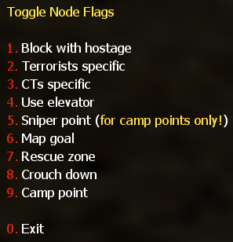
