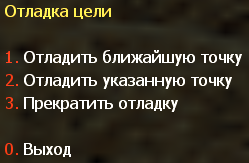

# Отладка

## Меню отладки цели

Чтобы проверить проходимость ботов до указанного узла, вам нужно открыть вторую страницу меню "Редактор графов" и выбрать **1. Отладка цели**. Затем должно появиться меню, как показано на картинке ниже.

| Опция | Описание |
|--------|----------|
| **1. Отладка ближайшего узла** | Определить ближайший узел как цель, которую должен достичь бот |
| **2. Отладка направленного узла** | Определить направленный узел (на который вы указали прицелом) как цель, которую должен достичь бот |
| **3. Остановить отладку** | Отключить функцию отладки цели |
