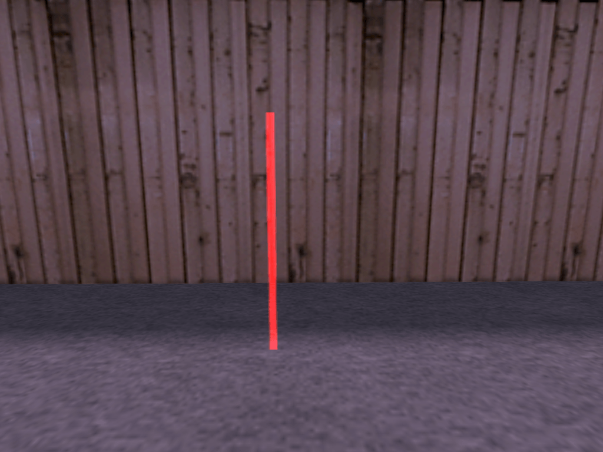
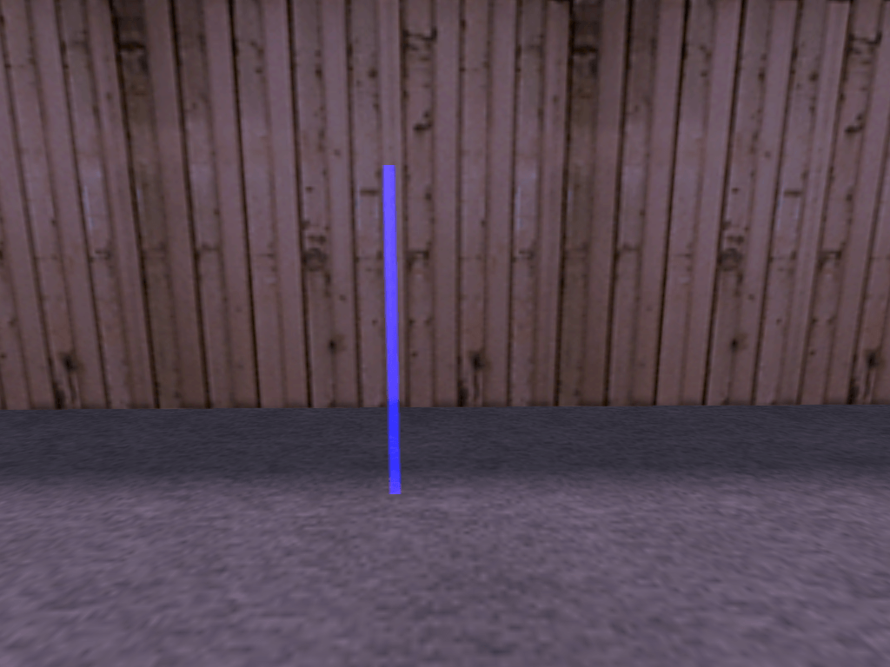
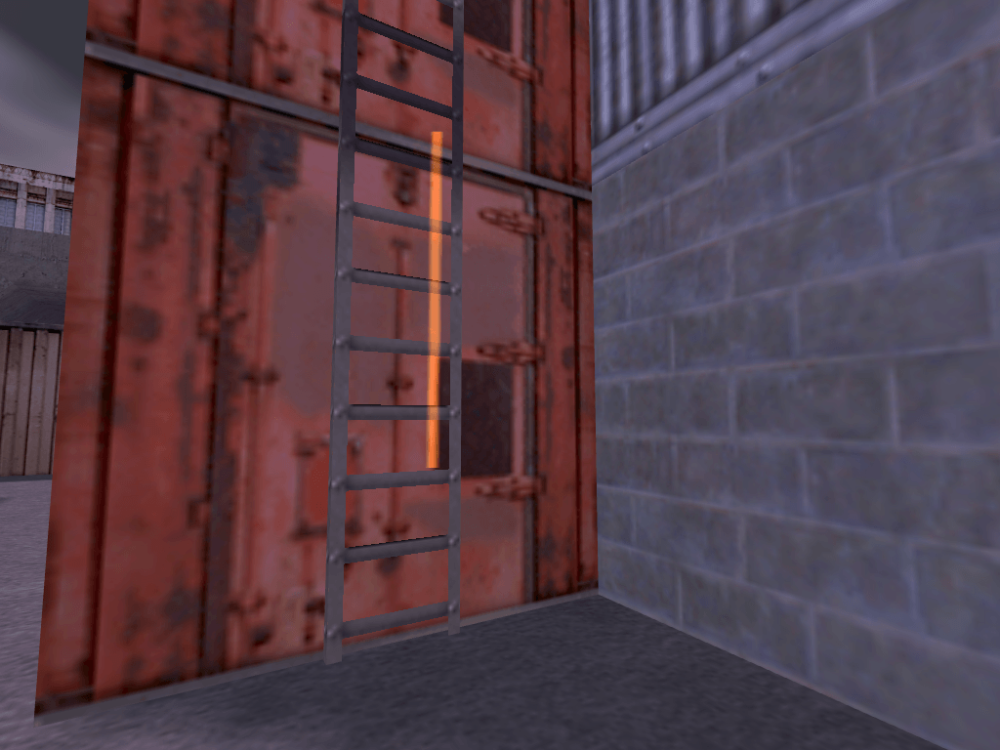
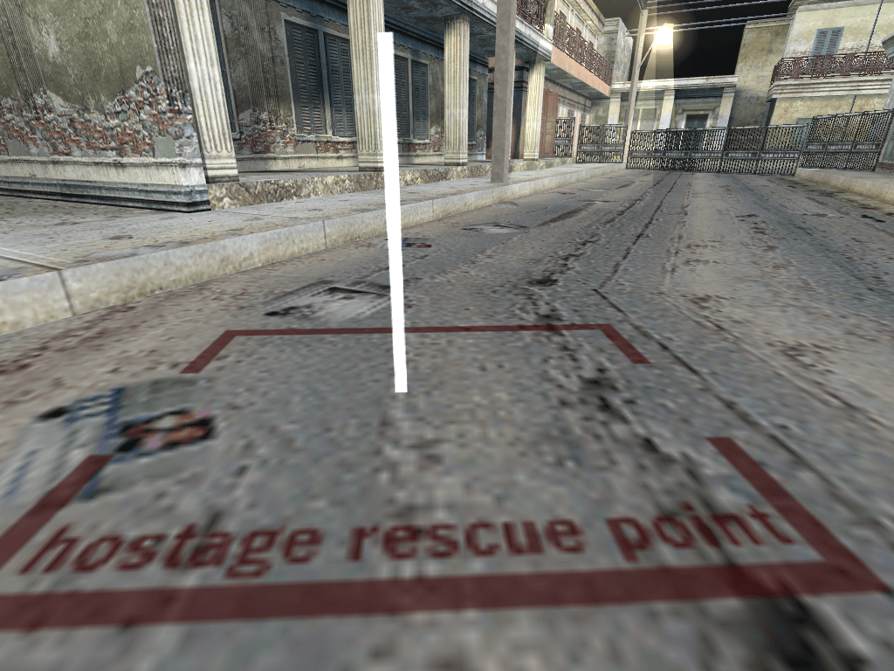
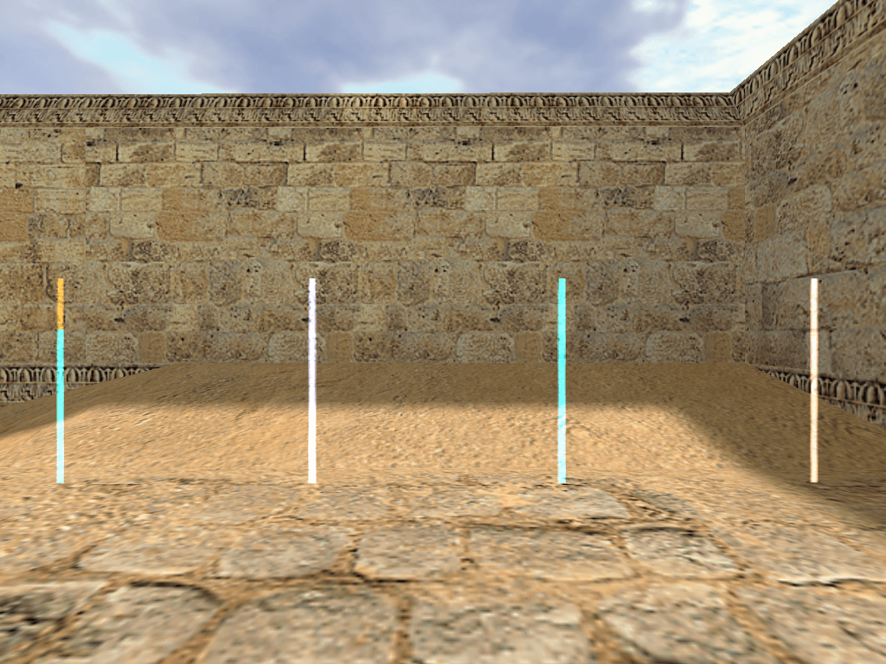
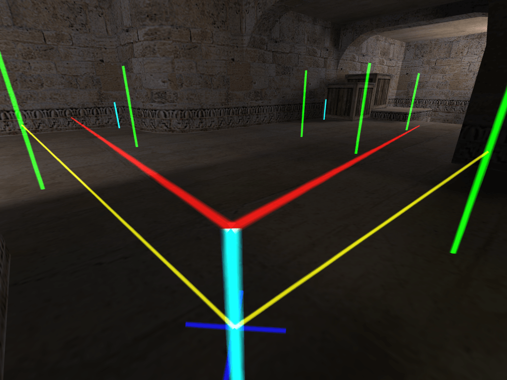
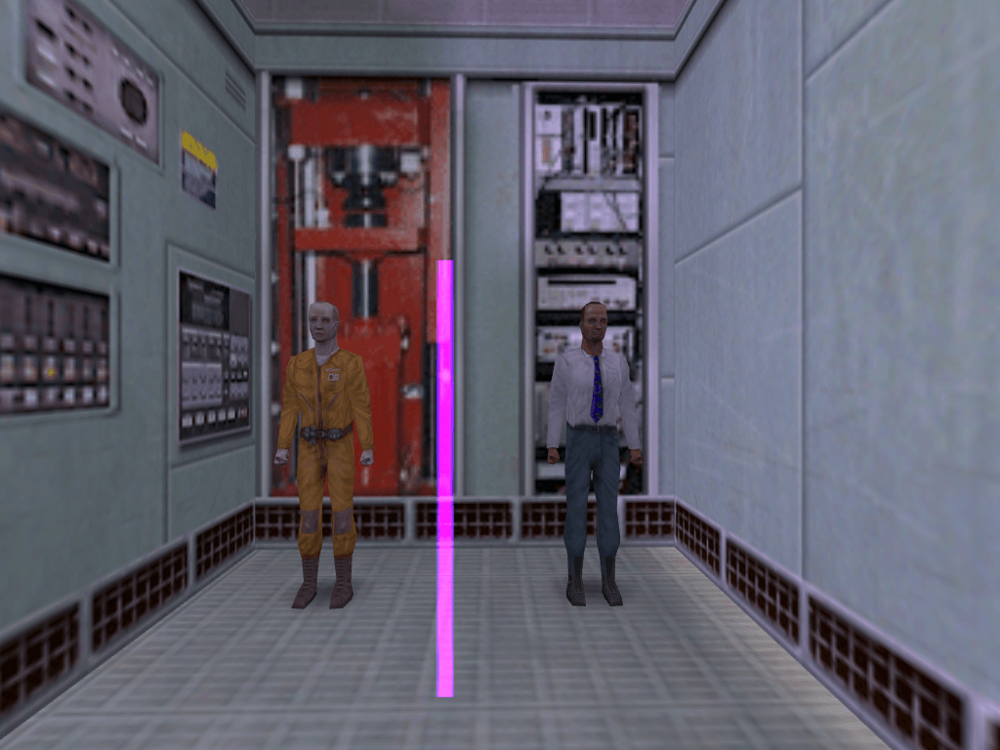
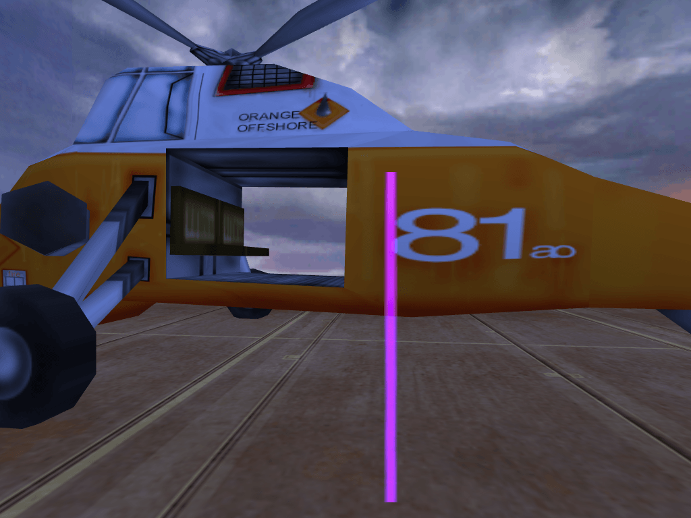
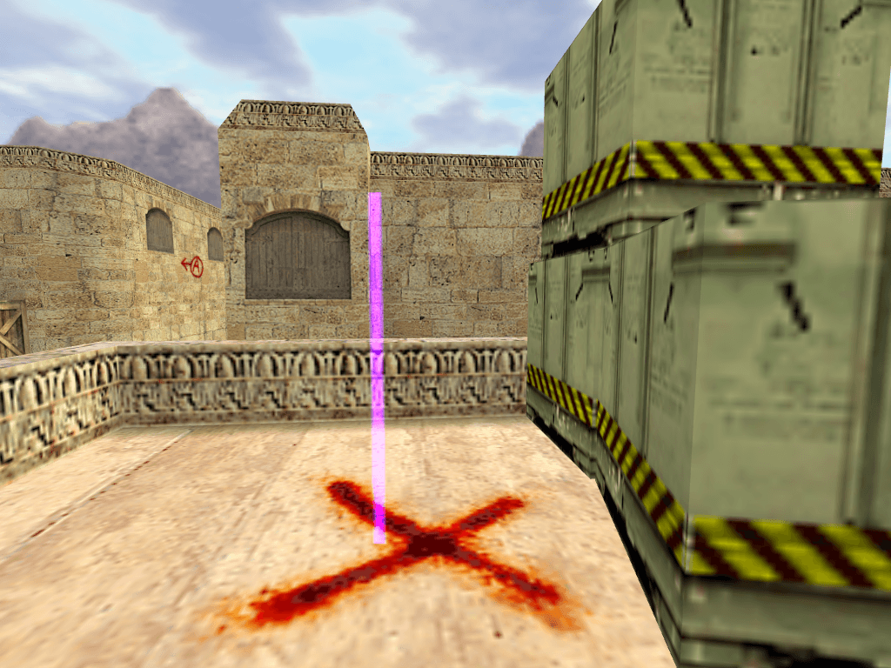
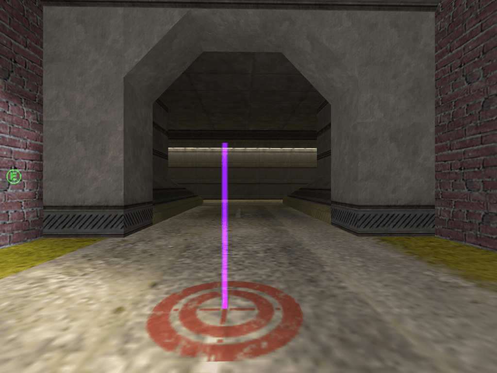

# Node Types

## Normal Nodes

**Normal** nodes are the points you need in order to make bots walk through the map. They are used for navigation only and will not trigger any particular behaviour. You can add a Normal node by selecting `1. Normal` from the Node Type menu. **The colour of Normal nodes is green**, as you can see in the picture below.

## Terrorist Important Nodes

This type of nodes can be navigated just as a Normal node by all bots, but it has one additional function. It marks strategically important points for a Terrorist team. Adding a **Terrorist Important** point in a room will tell Terrorist bots to go to the room and check it frequently. You can add this type of node by selecting `2. Terrorist Important` from the Node Type menu. **The colour of Terrorist Important nodes is green with red head**, as you can see in the picture below.

> **Important:** The use of Terrorist Important points depends on the map type! Wherever the Terrorist team is the "defending" team (i.e. on As_ Cs_ type maps), Terrorist Important points should be placed at key positions around the hostage area or VIP escape zone. For example, if the hostages are inside a building, Terrorist Important points should be added behind each entrance to the building. Doing so will make the Terrorists check all entrances frequently and guard them. Do not place Terrorist Important points far away on the other side of the map. After all, you don't want the Terrorists to abandon the hostages and rush aimlessly through the map, now, do you? With the VIP escape zone, the same strategy applies: Make Terrorists guard the key routes to the escape zone by using Terrorist Important nodes. You **DON'T** need to place Terrorist Important points directly at the hostages. Terrorists will check on hostages anyway. On maps where the Terrorist team is "offensive" (i.e. De_ and Es_ type maps), Terrorist Important nodes should not be overused. The "offensive" team will try to reach the map goal node anyway. The only useful function you can use important nodes for is to make particular routes more attractive for the bots. For example, if there is a longer and more complicated, but safer and more surprising route to the map goal, bots may tend to underuse it a little. In such cases, placing one or two Terrorist Important nodes along this route can help.

## Counter-Terrorist Important Nodes

The function of this node type is exactly the same as the Terrorist Important node described above. The only difference is that a **Counter-Terrorists Important** node obviously marks strategically important places for the Counter-Terrorist (CT) team. You can add this type of node by selecting `3. Counter-Terrorist Important` from the Node Type menu. **The colour of Counter-Terrorist Important nodes is green with blue head**, as you can see in the picture below.

> **Important:** As with the other team specific nodes, Counter-Terrorist Important nodes should also be placed according to the map type. On maps where the Counter-Terrorist team is forced to move out and reach a certain goal -- either hostages to rescue or a VIP escape zone to reach safely -- Counter-Terrorist Important points can be useful to make a particular route more attractive. You **DON'T** need to place Counter-Terrorist Important points near a map goal (hostages on CS_ maps, VIP escape zone(s) on As_ maps), Counter-Terrorist bots will go there anyway. It's the most important point for them, and adding several other important nodes right next to it doesn't yield any benefit. On maps where the Counter-Terrorist team is in a defensive role (i.e. on De_ maps and Es_ maps), place Counter-Terrorist Important points at key positions around the bomb/escape zone(s) in order to make Counter-Terrorist bots defend all possible routes to the Terrorists map goal.

## Ladder Nodes

**Ladder** nodes are only used for nodding ladders, as you possibly guessed. To enable your bots to use a ladder, simply walk up to the ladder until you get "stuck" on it (you will see your crosshair grow wider once you are on the ladder). Now place one Ladder node at the bottom of the ladder. Then climb up the ladder until you are almost completely over the edge. Place a second node here and make sure that the two ladder nodes are connected (this should have happened automatically if the Ladder nodes aren't too far away from each other; if not you can create a connection manually). That's all! You can add this type of node by selecting `1. Normal` from the Node Type menu -- it will automatically turn into a ladder node if you are standing on a ladder. Or choose `4. Block with hostage / Ladder` from the Node Type menu if it's a Hostage Rescue (CS_) scenario map so that bots don't miss the hostages when going up on ladders. **The colour of Ladder nodes is brown**, as you can see in the picture below.

### General Hints for Ladder Nodes

1. Node ladders AFTER you noded the areas above and below them! If you node ladders first, all nodes in reach of a ladder node will be connected with it and have their radius reduced to zero automatically! It doesn't matter whether you place the top or the bottom Ladder node first.
2. If the ladder is very long, you can place additional Ladder nodes between the bottom and the top end.
3. The bottom node will automatically get connected with the nearest node, independent of current AutoPath Max Distance settings.
4. The top node will usually get a connection towards it automatically, but you will have to add a connection leading away from it manually.
5. Ladder nodes will always have a radius of zero, and this shouldn't be changed!

## Rescue Nodes

**Rescue** nodes are only needed on Cs_ type maps (hostage rescue scenarios). They mark the zone where the Counter-Terrorist team must bring the hostages, the rescue zone. Place one of these nodes inside each rescue zone there is. If there is only one, you only need one Rescue node. Placing more points in one rescue zone is unnecessary bulk and will rather cause problems than improve anything.

A Counter-Terrorist bot that has succeeded in "activating" the hostages will determine the position of the nearest rescue point and lead the hostages there. When the bot has reached the rescue point, it will check if the hostages are really rescued and after max time about 5 seconds turn back to return to combat. Badly placed rescue points may lead to bots turning around before the hostages have really reached the rescue zone. As a consequence, the hostages will be left standing a few inches away from the rescue zone while the bot considers its mission as completed and turns back to fight, ignoring the deserted hostages. That's why you are advised to place a rescue node well inside a rescue zone, not at its edges!

In the editor, rescue points will be displayed in bright white. Their radius is set to zero by default and shouldn't be changed. All bots can use this node type for Normal navigation as well. You can add this type of node by selecting `5. Rescue Zone` from the Node Type menu. **The colour of Rescue nodes is white**, as you can see in the picture below.

## Camp Nodes

As the name suggests, Camp nodes are used to mark good sniper spots. They can be navigated by all bots. However, whether a bot may camp there or not is determined by the flag you can add to the camp node. You can make Camp nodes team specific or leave them "open" to any team. The colour of Normal Camp nodes is cyan. Terrorist specific camp nodes have coral color, Counter-Terrorist specific is cornflower blue color, as you can see in the picture below.

Although there are two entries in the Node Type menu ("Camping" and "Camp end"), the Camp node is in fact only one point. However, it carries two "markers" that tell a camping bot where to look while camping. When you are camping yourself, you will monitor a certain area. If you wanted to define this area, you could describe it as an angle. This angle would be specified by two lines going out from your position: One that marks the left edge and another one for the right edge. The monitored area would be between these two lines. The mentioned "markers" fulfill exactly this function. They are displayed as more or less horizontal beams going out from the top of a Camp node. **The colour of Camp markers is red**, as you can see in the picture below.

When a bot approaches the depicted Camp node, it will turn to face the direction of the Camp start marker first. Then it will scan the area between this marker and the Camp end marker by changing every few seconds the direction it is facing from one to the other. An enemy moving outside the two markers may escape the bot's attention, unless it hears the enemy coming. In the picture above, both markers are pointing to the same height. However, you can also specify different heights for each marker. This is very useful for making bots monitor a ramp, a slope, a stairway or other uneven surfaces.

So far, so good. But how to set a working camp node? Follow these steps:

1. Go to the exact position where you want bots to camp (of course, a dark corner or similar locations are best suited for camping)
2. If you want bots to stand while they are camping, remain standing upright. If you want them to crouch while camping (more precise aiming!), crouch yourself while adding the point
3. Point your crosshair at the exact direction and height where you want your bots to start looking
4. Bring up the Node Type menu and select `6. Camping`. The Camp node itself will now be placed at your current position, and you will see the two marker beams going out from it. The Camp start marker will already be pointed at the direction you specified, the Camp end marker will still need some adjustment
5. Now point your crosshair at the exact direction and height where you want your bots to end their monitoring
6. Once again, open the Node Type menu, but now select `7. Camp end`. You will see that the Camp end marker will now be pointed at the direction you specified

That's it! Unless you want to make your Camp node team specific or add another flag (see: [Node Flags](connections-and-flags.md)), you are done! In fact, it sounds much more complicated than it actually is.

### Quick Notes and Hints About Camp Nodes

1. You can alter Camp start and Camp end markers as often as you want. As soon as you are near an existing Camp node (i.e. as soon as its node stats are shown in the upper left corner of your HUD), bringing up the Node Type menu and selecting `6. Camping` or `7. Camp end` will **NOT** add a new node. Instead, it will readjust the Camp start and/or Camp end marker(s) of the nearby Camp node to the new direction you specified.
2. Thus, if you want to place two Camp nodes closely together, make sure that the node stats of the first one have disappeared from your HUD before you set the second one. If the stats of the first node are still visible, you will accidentally modify the Camp start and Camp end markers of that node instead of inserting a new point.
3. Don't place Camp nodes in strategically irrelevant areas, or you will see bots camping in a situation totally unimportant area while their team mates are under heavy attack.
4. Provide the "defending" team with some nice sniper spots near the map goal! In general, if you make team-specific Camp nodes, make more for the defending team than for the attacking team.

## Map Goal Nodes

This node type obviously indicates the **Map Goal**.

- On an As_ map, the **Map Goal** node tells the bots where the VIP escape zone is. Make sure the escape zone symbol is visible on your HUD when you place a map goal node there. Otherwise the VIP may end up reaching the point and running away again just like you would do with Rescue nodes.
- On a Cs_ map, the **Map Goal** node marks the position of the hostages. It is **NOT** necessary to place one Map Goal node per hostage. Unless the hostages are standing really far away from each other, one point per hostage group will perfectly do.
- On a De_ map, the **Map Goal** node marks the bomb spots. It must be placed somewhere inside the bomb zone, i.e. the bomb icon must be blinking on your HUD when you place such a node. In contrast to Cs_ maps, on De_ maps it makes sense to set various goal nodes in one bomb zone. This will enable bots to choose from several spots to plant the bomb and make them less predictable.
- On Es_ maps, the **Map Goal** node marks the escape zone for the Terrorists. You can follow the same rules as for As_ maps.

Now you may wonder how to determine the exact function of the Map Goal node. Don't worry, this is entirely map specific, you don't have to do anything about it. All bots of both participating teams will automatically know what the Map Goal is, they only need the point to guide them there. You can add this type of node by selecting `8. Goal` from the Node Type menu. **The colour of Goal nodes is purple**, as you can see in the pictures below.

### Examples of Goal Nodes

